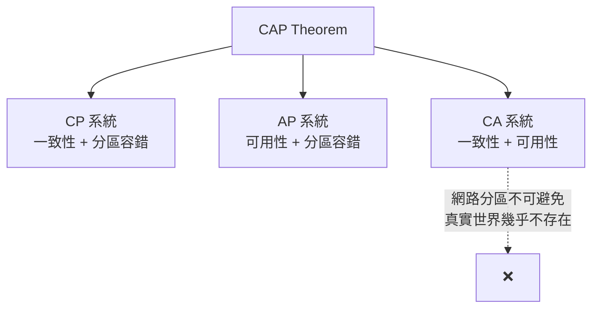
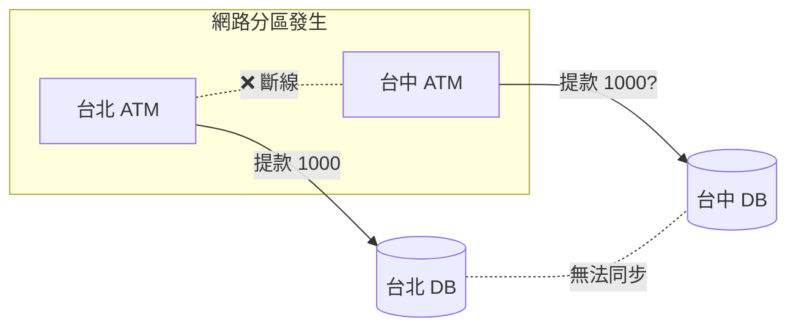

# CAP Theorem

## 什麼是 CAP 定理？

CAP 定理（Consistency, Availability, Partition Tolerance）是分散式系統中的一個基本理論。它指出在一個分散式系統中，當節點間無法通訊的狀況發生時，**不可能同時完全滿足**以下三個特性：

| 特性 | 說明 |
|---|---|
| **Consistency（一致性）** | 所有節點在同一時間看到的資料是一致的 |
| **Availability（可用性）** | 每個請求都能在有限時間內獲得回應，不會長時間等待 |
| **Partition Tolerance（分區容錯性）** | 系統能在網路分區或訊息丟失的情況下繼續運作 |

當網路分區發生時，我們需要決定：**優先考慮可用性還是一致性？**

### CP / AP / CA 系統

根據 CAP 定理，一個系統最多只能同時滿足其中的兩個特性：

| 類型 | 保證 | 犧牲 | 現實可行性 |
|---|---|---|---|
| **CP** | 一致性 + 分區容錯 | 網路分區時可能犧牲可用性 | 常見 |
| **AP** | 可用性 + 分區容錯 | 可能犧牲一致性 | 常見 |
| **CA** | 一致性 + 可用性 | 無法容忍網路分區 | 真實世界中幾乎不可能，因為網路分區不可避免 |

---

## Consistency vs Availability

| 面向 | 選擇 Consistency | 選擇 Availability |
|---|---|---|
| 行為 | 所有節點在同一時間看到相同資料 | 每個請求都會收到回應，即使在網路分區期間 |
| 寫入後讀取 | 所有後續讀取返回最新值，不論打到哪個節點 | 不同節點可能暫時擁有不同版本的資料 |
| 網路分區時 | 部分節點可能變得不可用，以維持一致性保證 | 系統最終會調和差異，但無法保證何時完成 |

> **面試提示**：可用性通常應該是預設選擇。只有在那些**無法容忍過期資料**的系統中，才需要強一致性。

---

## 強一致性系統的範例

有些系統對一致性要求極高，因為即使是短暫的不一致也會造成嚴重後果：

| 系統 | 為什麼需要強一致性 |
|---|---|
| 庫存管理系統 | 需要精確追蹤庫存量，避免商品超賣導致顧客抱怨、退款 |
| 有限資源預訂系統（航空座位、門票、飯店房間） | 必須避免重複預訂 |
| 銀行系統 | 帳戶餘額必須在所有節點間保持一致，防止詐騙 |

這些系統的關鍵特徵是：任何不一致，即使是暫時的，也可能導致**重大的商業或技術問題**。

---

## 真實世界案例：ATM 提款機系統

想像銀行有多個分行與提款機（分散式系統），帳戶餘額資料需要共享。

### C + P：犧牲可用性，保證一致

你在台北提款 1000 元，系統立刻更新，台中的 ATM 查到的餘額馬上減少。保證大家看到的數據都是最新、相同的。

但如果台北和台中**網路斷線**，台中就不能讓你提款，因為無法確定最新餘額。

### A + P：犧牲一致性，保證可用

你在台北提款 1000 元，但台中 ATM 因網路斷線暫時無法同步資料，系統仍允許你提款。

使用者體驗好（永遠能提款），但可能造成**超支**（兩邊各領 1000）。

### Partition Tolerance 為什麼幾乎必選？

網路不可能永遠不斷，所以分散式系統**必須能忍受分區**，也就是承受網路暫時斷開。因此 P 幾乎一定要保留，只能在 C 和 A 之間取捨。

---

## 自我測驗

### Q1：為什麼 CA 系統在真實的分散式系統中幾乎不存在？

因為在分散式系統中，**網路分區（Partition）是不可避免的**，所以 P 幾乎是必選的。當 P 必須保留時，只能在 C 和 A 之間二選一，CA 系統等於假設網路永遠不會出問題，這不切實際。

### Q2：以下哪些場景最適合選擇 CP（強一致性）？

(A) 社群媒體動態牆 (B) 飯店訂房系統 (C) 使用者頭像快取 (D) 銀行帳戶餘額

**答案：(B) 和 (D)**

飯店訂房系統不能超賣（同一房間賣給兩人），銀行帳戶餘額必須精確。這些場景中，即使短暫的不一致也會造成嚴重後果。社群動態牆和頭像快取可以容忍短暫的資料不一致。

### Q3：在 ATM 案例中，如果系統選擇 AP，台北和台中同時提款可能造成什麼問題？

可能造成**超支（overdraft）**。兩邊的 ATM 因為網路斷線無法同步餘額，各自允許提款，結果使用者實際提取的總金額超過帳戶餘額。

### Q4：在系統設計面試中，預設應該選擇一致性還是可用性？

**可用性（Availability）** 通常是預設選擇。只有在那些無法容忍過期資料的系統（如庫存管理、預訂系統、銀行系統）中，才需要選擇強一致性。