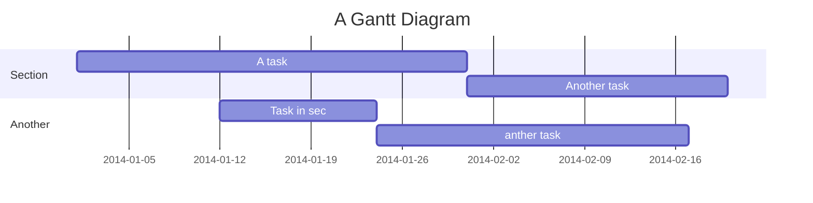

Tailand [Samui & Bangko] 9 days
===

## 目錄

[TOC]

## 住宿

Day1 2/3 (六) TPE-BKK & BKK-USM
Holiday Inn Resort Samui 住三晚

2/4 (日)
Koh Tao 濤島(龜島)/南園島半日遊
Bophut Beach 波普海灘放空
Lamei night market

2/5 (一) 
AngThong 安通一日遊
Fisherman's Village 漁村夜市

2/6 (二)
Centara Reserve Samui 住兩晚
大象園半日遊（換住宿點）
Chaweng night market

2/7 (三)
酒店放空

2/8 (四) USM-BKK
Easton Hotel Phayathai 住三晚
Chaweng Beach 查汶海灘放空
Asiatique河濱夜市 11:00–00:00
昭披耶河遊河 17:00-19:00

2/9 (五) 
動物園 09:00–16:30
ICONSIAM 10:00-22:00

2/10 (六)
大皇宮/玉佛寺 08:30–15:30
水上市場（未定）
SEA LIFE曼谷海洋世界 10:00-20:00
 
2/11 (日) BKK-TPE

User flows
---
```sequence
Alice->Bob: Hello Bob, how are you?
Note right of Bob: Bob thinks
Bob-->Alice: I am good thanks!
Note left of Alice: Alice responds
Alice->Bob: Where have you been?
```

> Read more about sequence-diagrams here: http://bramp.github.io/js-sequence-diagrams/

Project Timeline
---


> Read more about mermaid here: http://mermaid-js.github.io/mermaid/
