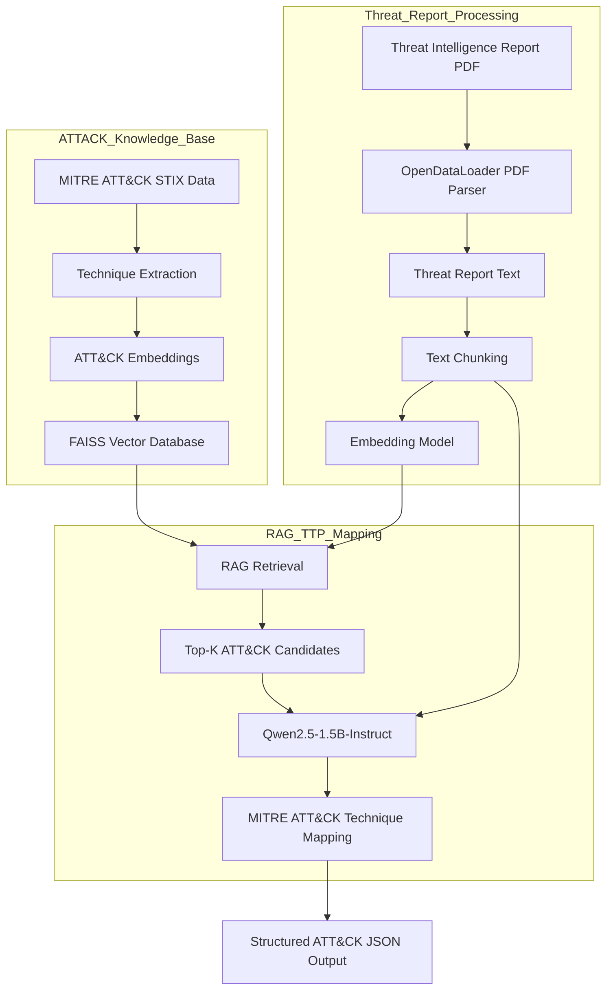

LeetCode-hard
===
[toc]

```mermaid
flowchart TD

    subgraph Threat_Report_Processing
        A[Threat Intelligence Report PDF]
        B[OpenDataLoader PDF Parser]
        C[Threat Report Text]
        D[Text Chunking]
        E[Embedding Model]
    end

    subgraph ATTACK_Knowledge_Base
        F[MITRE ATT&CK STIX Data]
        G[Technique Extraction]
        H[ATT&CK Embeddings]
        I[FAISS Vector Database]
    end

    subgraph RAG_TTP_Mapping
        J[RAG Retrieval]
        K[Top-K ATT&CK Candidates]
        L[Qwen2.5-1.5B-Instruct]
        M[MITRE ATT&CK Technique Mapping]
    end

    A --> B
    B --> C
    C --> D
    D --> E

    F --> G
    G --> H
    H --> I

    E --> J
    I --> J

    J --> K
    K --> L
    D --> L

    L --> M
    M --> N[Structured ATT&CK JSON Output]
```
