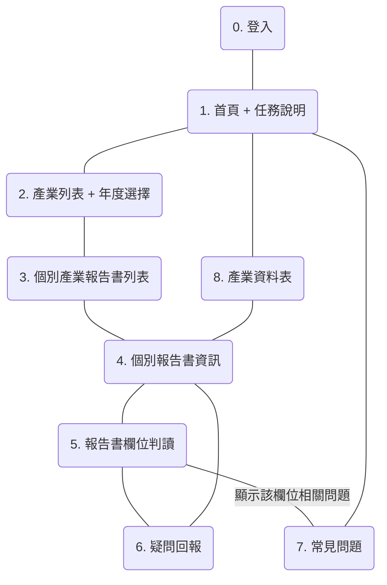

# 企業永續資料庫 UX 文件

本文以 CC-BY-4.0 授權釋出

這份文件紀錄目前對使用者的理解，以及對應的使用情境，會根據每次的 prototype 實驗而調整

## 人物誌

1. 資料總管
   - 負責統籌分工、規劃時程、校對資料，並將資料發佈給相關專案使用
   - 經手過最多種報告書，熟知要如何找到每個欄位的答案、解決特例
   - 有 14" ，解析度 1440x810 的筆電
2. 專業工人
   - 負責實際找出欄位答案的人，一次認領幾本報告書
   - 在開始判讀前，會先由資料總管培訓，最後將資料填在共用的試算表中
   - （不確定工作節奏，例如一次做多久，習慣用什麼方式工作）
3. 路過的鄉民
   - 未經訓練，願意提供 5 分鐘以內的注意力 → 任務導向性質高
   - 需要更明確的引導，否則會不知道操作流程
   - 因為時間與預期不同，較不容易長為完整的專案目的，要提供明確的目標，並確定目標與專案方向吻合
     > 以「核對其他人的答案」來說，如果答案是數值，目標很容易從「確定這是對的答案」轉為「確定報告書中有出現這個數值」

## 使用者故事

為了讓綠盟能收入更多報告書，2023 Q4 的專案目標，將設定為「打造協助專業工人、資料總管，完成報告建置、匯出的工具」

1. 身為 `專業工人` ，我想要快速找到我認領的報告書、接下來要判讀的欄位，讓我能將經歷花在判讀本身上
   1. 報告書以年度、產業分類，提供獨立網址，並標注認領人、建置完成度、驗證是否完成
   3. 提供單一報告書概覽、欄位資料，並允許直接開啟下一個待填欄位
2. 身為 `專業工人` ，我想要常見的 PDF 器瀏覽功能，讓我能無痛使用這套工具
   1. 可輸入頁次，直接跳頁
   2. 顯示當前頁次
   3. 允許熱鍵縮放
   5. （加分）可點選頁面超連結，直接跳轉
3. 身為 `專業工人` ，我想要盡量減少重複的操作與等待，將精力花在人類的判斷力上
   1. 提供單一視窗的多工界面，整合 PDF 閱讀、關鍵字搜尋、資料填寫、補充資訊回報
   2. 同時紀錄填寫時的補充資訊，例如答案的頁次、使用的、沒用到的關鍵字
   3. 免整本下載，即可快速打開指定 PDF 頁次
4. 身為 `專業工人` ，我想要專注在目前欄位，以及答案可能出現的地方，以減少注意力消耗
   1. 頁面上，一次僅提供一個欄位的資訊，例如關鍵字、歷史數值
5. 身為 `專業工人` ，我想要在判讀時直接回報問題，並了解是否已有相關的解答
   1. 判讀頁面，可以直接用文字、截圖，回報問題
   2. 提供即時 QA ，開放大家協作，並隨時更新，允許分類、搜尋
6. 身為 `資料總管` ，我想要確認已判讀完畢的報告書，資料是否無誤，以將資料匯出至公開資料庫
   1. 在報告書列表頁，顯示整體、個別報告書判讀完成度
   2. 一次列出同產業的所有資料，並標注完成度
   3. 可以將個別報告書，標注為「驗證完成」
   4. 可將同產業 & 已驗成完成的報告書，匯出為可直接貼到正式資料集的 CSV

## 資訊架構

## 使用流程

1. 專業志工填答
   1. 主要流程： 登入 → 選產業別 & 年份 → 報告書 → 看目前狀況、跳到下一個待做欄位 → 填答界面
   2. 次要情境：
      1. 往返其他欄位，確認結果： 點麵包屑，回到目前狀況頁
      2. 回報填寫問題：
         1. 給一個置頂按鈕，填寫回報
         2. 建立頁面回報頁，填寫處理狀況
      3. 查看報告書進度： 報告書頁面、目前狀況頁，顯示填答比例
2. 資料總管驗證
   1. 主要流程：登入 → 看各產業填答進度（完成度、列出試算表大表） → 匯出 → 填入 Google 試算表
   3. 次要情境：
      1. 修改資料：各產業填答進度 → 點公司 → 進入專業志工的目前狀況頁 → 進入填答界面
      2. 標注報告書完成： 各產業進度頁 → 選擇公司 → 點選完成

## 其他資料

1. [欄位說明](https://docs.google.com/spreadsheets/d/1Ypq8uVsJoU4RhB4shdCrygKmk6Hm_OcqNR5QbBb5bSQ/edit#gid=0)

---

# 2023-08 月大松版本

## 使用者故事

1. 身為 `專業工人` / `路過的鄉民` ，我想要盡量減少重複的操作與等待，將精力花在人類的判斷力上
   1. 提供單一視窗的多工界面，整合 PDF 閱讀、關鍵字搜尋、資料填寫、補充資訊回報
   2. 自動紀錄填寫時的補充資訊，例如答案的頁次、使用的、沒用到的關鍵字
   3. 免整本下載，即可快速打開指定 PDF 頁次
2. 身為 `專業工人` / `錄過的鄉民` ，我想要專注在目前欄位，以及答案可能出現的地方，以減少注意力消耗
   1. 頁面上，一次僅提供一個欄位的資訊，例如關鍵字、歷史數值
3. 身為 `專業工人` ，我想要快速跳到空白欄位、指定報告書，以完成我認領的工作
   1. 快速跳到下一個尚未輸入的欄位
   2. 可以選擇報告書
5. 身為 `路過的鄉民` ，我想要清楚的引導，告訴我下一步該做什麼
   1. 第一次進入時，提供簡單的逐步導引，包含點選關鍵字、跳到頁次、填入答案
   2. 正式開始前，說明規則，並詢問 ID ，以綁訂成績
   3. 正式開始後，在各區域提供說明文字，協助引導
   4. 由系統自動分配報告書、欄位，以走頑童一本報告書的不同欄位為原則
6. 身為 `路過的鄉民` ，我想要知道最新的填答狀況，以知道我的貢獻產生什麼影響
   1. 顯示每本報告書的填答、驗證比例
   2. 顯示 ID 排名

## 資訊架構

1. 前台
   1. 專業工人
      1. 年份與報告書，顯示整體完成比例
         1. 報告書填答頁面
   2. 路過的鄉民
      1. 目前排名、填答統計
      2. 開始判讀
         1. 新手教學
         2. 報告書填答頁面
   2. 報告書填答頁面
      1. 各區說明指引
      2. 年度 / 公司 / 當前欄位名稱 / 已填寫欄位數量（工人智慧模式）
      3. 欄位工具列
         1. 輸入數值、單位
            1. 提交資料 / 標為正確 / 標為錯誤 / 修正資料
               > 路過鄉民模式中，每個欄位須至少兩個不同 ID 提交資料 + 各兩次標為正確，才算完工
         3. 補充說明（可以先是文字）
         4. 預設關鍵字、自訂關鍵字
         5. 關鍵字搜尋結果、前後文
         6. 顯示同公司欄位的歷史數值
      4. PDF 閱讀器
         1. 縮放、搜尋工具列：放大 / 縮小 / fit width / fit height / zoom & pan to current match / next & prev match
         2. PDF 逐頁顯示
4. 後台
   1. 整體報告書、欄位完成狀況（填答、驗證、輔助資料比例）
   1. 個別年份-公司頁面
      1. 標注不一致、有補充資料的欄位
         1. 顯示資訊細節
         2. 以報告書填答頁面確認
      2. 將整份公司資料標為「已核對」
   2. 匯出所有已核對資料

## 使用者訪談

- [2023-06-12](https://g0v.hackmd.io/@ddio-io/open-csr-report/https%3A%2F%2Fg0v.hackmd.io%2FrsJT1-ryRES39e_p9M68AQ)
- [2023-07-01 黑客松](https://g0v.hackmd.io/@ddio-io/open-csr-report/https%3A%2F%2Fg0v.hackmd.io%2FK_N6QOg1QgC8lMneeJqdEg%3Fboth%2320230701-%25E5%25A4%25A7%25E6%259D%25BE%25E5%25B0%258F%25E8%25A8%2598)

