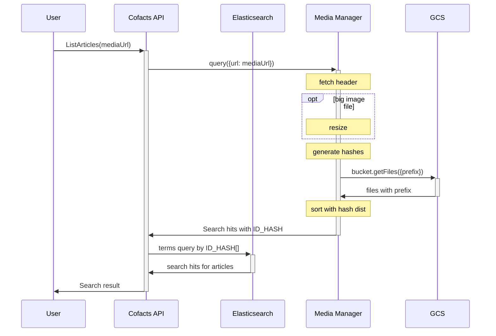
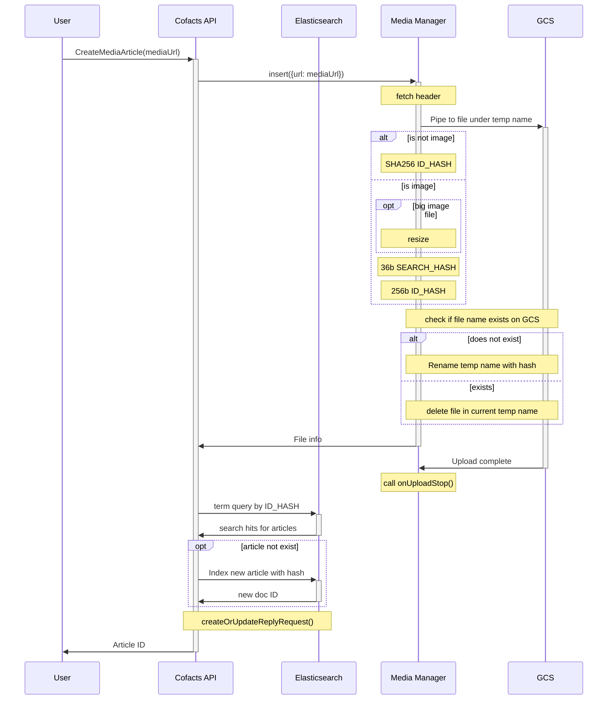

# Cofacts media manager implementation

## Spec

Build an production-ready Node.JS API library that provides image indexing & search capability, and the documentation of how to use it and deploy it.

It supports
1. setting up  credentials for GCS
2. uploading hoax images to GCS and index properly to support (3)
3. searching for near duplicate results when a query image is given

## API design

A Typescript library developed using [tsdx](https://github.com/jaredpalmer/tsdx) and will publish to npm.

- Repository name: `cofacts/media-manager`
- npm package name: `@cofacts/media-manager`

The manager will act as an interface to the underlying storage, providing simple search (listing / indexing), get and insert functionality.

Expected Usage:
```typescript=
import MediaManager from '@cofacts/media-manager';

// Setup
const manager = new MediaManager({
  credentialsJSON: process.env.GCS_CREDENTIALS,
  bucketName: process.env.GCS_BUCKET_NAME,
});

// Search
const { hits } = await manager.query({url: 'https://......'});

// Upload and index
const { id, url } = await manager.insert({url: 'https://......'});
```


### `MediaManager`

```typescript=
class MediaManager {
  constructor(params: {
    /** Google cloud credentail JSON content of a service account. */
    credentialsJSON: string;
    
    /**
     * Existing GCS bucket. The service account of `credentialsJSON` needs to
     * have the following permission of this bucket:
     * - roles/storage.objectCreator
     * - roles/storage.objectViewer
     */
    bucketName: string;
    
    /**
     * The prefix to write media files.
     * File structure after this prefix is managed by MediaManager
     */
    prefix?: string;
  }) {}
  
  // The GCS Bucket object
  #bucket: Bucket;

  query({url: string}): Promise<SearchResult> {}
  insert({url: string}): Promise<InsertResult> {}
  
  // Get file by ID from GCS
  getContent(id: string): ReadableStream {}
  
  // Get file info by ID from GCS. Null if specified ID does not exist.
  getInfo(id: string): FileInfo | null {}
}
```

### `#query({url: string}): Promise<SearchResult>`

It can return multiple search hit for images; one hit (exact match) for videos, audios or other formats.

The reason of why video & audio can only have exact match result:

1. We don't have enough data to determine a good search index.
2. Even if we can provide multiple search result, it is very difficult for user to choose a "most similar" video or "audio" from a list.

```typescript=
interface SearchResult {
  /** metadata for the queried file */
  queryInfo: QueryInfo;
  hits: SearchHit[];
}

interface SearchHit {
  /** Similarity between 0 and 1 */
  similarity: number;
  /** Metadata for the file */
  info: FileInfo;
}

enum MediaType {
  IMAGE = 'image'
  AUDIO = 'audio'
  VIDEO = 'video'
  FILE = 'file'
}

interface FileInfo {
  /**
   * The unique ID for the file.
   * The ID is considered opaque;
   * Applications should not try to decipher this ID. */
  id: string;
  
  /** Public URL */
  url: string;

  type: MediaType;

  // Extension from https://www.npmjs.com/package/mime
  ext: string;

  // MIME string
  mime: string;
  createdAt: Date;
}

/** ID is the to-be ID if the file is being inserted into database. */
type QueryInfo = Pick<FileInfo, 'id' | 'type' | 'format' | 'mime'>;
```

The promise may reject with the following errors:

```typescript
/** Cannot download file from the specified URL */
class DownloadError {
  // Error thrown by node-fetch if applicable
  fetchError: Error;
}
```

### `#insert({url: string, onUploadStop?: (Error | null) => void}): Promise<FileInfo>`

This method will upload file of the given `url` to GCS. Files with identical or near duplicate image content will produce the same perceptual hash or file fingerprint, so there will be no duplicates on GCS.

`insert()` resolves as soon as all data in `FileInfo` is resolved. Among all fields in `FileInfo`, `id` should be the slowest to retrieve (`url` is resolved along with `id`.)

By the time `insert()` resolves, it is possible that file upload to GCS is still in progress. When upload succeeded, `onUploadStop(null)` will be called. If upload fails, `onUploadStop(err)` will be called, passing the `err` returned by GCS NodeJS API.


## Implementation 

### `query()`

1. invoke node-fetch to get response header
2. if resp header is not image, pipe response body to SHA-256
   - after SHA-256 hash is calculated, search GCS using the hash and resolve `query()` with this result
4. if resp header is image, also:
   - if resp content is larger than 5MB, pipe response body to [sharp](https://github.com/lovell/sharp#stream) resizer
   - then pipe to buffer
   - when streaming ends, send buffer to image-hash to calculate `SEARCH_HASH` and `ID_HASH`
   - after hash `SEARCH_HASH` is calculated, search GCS using the search
   - rank the search result using the distance betwen `ID_HASH` and each file's `ID_HASH`


### `insert()`

1. invoke node-fetch to get response header
2. create GCS bucket file object `f` with temporary name
3. pipe response body stream to `f`
   - upon finish, call `onUploadStop` 
4. if resp header is not image, also pipe response body to SHA-256 at the same time
   - upon finish, check if `<file_type>/<hash>` exist on GCS
   - if not exist, rename `f` to `<file_type>/<hash>`; otherwise, delete `f`
   - resolve `insert()`
4. if resp header is image, also:
   - if resp content is larger than 5MB, pipe response body to [sharp](https://github.com/lovell/sharp#stream) resizer
   - then pipe to buffer
   - when streaming ends, send buffer to image-hash
   - after hash is calculated, check if `image/<SEARCH_HASH>/<ID_HASH>` exist on GCS
   - if not exist, rename `f` to `image/<SEARCH_HASH>/<ID_HASH>`; otherwise, delete `f`
   - resolve `insert()`

:::info
- 每次都傳 loading 會不會很大 [name=nonumpa]
  - 有可能，希望使用者會先 search 才呼叫 insert，減少兩人同時 insert 的機會
- delete `f` 不一定要做
  - 代表有 hash conflict
  - can periodically delete them, or set [auto delete](https://cloudplatform.googleblog.com/2013/07/new-in-google-cloud-storage-auto-delete.html)
:::

## Processing detail and design alternatives

### Handling large files

The maximum file size user can send to LINE is a bit vague. It is said that the file can be as large as 1GB (for fesktop version).
https://tw.imyfone.com/line/line-sends-files-size-limit/

It is said that files over 20MB cannot be retrieved by get content API.
https://www.line-community.me/en/question/5e306351851f7402cd95223f/get-file-content-of-messaging-api-larger-than-20mb?loginnow=true

After decoding into raw data, file size can be so large that it is not recommended to fit all of them into memory.

We can use the following strategies to avoid processing big file in memory:

1. Use NodeJS stream all the way in our processes
   - hash functions provided by crypto package can accept stream as input and output.
   - However, image-hash always process the whole file in memory amd do not accept streaming.
2. Cut-off at certain size and then process portion 
   - This method is risky because we are not sure if our hashing algorithm can function properly if the image is corrupted.
3. Resize the file into smaller one and process the smaller file
   - Despite the fact that this adds to complexity and processing time, this is probably the most commonly used method.
   - For images, [sharp](https://www.npmjs.com/package/sharp) can resize image and supports file streaming API.

LINE already downsize images, videos by limiting their dimensions. Among all images we previously collected, image files very rarely exceed 2MB. 

As for file upload, it can be more complex because if we cannot buffer whole file into memory, we cannot get file hash before uploading the whole file. **To keep the response stream flowing, we must calculate hash and upload to GCS at the same time**. After hash is calculated, we rename the file on GCS if the file previously did not exist.

:::spoiler File sending tests

LINE file test

- 3,186,021 byte --> 1,227,284 byte
- 4032 × 3024像素 --> 2364 × 1773像素
- content-type: image/jpeg
- content-length: 1227284

---

212MB --> Cannot upload QQ

---

Video cofacts_Final_TW.mp4
- 22,481,297 byte --(首次上傳)--> 9,830,992 byte --(下載後再上傳)--> 9,830,992 byte
- H264, 1920x1080, 24fps, AAC 48000Hz--> H264, 960x540, 24fps 44100Hz
- content-type: video/mp4
- content-length: 9830992

---

- 50,118 KB --(首次上傳)--> 384KB
- H264 1306x768 --> H264, 918x540
- content-type: video/mp4
- content-length: 383836
:::

:::info
It seems that it is possible for LINE to have video files over 50MB. We will
:::


### Determine file type

LINE's `getContent` API provides content-type header. This provides us a tool to plan the processing route before reading any byte from body stream.

We can [parse content-type header](https://www.npmjs.com/package/content-type) and use its type to determine `MediaType` accordingly:
- Map `image/*` to `MediaType.IMAGE`
- Map `video/*` to `MediaType.VIDEO`
- Map `audio/*` to `MediaType.AUDIO`
- Map others to `MediaType.FILE`

:::info
#### Design alternative

As an alternative, we can also use [file-type](https://www.npmjs.com/package/file-type) package:
- Determine file from buffer, stream, etc, using magic number in files
- Used in [image-hash](https://github.com/danm/image-hash/blob/master/src/imageHash.ts#L3)

##### Pros
Assert type from file content can make media manager more robust.

##### Cons
Since we are using different stream pipeline when different types of data is received, using file-type is more complicated than usung response header directly.

For the sake of simplicity we use HTTP response's content-type directly.
:::

### Processing images

- Use [image-hash](https://github.com/danm/image-hash) because it also decodes images.
- When a file is retrieved, 2 block hash of different bit size is generated:
    - Use `bits=16` (256 bits in length) hash as dedup ID (`ID_HASH`)
    - Use `bits=6` (36 bits in length) to search (`SEARCH_HASH`) - [see hash performance here](https://g0v.hackmd.io/LHhF_VQ1RdS12C0k0ESQ_Q#Bits6-36-bit-hash)
- When inserting files, the new image is stored at `<prefix>/image/<SEARCH_HASH>/<ID_HASH>`
- When searching, we list all files under `<prefix>/image/SEARCH_HASH` prefix as search hits
  - We can calculate similarity between query image's `ID_HASH` and the search hits' `ID_HASH`.
  - When calculating similarity, we first use [`buffer-xor`](https://github.com/crypto-browserify/buffer-xor) and [table lookup to get the hamming distance](https://github.com/commonsmachinery/blockhash-js/blob/master/index.js#L10-L27), then return the portion of the number of identical bits as similarity.
- The `id` in `FileInfo` can be the file path `image/<ID_HASH>`, as it must uniquely identify a media file (videos and audios included).

:::info
#### Design alternative

Use Elasticsearch to index images and perform search instead.

- `MediaManager` takes a elasticsearch `client` and an index name (`MediaEntry` index).
- when `MediaManager` initializes, it checks if `MediaEntry` index exist. If not, it tries to create the index.
- Documents in `MediaEntry`:
  - is indexed by `<ID_HASH>`
  - 4 fields `b1` ~ `b4`, 64-bit long int of part of `ID_HASH`. This is for sorting the search results.
  - Contains other feature generated by `SEARCH_HASH`.
- Possible features
  - If [`fuzzy` query](https://www.elastic.co/guide/en/elasticsearch/reference/6.8/query-dsl-fuzzy-query.html) is used, we can store just store 1 field, the `SEARCH_HASH`.
  - If LIRE's term match method is used, it stores `Ibs` and `Obs`, recording the index of `1` and `0`. The length of `Ibs` and `Obs` sums up to the lengh of `SEARCH_HASH` (36).
  - If FENSHES is used, we can store 3 subcode of `SEARCH_HASH` (each are 12 bits in length).
- As search function is implemented using Elasticsearch, we can just use `ID_HASH` for image file's GCS path.

##### Pros
- More flexible way to index the files
- No need to touch files if we want to change `SEARCH_HASH` or indexing methods

##### Cons
- Extra external dependency (Elasticsearch)
- Extra management cost
- Possible inconsistency betwen the GCS and the Elasticsearch index

:::

:::spoiler Details of design alternative
All features comes from [Fast and Exact Nearest Neighbor Search in Hamming Space on Full-Text Search Engines](https://arxiv.org/pdf/1902.08498.pdf).

#### Fuzzy query
We directly perform [`fuzzy` query](https://www.elastic.co/guide/en/elasticsearch/reference/6.8/query-dsl-fuzzy-query.html) on the `SEARCH_HASH` itself.

The `SEARCH_HASH` can be stored in binary form (a term with 36 charactors, either '0' or '1') , or other forms (such as base-4 strings, allowing up to 2-bit distance per difference in charactor).

#### LIRE's Term Match Method

1. Stores position of `1`s and `0`s in 2 field, `Ibs` and `Obs`
2. Perform length of hash (36) filter queries to find out how many position of 0 and 1 are identical between DB articles & query image


#### FENSHES

Suppose 3 subcode (12 bits in lengh) is used, and we are finding 3-neighbor (which means 1-neighbor for each subcode)

FENSHES will generate a bool query with 3 `terms` query, each terms query would have 13 candidate terms.


If we use `fuzzy` instead of `terms` query, we can calculate up to 6-neighbor because we can perform 2-neighbor search for each subcode. Not sure of this will include too many results, though.
:::

### Changing hash and migration strategy

In the current design, we use the file content's ID hash as file name to perform deduplication. Therefore, the following data are subject to change if hashing method updates, but they are outside of `MediaManager`'s administration:

- File ID (stored in Cofacts `articles.attachmentHash`)
- File URL (stored in Cofacts `articles.attachmentUrl`)

If we plan to update hashing algorithm one day in the future, a strategy of doing so may be:

1. Change `MediaManager`'s `prefix` along with the hashing algorithm update so that new media files are sent to new prefix.
    - At this point of time, old files cannot be searched; but file ID can still get the file, and file URL are still valid.
2. Re-hash existing files into new prefix or new bucket
    - In this step, a mapping of old ID to new ID & new URL must be generated.
    - After this, current bucket size doubles and may incur some costs
    - Since old files are now under the new bucket or prefix, it is searchable by the `MediaManager` again; however, as Cofacts relies on file ID as foreign key, it will not map to any Cofacts article yet
    - If we put search index in Elasticsearch (design alternative), we are also updating the `mediaentries` index in this step
3. Migrate old `attachmentUrl` / `attachmentHash` in Cofacts database according to the generated mapping in step 2.
4. Delete old files in old prefix / bucket.

### Processing audio & video

In [previous research](https://g0v.hackmd.io/aJqHn8f5QGuBDLSMH_EinA#Hashed-file-names), we plan to extract frames from video and use chromaprint for audio. 

However, for the time being we do not have enough real samples from LINE to evaluate the effectiveness of the hashing / fingerprinting technique.

Furthermore, we found that if the user saves audio and video from LINE and send to LINE again, the files Messaging API provides are exactly identical.

:::warning
MyGoPen said they also use file hash. However, they observed that in some weird phones, the file may change (by a few bytes) when its user downloads and re-uploads to LINE.
:::

Therefore, we will just process these files in the same way as other files (see below).

### Processing other files

For other file formats like PDF, doc, zip, the user is less likely to mutate them when sharing, and LINE does not mutate them either. We can just use [file fingerprinting](https://hackernoon.com/data-fingerprinting-in-javascript-k0c23ygz) to dedup.

We can use NodeJS native `crypto` package to generate a SHA-256 hash as its finterprint for each file. It supports streaming.

## Extended goal: supporting signed URLs and preview URLs

- In addition to original files, we generate preview files on the fly during file upload.
    - For images:
        - Original file - `<prefix>/image/<SEARCH_HASH>/<ID_HASH>/original`
        - JPG preview - `<prefix>/image/<SEARCH_HASH>/<ID_HASH>/jpg`
        - webp preview - `<prefix>/image/<SEARCH_HASH>/<ID_HASH>/webp`
    - For videos:
        - Original file - `<prefix>/video/<ID_HASH>/original`
        - Preview - `<prefix>/video/<ID_HASH>/preview` (240p & 16fps, usually played in 1.5x speed, 24kbps aac_he_v2 or [aac vbr1](https://trac.ffmpeg.org/wiki/Encode/AAC) encoded)
        - JPG preview - `<prefix>/video/<ID_HASH>/jpg` of first frame, 240p
        - webp preview - `<prefix>/video/<ID_HASH>/webp` of first frame, 240p
        - highlight - `<prefix>/video/<ID_HASH>/highlight` (240p & 24fps, no sound, 6 seconds long, 1.5x speed)
    - For audio:
        - Original file - `<prefix>/audio/<ID_HASH>/original`
        - preview: `<prefix>/audio/<ID_HASH>/preview` ([aac vbr1](https://trac.ffmpeg.org/wiki/Encode/AAC), mono)
    - For other files:
        - Original file (gzipped) - `<prefix>/video|audio/<ID_HASH>/original.gz`
        - Can be achived by setting [`gzip` flag](https://googleapis.dev/nodejs/storage/latest/global.html#CreateWriteStreamOptions) in `createWriteStream`
- Add `getSignedUrl(fileType, expires)` to `FileInfo`
- `FileInfo.url` still returns public URL to the original file.
    - If GCS bucket setting is private, the URL will not be accessible.
- `fileType`:
    - `'original' | 'jpg' | 'webp'` for images
        - `webp` & `jpg` are for preview in chatbot & website, max 512px width or height
    - `'original'` | `'preview'`  | `'jpg'` | `'webp'` | `'highlight'` for videos
    - `'original'` | `'preview'` for audio
    - `'original'` only for files
- `expires`:
    - Any future date should work
- `rumors-api` integration
    - `attachmentUrl` field does not read from elasticsearch; it calls `getSignedUrl` instead
    - `attachmentUrl` field will take an optional `fileType` argument
        - If not given, `webp` is chosen for images; `preview` chosen for videos and audio; `original` is chosen for other files
        - Users must be logged in to use `original`
            - original files may be large and costs some money to allow download
            - we should spend the cost on fact checkers only
    - when calling `getSignedUrl()`, we can choose a `expire` date that is fixed for 24 hours so that the URL can be cached by the browser
        - ex: In application we can set `expires` to 23:59 of the next day. Every request to the image today will generate the same URL using the same `expires`.

## Extended goal: type specific `FileInfo`

Some info that may help with rendering and features for editors to quickly recognize if two media are identical.

- Image: width, height, preview width, preview height
- Video: width, height, duration (seconds), preview width, preview height (=240), highlight start time
- Audio: duration (seconds)
- File: file name, file size (bytes) -- not given by getContent API but by [other messaging API fields](https://developers.line.biz/en/reference/messaging-api/#wh-file)

## Cofacts integration

Separation of concern between Media Manager and Cofacts API
- Media Manager does not search & index using any hint from Cofacts article data
- Cofacts API only records Media Manager's ID hash (and other `FileInfo`) and has no idea about search hash and search logic

### Search flow


### Create flow


