# Cofacts DB Mapping

> https://github.com/cofacts/rumors-db/tree/master/schema

- 🔑: field used in `_id` key; combinations must be unique within index.
- Solid line: foreign key relation
- Dotted line: cached field, or having interaction

```graphviz
graph mappings{
  rankdir=LR;
  node[shape=record];

  replyrequests [label="
    𝐫𝐞𝐩𝐥𝐲𝐫𝐞𝐪𝐮𝐞𝐬𝐭𝐬
    |
    <id>articleId🔑\l
    |
    <user>
    userId🔑\l
    appId🔑\l
    |
    reason\l
    |
    <timestamps>
    createdAt\l
    updatedAt\l
    |
    {
      feedbacks\n
      (nested)
      |
      {
        score\l
        |
        userId\l
        appId\l
        |
        createdAt\l
        updatedAt\l
      }
    }
    |
    positiveFeedbackCount\l
    negativeFeedbackCount\l
  "]
  
  articlereplyfeedbacks [fixedsize="true" width="3" height="2" label="
    𝐚𝐫𝐭𝐢𝐜𝐥𝐞𝐫𝐞𝐩𝐥𝐲𝐟𝐞𝐞𝐝𝐛𝐚𝐜𝐤𝐬
    |
    <id>articleId🔑\l
    |
    <replyid>replyId🔑\l
    |
    userId🔑\l
    appId🔑\l
    |
    <score> score\l
    |
    comment\l
    |
    createdAt\l
    updatedAt\l
  "]
  
  articlecategoryfeedbacks [fixedsize="true" width="3" height="2" label="
    𝐚𝐫𝐭𝐢𝐜𝐥𝐞𝐜𝐚𝐭𝐞𝐠𝐨𝐫𝐲𝐟𝐞𝐞𝐝𝐛𝐚𝐜𝐤𝐬
    |
    <id>articleId🔑\l
    |
    <categoryid>categoryId🔑\l
    |
    userId🔑\l
    appId🔑\l
    |
    <score> score\l
    |
    comment\l
    |
    createdAt\l
    updatedAt\l
  "]
  
  replies [label="
    <id>𝐫𝐞𝐩𝐥𝐢𝐞𝐬
    |
    userId\l
    appId\l
    |
    <type>
    type\l
    |
    text\l
    |
    {
      hyperlinks
      \n(nested)
      |
      {
        <url>
        url\l
        |
        <title>
        title\l
        |
        <summary>
        summary\l
      }
    }
    |
    reference\l
    |
    createdAt\l
  "]
  
  articles [label="
    <id>
    𝐚𝐫𝐭𝐢𝐜𝐥𝐞𝐬
    |
    <requests>
    replyRequestCount\l
    lastRequestedAt\l
    |
    createdAt\l
    updatedAt\l
    |
    text🔑\l
    |
    userId\l
    appId\l
    |
    {
      references\n
      (nested)
      |
      {
        type\l
        permalink\l
        createdAt\l
        |
        userId\l
        appId\l
      }
    }
    |
    {
      articleReplies
      \n(nested)
      |
      {
        <reply>
        replyId\l
        |
        <feedbackcounts>
        positiveFeedbackCount\l
        negativeFeedbackCount\l
        |
        <replytype>
        replyType\l
        |
        userId\l
        appId\l
        |
        status\l
        |
        createdAt\l
        updatedAt\l
      }
    }
    |
    normalArticleReplyCount\l
    |
    {
      articleCategories
      \n(nested)
      |
      {
        <category>
        categoryId\l
        |
        <categoryfeedbackcounts>
        positiveFeedbackCount\l
        negativeFeedbackCount\l
        |
        aiModel\l
        aiConfidence\l
        |
        userId\l
        appId\l
        |
        status\l
        |
        createdAt\l
        updatedAt\l
      }
    }
    |
    normalArticleCategoryCount\l
    |
    {
      hyperlinks
      \n(nested)
      |
      {
        <url>
        url\l
        normalizedUrl\l
        |
        <title>
        title\l
        |
        <summary>
        summary\l
      }
    }
  "]
  
  categories[label="
    <id>𝐜𝐚𝐭𝐞𝐠𝐨𝐫𝐢𝐞𝐬
    |
    title\l
    |
    description\l
    |
    createdAt\l
    updatedAt\l
  "]
  
  urls[label="
    <id>𝐮𝐫𝐥𝐬
    |
    <url>url\l
    canonical\l
    |
    <title>title\l
    |
    <summary>summary\l
    |
    html\l
    topImageUrl\l
    |
    fetchedAt\l
    status\l
    error\l
    isReferenced\l
  "]
  
  users[label="
    <id>𝐮𝐬𝐞𝐫𝐬
    |
    email\l
    name\l
    avatarUrl\l
    |
    facebookId\l
    githubId\l
    twitterId\l
    |
    createdAt\l
    updatedAt\l
  "]
  
  cooccurrences[label="
    𝐜𝐨𝐨𝐜𝐜𝐮𝐫𝐫𝐞𝐧𝐜𝐞𝐬
    |
    <id>articleIds 🔑\l
    |
    userId 🔑\l
    appId 🔑\l
    |
    createdAt\l
    updatedAt\l
  "]
  
  airesponses[label="
    𝐚𝐢𝐫𝐞𝐬𝐩𝐨𝐧𝐬𝐞𝐬
    |
    <id>docId\l
    type\l
    |
    userId\l
    appId\l
    |
    status\l
    text\l
    request\l
    usage\l
    |
    createdAt\l
    updatedAt\l
  "]
  
  
  articles:id -- replyrequests:id;
  articles:requests -- replyrequests:timestamps [style="dotted"];
  articles:category -- categories:id;
  articles:url -- urls:url;
  articles:id -- articlereplyfeedbacks:id;
  articles:id -- articlecategoryfeedbacks:id;
  articles:reply -- articlereplyfeedbacks:replyid;
  articles:category -- articlecategoryfeedbacks:categoryid;
  articles:reply -- replies:id;
  articles:feedbackcounts -- articlereplyfeedbacks:score [style="dotted"];
  articles:categoryfeedbackcounts -- articlecategoryfeedbacks:score [style="dotted"];
  articles:replytype -- replies:type [style="dotted"];
  articles:title -- urls:title [style="dotted"];
  articles:summary -- urls:summary [style="dotted"];
  replies:url -- urls:url;
  replies:title -- urls:title [style="dotted"];
  replies:summary -- urls:summary [style="dotted"];
  articles:id -- cooccurrences:id;
  articles:id -- airesponses:id;
}
```

