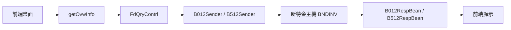
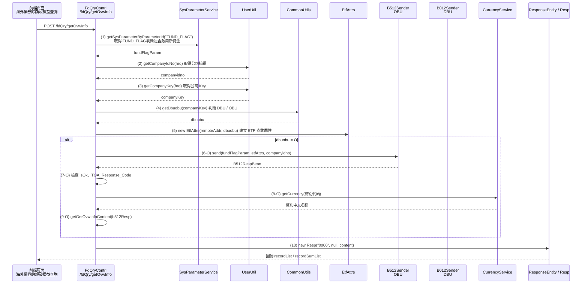
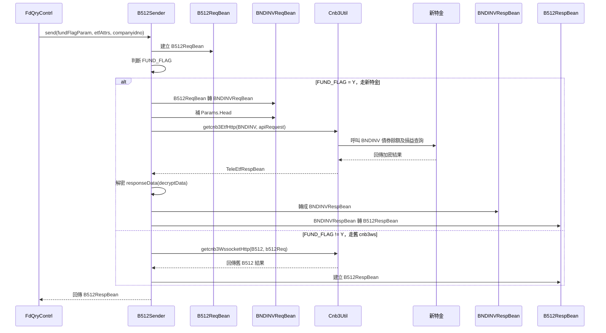

# 新企網新特金電文轉接說明

## 以海外債券餘額及損益查詢 B512 → BNDINV 為例

---

# 功能介紹

本功能為「海外債券餘額及損益查詢」，主要透過 `/getOvwInfo` 查詢海外債券相關資料。

---

# 前端如何找到後端流程

## Step 1：前端操作功能

於前端畫面操作「海外債券餘額及損益查詢」。

## Step 2：透過 F12 Network 找 API

於瀏覽器 F12 → Network 中，可找到：

```text
/getOvwInfo
```

## Step 3：找到對應 Controller

搜尋 `/getOvwInfo`，可找到：

```text
FdQryContrl
```

---

# 系統流程概觀



---

# Controller


---


# Sender



Sender 內部會依 `FUND_FLAG` 判斷：

- 是否走新特金
- 是否走舊 cnb3ws

---

# 如何將舊電文轉接成新特金 (以B512/BNDINV為例)
## 架構說明

ETF 電文採用 Sender 模式： 
cnb3-client 透過 B012/B512Sender 發送電文並取得 Response Bean。 

Sender 內部依 FUND_FLAG 判斷新舊流程，走新特金時透過 Cnb3Util 呼叫 BNDINV API。

---

```text
Controller/Service (@Autowired B512Sender)
    ↓ b512Sender.send(...)

B512Sender
    ↓ 建立 B512ReqBean
    ↓ 判斷 FUND_FLAG
        ↓ Y（新特金）
            ↓ BNDINVReqBean
            ↓ cnb3Util.getcnb3EtfHttp(...)
            ↓ HTTP POST → /cnb3etf/api/fund

        ↓ N（舊系統）
            ↓ 呼叫 cnb3ws B512

新特金主機（BNDINV API）
    ↓ 回傳 TeleEtfRespBean

B512Sender
    ↓ responseData decode / 解壓
    ↓ JSON → BNDINVRespBean
    ↓ 轉回 B512RespBean

B512RespBean（回傳）
```
---

## 步驟一：建立 RequestBean

### 路徑

```text
cnb3-telegram-jar/src/main/java/com/bankpro/tele/bean/fundreq/BNDINVReqBean.java
```

### 說明

建立新特金 BNDINV 上行 Request Bean。

負責將舊電文轉換成新特金 Request 格式：

```text
B012ReqBean / B512ReqBean
        ↓
BNDINVReqBean
```

### 範例程式

```java
/**
 * BNDINV (B012) - 債券餘額及損益查詢 (Request)
 */
public class BNDINVReqBean extends EtfRequestBeanBase {

	/** 功能代碼 */
	public static final String TXN_TYPE = "BNDINV";
	private static final long serialVersionUID = 5464202829674809086L;

	@JsonProperty(value = "CustPermId")
	private String custPermId;// 身份證字號

	@JsonProperty(value = "PrdCtg")
	private String prdCtg;    // 產品種類 02-債券
	
	public BNDINVReqBean() {}
	
	public BNDINVReqBean(final B012ReqBean b012) {
		this.setCustPermId(Cnb3etfUtils.toValue(b012.getCUSIDN()));// 身份證字號
		this.setPrdCtg("02");                                      // 產品種類
	}
	
	public BNDINVReqBean(final B512ReqBean b512) {
		this.setCustPermId(Cnb3etfUtils.toValue(b512.getCUSIDN()));// 身份證字號
		this.setPrdCtg("02");                                      // 產品種類
	}
	
	/**
	 * 身份證字號
	 */
	public String getCustPermId() {
		return this.custPermId;
	}

	/**
	 * @param custPermId - 身份證字號
	 */
	public void setCustPermId(String custPermId) {
		this.custPermId = custPermId;
	}

	/**
	 * 產品種類 02-債券
	 */
	public String getPrdCtg() {
		return this.prdCtg;
	}

	/**
	 * @param prdCtg - 產品種類 02-債券
	 */
	public void setPrdCtg(String prdCtg) {
		this.prdCtg = prdCtg;
	}

```

---

## 步驟二：建立 ResponseBean

### 路徑

```text
cnb3-telegram-jar/src/main/java/com/bankpro/tele/bean/fundresp/BNDINVRespBean.java
```

### 說明

建立新特金 BNDINV 下行 Response Bean。

負責將新特金回傳內容轉回原本系統格式：

```text
新特金 Response JSON
        ↓
BNDINVRespBean
        ↓
B512RespBean
```

### 範例程式

```java

/**
 * BNDINV (B012, B512) - 債券餘額及損益查詢 (Response)
 */
public class BNDINVRespBean extends EtfResponseBeanBase {

	private static final long serialVersionUID = 3122962690717369591L;
	
	@JsonProperty(value = "CustPermId")
	private String custPermId;// 身份證字號

	@JsonProperty(value = "Data")
	private BNDINVResponseData data;

	/**
	 * 身份證字號
	 */
	public String getCustPermId() {
		return this.custPermId;
	}

	/**
	 * @param custPermId - 身份證字號
	 */
	public void setCustPermId(String custPermId) {
		this.custPermId = custPermId;
	}

	public BNDINVResponseData getData() {
		return this.data;
	}

	public void setData(BNDINVResponseData data) {
		this.data = data;
	}

	@Override
	public JSONObject toJSONObject() {
		BNDINVResponseData respData = this.getData();
		JSONObject data = new JSONObject();
		List<JSONObject> respDataList = new ArrayList<>();// Record + RecordCurr
		
		// B012RespBean, B512RespBean
		if (respData.getRecord() != null && respData.getRecord().size() > 0) {
			for (BNDINVResponseRecord record : respData.getRecord()) {
				JSONObject recordData = new JSONObject();
				
				// O01 ~ O20 先給預設值
				for (int o = 0; o < 20; o++)
					recordData.put("O".concat(StringUtils.leftPad(String.valueOf((o + 1)), 2, Cnb3etfUtils.ZERO)), Cnb3etfUtils.EMPTY);
				
				// 放值 (1.債券)
				recordData.put("O18", "1");                                                                        // 1.債券
				recordData.put("O01", Cnb3etfUtils.toSocketStr(record.getFundSN()));                               // 委託單號
				recordData.put("O02", Cnb3etfUtils.toSocketStr(record.getFundCode()));                             // 商品代號
				recordData.put("O03", Cnb3etfUtils.toSocketStr(record.getPrdNam()));                               // 商品名稱
				recordData.put("O07", Cnb3etfUtils.toSocketStr(record.getCurAmt(), 2));                            // 信託本金
				recordData.put("O05", Cnb3etfUtils.toSocketStr(record.getUnit(), 2));                              // 庫存面額
				recordData.put("O08", Cnb3etfUtils.toSocketStr(record.getCurCode()));                              // 計價幣別
				recordData.put("O09", Cnb3etfUtils.toSocketStr(record.getNetPrice(), 4));                          // 參考價格
				recordData.put("O10", Cnb3etfUtils.toSocketRocDate(record.getNetDate()));                          // 報價日期 (民國年)
				recordData.put("O11", Cnb3etfUtils.toSocketStr(record.getTotXd(), 2));                             // 累計配息金額
				recordData.put("O12", Cnb3etfUtils.toSocketStr(record.getNavAmt(), 2));                            // 市值
				recordData.put("O13", Cnb3etfUtils.toSocketStr(record.getSign2(), record.getReturn2(), 2));        // 報酬率
				recordData.put("O14", Cnb3etfUtils.toSocketStr(record.getSign1(), record.getReturn1(), 2));        // 含息報酬率
				recordData.put("O15", Cnb3etfUtils.toSocketRocDate(record.getUpTrnDt()));                          // 申購日期 (民國年)
				recordData.put("O16", Cnb3etfUtils.toSocketStr(record.getPriorIntMark(), record.getPriorInt(), 2));// 前手利息
				recordData.put("O17", Cnb3etfUtils.toSocketStr(record.getXdProfitSign(), record.getXdProfit(), 2));// 參考含息損益
				recordData.put("O19", Cnb3etfUtils.toSocketStr(record.getSellSts()));                              // 委賣處理中 Y/N
				recordData.put("O20", Cnb3etfUtils.toSocketStr(record.getProfitSign(), record.getProfit(), 2));    // 參考損益
				recordData.put("O06", Cnb3etfUtils.toSocketStr(record.getBuyPrice()));                             // 買入價格
				recordData.put("O04", Cnb3etfUtils.EMPTY);                                                         // [停用] 庫存單位數
				respDataList.add(recordData);
			}
		}
		
		// RecordCurr
		if (respData.getRecordCurr() != null && respData.getRecordCurr().size() > 0) {
			for (BNDINVResponseRecordCurr recordCurr : respData.getRecordCurr()) {
				JSONObject recordCurrData = new JSONObject();
				
				// O01 ~ O20 先給預設值
				for (int o = 0; o < 20; o++)
					recordCurrData.put("O".concat(StringUtils.leftPad(String.valueOf((o + 1)), 2, Cnb3etfUtils.ZERO)), Cnb3etfUtils.EMPTY);
				
				// 放值 (2.幣別)
				recordCurrData.put("O18", "2");                                                                                // 2.幣別
				recordCurrData.put("O08", Cnb3etfUtils.toSocketStr(recordCurr.getCurr()));                                     // 信託幣別
				recordCurrData.put("O07", Cnb3etfUtils.toSocketStr(recordCurr.getAmt(), 2));                                   // 總信託金額
				recordCurrData.put("O12", Cnb3etfUtils.toSocketStr(recordCurr.getValAmt(), 2));                                // 總參考現值
				recordCurrData.put("O16", Cnb3etfUtils.toSocketStr(recordCurr.getPriorIntMark(), recordCurr.getPriorInt(), 2));// 前手息
				recordCurrData.put("O20", Cnb3etfUtils.toSocketStr(recordCurr.getSign(), recordCurr.getProfit(), 2));          // 總參考損益
				recordCurrData.put("O13", Cnb3etfUtils.toSocketStr(recordCurr.getSign2(), recordCurr.getReturn2(), 2));        // 不含息報酬率(%)
				recordCurrData.put("O11", Cnb3etfUtils.toSocketStr(recordCurr.getTotXd(), 2));                                 // 累計配息金額
				recordCurrData.put("O17", Cnb3etfUtils.toSocketStr(recordCurr.getSign11(), recordCurr.getProfit1(), 2));       // 總參考含息損益
				recordCurrData.put("O14", Cnb3etfUtils.toSocketStr(recordCurr.getSign1(), recordCurr.getReturn1(), 2));        // 未實現含息報酬率(%)
				respDataList.add(recordCurrData);
			}
		}
		
		// 參數值
		data.put("CUSIDN", Cnb3etfUtils.toSocketStr(this.getCustPermId()));// 身份證字號
		data.put("ARRAY", respDataList);
		
		// 共用回傳值
		data.put("TOTRECNO", this.getRespRecordCount());        // 資料筆數
		data.put("TOA_Response_Code", this.getRespStatusCode());// 交易結果代號
		return data;
	}
}

```

---

## 步驟三：Sender 修改

### 路徑

```text
cnb3-telegram-jar/src/main/java/com/bankpro/tele/service/bsend/B512Sender.java
```

### 功能說明

Sender 為新舊特金轉接核心。

主要負責：

- 依 `FUND_FLAG` 判斷走新特金或舊系統
- 將 `B512ReqBean` 轉成 `BNDINVReqBean`
- 補上新特金 Header
- 呼叫 `cnb3Util.getcnb3EtfHttp()`
- 處理 cnb3etf 回傳內容
- 將 `BNDINVRespBean` 轉回 `B512RespBean`

### 範例程式

```java
public class BNDINVReqBean extends EtfRequestBeanBase {

    public static final String TXN_TYPE = "BNDINV";

    public BNDINVReqBean(final B512ReqBean b512) {

        this.setCustPermId(
            Cnb3etfUtils.toValue(b512.getCUSIDN())
        );

        this.setPrdCtg("02");
    }
}
```

---

# B512Sender 流程摘要

```java
private B512RespBean callTelegram(
        final Sysparameter sysParameter,
        final EtfAttrs etfAttrs,
        final B512ReqBean b512Req) {

    // 呼叫 cnb3etf
    if (sysParameter != null
            && "Y".equalsIgnoreCase(sysParameter.getParametervalue())) {

        return callCnb3etfTelegram(etfAttrs, b512Req);
    }

    // 呼叫 cnb3ws
    return callCnb3wsTelegram(b512Req);
}
```

---

# 新特金流程摘要

```java
BNDINVReqBean apiRequest =
        new BNDINVReqBean(b512Req);

paramsHead = new EtfRequestAmBodyParamsHead();

paramsHead.setDbuObu(etfAttrs.getDbuobu());

apiRequest.setParamsHead(paramsHead);

apiResult =
        this.cnb3Util.getcnb3EtfHttp(
                etfTxnType,
                apiRequest
        );
```

---

# 回傳處理流程

```java
apiResultJson =
    Cnb3etfUtils.decryptData(
        apiResult.getEncryptType(),
        apiResult.getResponseData()
    );

apiResponse =
    Cnb3etfUtils.toObject(
        apiResultJson,
        new TypeReference<
            EtfResponseAm<BNDINVRespBean>
        >() {}
    );

apiRespBean =
    apiResponse.getAmbody().getResult();

respBean =
    new B512RespBean(apiRespBean.toJSONObject());
```

---

# 結論

本次新特金改造採用「Sender 轉接模式」。

具備以下優點：

- 前端不需修改
- Controller 不需修改
- 保留原本 B012 / B512 流程
- Sender 內部完成新舊轉換
- 降低既有系統影響範圍
- 提升新特金整合彈性