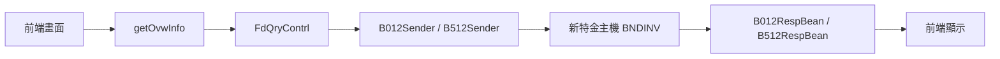

# 新企網新特金電文轉接說明

## 以海外債券餘額及損益查詢 B512 → BNDINV 為例

---

# 功能介紹

本功能為「海外債券餘額及損益查詢」，主要透過 `/getOvwInfo` 查詢海外債券相關資料。

---

# 前端如何找到後端流程

## Step 1：前端操作功能

於前端畫面操作「海外債券餘額及損益查詢」。

## Step 2：透過 F12 Network 找 API

於瀏覽器 F12 → Network 中，可找到：

```text
/getOvwInfo
```


## Step 3：找到對應 Controller

搜尋 `/getOvwInfo`，可找到：

```text
FdQryContrl
```

---

# 系統流程概觀



---

# Controller


## 說明

1. Controller 先取得 `FUND_FLAG`，此參數用來判斷後續 Sender 是否走新特金流程。
2. 透過 `UserUtil` 取得公司統編與公司 Key。
3. 透過 `CommonUtils.getDbuobu()` 判斷該公司屬於 DBU 或 OBU。
4. 若為 OBU，呼叫 `B512Sender`；若為 DBU，呼叫 `B012Sender`。
5. Sender 回傳 `B512RespBean / B012RespBean` 後，Controller 會檢查交易狀態。
6. 最後透過 `getGetOvwInfoContent()` 將資料整理成前端需要的 `recordList / recordSumList`。


```text
接收前端查詢
    ↓
取得 FUND_FLAG、公司統編、DBU/OBU
    ↓
決定呼叫 B012Sender 或 B512Sender
    ↓
整理 Response Bean
    ↓
回傳前端顯示資料
```

---


# Sender


## 說明
1. `B512Sender.send()` 先建立原本舊電文格式的 `B512ReqBean`。
2. 接著依 `FUND_FLAG` 判斷後續流程：
   - `FUND_FLAG = Y`：走新特金 BNDINV。
   - `FUND_FLAG != Y`：走舊系統 cnb3ws B512。
3. 若走新特金，Sender 會將 `B512ReqBean` 轉成 `BNDINVReqBean`。
4. 接著補上新特金必要的 `Params.Head`，例如 `DbuObu`、`MsgId`、`ChannelId`、`DtaCrtIP`、`Pid`。
5. 透過 `Cnb3Util.getcnb3EtfHttp()` 呼叫新特金 BNDINV API。
6. 新特金回傳後，Sender 會解密 `responseData`，並轉成 `BNDINVRespBean`。
7. 最後再將 `BNDINVRespBean` 轉回 `B512RespBean`，回傳給 Controller。

```text
建立 B512ReqBean
    ↓
判斷 FUND_FLAG
    ↓
Y：B512ReqBean → BNDINVReqBean → 新特金 BNDINV → BNDINVRespBean → B512RespBean
    ↓
N：B512ReqBean → 舊 cnb3ws B512 → B512RespBean
```

---

# 如何將舊電文轉接成新特金 (以B512/BNDINV為例)
## 架構說明

cnb3-client 透過 B012/B512Sender 發送電文並取得 Response Bean。 
Sender 內部依 FUND_FLAG 判斷新舊流程，走新特金時透過 Cnb3Util 呼叫 BNDINV API。


```text
Controller/Service (@Autowired B512Sender)
    ↓ b512Sender.send(...)

B512Sender
    ↓ 建立 B512ReqBean
    ↓ 判斷 FUND_FLAG
        ↓ Y（新特金）
            ↓ BNDINVReqBean
            ↓ cnb3Util.getcnb3EtfHttp(...)
            ↓ HTTP POST → /cnb3etf/api/fund

        ↓ N（舊系統）
            ↓ 呼叫 cnb3ws B512

新特金主機（BNDINV API）
    ↓ 回傳 TeleEtfRespBean

B512Sender
    ↓ responseData decode / 解壓
    ↓ JSON → BNDINVRespBean
    ↓ 轉回 B512RespBean

B512RespBean（回傳）
```
---

## 步驟一：建立 RequestBean

### 路徑

```text
cnb3-telegram-jar/src/main/java/com/bankpro/tele/bean/fundreq/BNDINVReqBean.java
```

### 說明

建立新特金 BNDINV 上行 Request Bean。


### 範例程式

```java
/**
 * BNDINV (B012) - 債券餘額及損益查詢 (Request)
 */
public class BNDINVReqBean extends EtfRequestBeanBase {

	/** 功能代碼 */
	public static final String TXN_TYPE = "BNDINV";
	private static final long serialVersionUID = 5464202829674809086L;

	@JsonProperty(value = "CustPermId")
	private String custPermId;// 身份證字號

	@JsonProperty(value = "PrdCtg")
	private String prdCtg;    // 產品種類 02-債券
	
	public BNDINVReqBean() {}
	
	public BNDINVReqBean(final B012ReqBean b012) {
		this.setCustPermId(Cnb3etfUtils.toValue(b012.getCUSIDN()));// 身份證字號
		this.setPrdCtg("02");                                      // 產品種類
	}
	
	public BNDINVReqBean(final B512ReqBean b512) {
		this.setCustPermId(Cnb3etfUtils.toValue(b512.getCUSIDN()));// 身份證字號
		this.setPrdCtg("02");                                      // 產品種類
	}
	
	/**
	 * 身份證字號
	 */
	public String getCustPermId() {
		return this.custPermId;
	}

	/**
	 * @param custPermId - 身份證字號
	 */
	public void setCustPermId(String custPermId) {
		this.custPermId = custPermId;
	}

	/**
	 * 產品種類 02-債券
	 */
	public String getPrdCtg() {
		return this.prdCtg;
	}

	/**
	 * @param prdCtg - 產品種類 02-債券
	 */
	public void setPrdCtg(String prdCtg) {
		this.prdCtg = prdCtg;
	}
}

```

---

## 步驟二：建立 ResponseBean

### 路徑

```text
cnb3-telegram-jar/src/main/java/com/bankpro/tele/bean/fundresp/BNDINVRespBean.java
```

### 說明

建立新特金 BNDINV 下行 Response Bean。


### 範例程式

```java

/**
 * BNDINV (B012, B512) - 債券餘額及損益查詢 (Response)
 */
public class BNDINVRespBean extends EtfResponseBeanBase {
    
	private static final long serialVersionUID = 3122962690717369591L;
	@JsonProperty(value = "CustPermId")
	private String custPermId;// 身份證字號
	@JsonProperty(value = "Data")
	private BNDINVResponseData data;

	/**
	 * 身份證字號
	 */
	public String getCustPermId() {
		return this.custPermId;
	}
	/**
	 * @param custPermId - 身份證字號
	 */
	public void setCustPermId(String custPermId) {
		this.custPermId = custPermId;
	}

	public BNDINVResponseData getData() {
		return this.data;
	}
	public void setData(BNDINVResponseData data) {
		this.data = data;
	}

	@Override
	public JSONObject toJSONObject() {
		BNDINVResponseData respData = this.getData();
		JSONObject data = new JSONObject();
		List<JSONObject> respDataList = new ArrayList<>();// Record + RecordCurr
		
		// B012RespBean, B512RespBean
		if (respData.getRecord() != null && respData.getRecord().size() > 0) {
			for (BNDINVResponseRecord record : respData.getRecord()) {
				JSONObject recordData = new JSONObject();
				
				// O01 ~ O20 先給預設值
				for (int o = 0; o < 20; o++)
					recordData.put("O".concat(StringUtils.leftPad(String.valueOf((o + 1)), 2, Cnb3etfUtils.ZERO)), Cnb3etfUtils.EMPTY);
				// 放值 (1.債券)
				recordData.put("O18", "1");                                                                        // 1.債券
				recordData.put("O01", Cnb3etfUtils.toSocketStr(record.getFundSN()));                               // 委託單號
				recordData.put("O02", Cnb3etfUtils.toSocketStr(record.getFundCode()));                             // 商品代號
				...
				respDataList.add(recordData);
			}
		}
		
		// RecordCurr
		if (respData.getRecordCurr() != null && respData.getRecordCurr().size() > 0) {
			for (BNDINVResponseRecordCurr recordCurr : respData.getRecordCurr()) {
				JSONObject recordCurrData = new JSONObject();
				
				// O01 ~ O20 先給預設值
				for (int o = 0; o < 20; o++)
					recordCurrData.put("O".concat(StringUtils.leftPad(String.valueOf((o + 1)), 2, Cnb3etfUtils.ZERO)), Cnb3etfUtils.EMPTY);
				// 放值 (2.幣別)
				recordCurrData.put("O18", "2");                                                                                // 2.幣別
				recordCurrData.put("O08", Cnb3etfUtils.toSocketStr(recordCurr.getCurr()));                                     // 信託幣別
				recordCurrData.put("O07", Cnb3etfUtils.toSocketStr(recordCurr.getAmt(), 2));                                   // 總信託金額
				...
				respDataList.add(recordCurrData);
			}
		}
		
		// 參數值
		data.put("CUSIDN", Cnb3etfUtils.toSocketStr(this.getCustPermId()));// 身份證字號
		data.put("ARRAY", respDataList);
		
		// 共用回傳值
		data.put("TOTRECNO", this.getRespRecordCount());        // 資料筆數
		data.put("TOA_Response_Code", this.getRespStatusCode());// 交易結果代號
		return data;
	}
}

```

---

## 步驟三：Sender 修改

### 路徑

```text
cnb3-telegram-jar/src/main/java/com/bankpro/tele/service/bsend/B512Sender.java
```

### 功能說明

Sender 為新舊特金轉接核心。

主要負責：

- 依 `FUND_FLAG` 判斷走新特金或舊系統
- 將 `B512ReqBean` 轉成 `BNDINVReqBean`
- 補上新特金 Header
- 呼叫 `cnb3Util.getcnb3EtfHttp()`
- 處理 cnb3etf 回傳內容
- 將 `BNDINVRespBean` 轉回 `B512RespBean`

### 範例程式


```java
    private B512RespBean callTelegram(final Sysparameter sysParameter,final EtfAttrs etfAttrs,final B512ReqBean b512Req) {

        // 呼叫 cnb3etf
        if (sysParameter != null && "Y".equalsIgnoreCase(sysParameter.getParametervalue()))

            return callCnb3etfTelegram(etfAttrs, b512Req);

        // 呼叫 cnb3ws
        return callCnb3wsTelegram(b512Req);
    }

    /**
     * 呼叫 cnb3etf 套件
     */
    private B512RespBean callCnb3etfTelegram(final EtfAttrs etfAttrs,final B512ReqBean b512Req) {

        BNDINVReqBean apiRequest = new BNDINVReqBean(b512Req);

        EtfRequestAmBodyParamsHead paramsHead;
        EtfResponseAm<BNDINVRespBean> apiResponse;
        BNDINVRespBean apiRespBean;
        B512RespBean respBean;
        TeleEtfRespBean apiResult;
        String apiResultJson;

        // 建立 ambody.Params.Head
        paramsHead = new EtfRequestAmBodyParamsHead();
        paramsHead.setDbuObu(etfAttrs.getDbuobu());
        paramsHead.setMsgId(etfTxnType);
        paramsHead.setChannelId("C");
        paramsHead.setDtaCrtIP(etfAttrs.getIp());
        paramsHead.setDeviceID(Cnb3etfUtils.EMPTY);
        paramsHead.setPid(Cnb3etfUtils.genAmbodyParamsHeadPid(paramsHead.getChannelId()));
        
        apiRequest.setParamsHead(paramsHead);

        // BNDINV - 債券餘額及損益查詢
        apiResult = this.cnb3Util.getcnb3EtfHttp(etfTxnType,apiRequest);

        // returnCode 9000：交易異常
        if (Cnb3etfUtils.isTransactionError(apiResult.getReturnCode())) {
            B512RespBean errTxnReqBean = new B512RespBean();
            errTxnReqBean.setOk();
            errTxnReqBean.setTOA_Response_Code(Cnb3etfUtils.toResponseCode(apiResult.getTxnStatusCode()));
            errTxnReqBean.setMessageDesc(apiResult.getReturnMessage());

            return errTxnReqBean;
        }

        // returnCode 9999：系統異常
        if (Cnb3etfUtils.isSystemError(apiResult.getReturnCode())) {
            B512RespBean errReqBean = new B512RespBean();
            errReqBean.set(false);
            errReqBean.setMessageDesc(apiResult.getReturnMessage());

            return errReqBean;
        }

        // 處理 cnb3etf 回傳內容
        apiResultJson = Cnb3etfUtils.decryptData(apiResult.getEncryptType(),apiResult.getResponseData());
        apiResponse = Cnb3etfUtils.toObject(apiResultJson,new TypeReference<EtfResponseAm<BNDINVRespBean>>() {});
        apiRespBean =apiResponse.getAmbody().getResult();

        // 若交易失敗
        if (!apiRespBean.isRespTxnSuccess()) {
            B512RespBean errReqBean = new B512RespBean();
            errReqBean.set(false);
            errReqBean.setMessageDesc(apiRespBean.getRespMessageDesc());

            return errReqBean;
        }

        // 轉換成 B512RespBean
        respBean = new B512RespBean(apiRespBean.toJSONObject());
        respBean.setMessageId(apiRespBean.getRespMessageId());
        respBean.setMessageDesc(apiRespBean.getRespMessageDesc());

        return respBean;
    }

```

---

# 結論

本次新特金改造採用「Sender 轉接模式」。

具備以下優點：

- 前端不需修改
- Controller 維持既有 B012/B512 呼叫模式
- 保留原本 B012 / B512 流程
- Sender 內部完成新舊轉換
- 降低既有系統影響範圍
- 提升新特金整合彈性