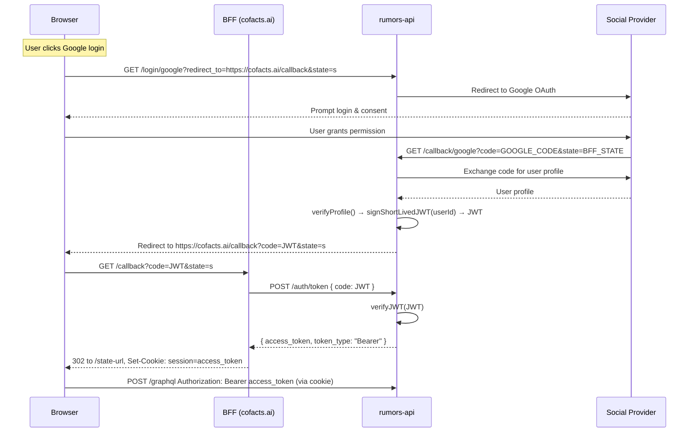
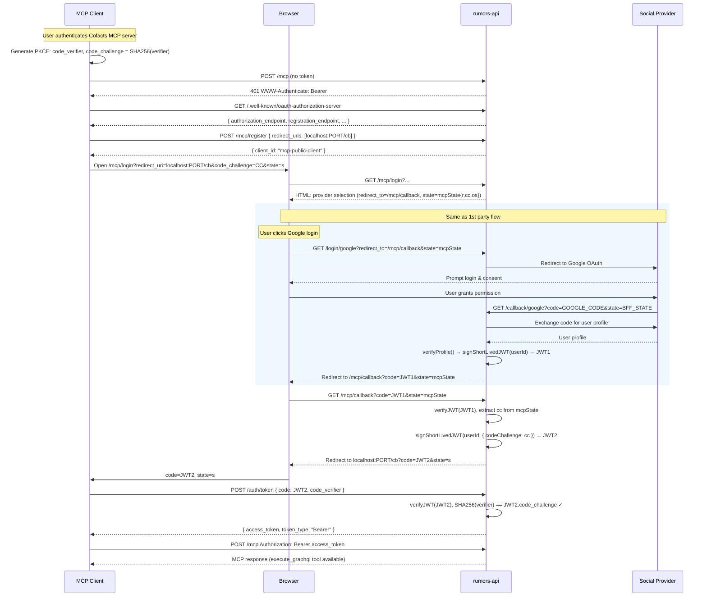

# Cofacts MCP Server — Technical Design Doc

## 1. Overview

本文說明 Cofacts MCP server 的現況與理想設計，目標 client 為：
- **Claude.ai connector**（雲端）：HTTPS redirect_uri
- **Claude Code / Cursor 等本機 agent**：loopback redirect_uri

現況實作： https://github.com/cofacts/rumors-api/pull/389

---

## 2. Auth Flow 對比

### 2-a. 1st-party flow（cofacts.ai）

cofacts.ai 採用 BFF（Backend-for-Frontend）模式，access token 存在 SSR server 端的 HttpOnly cookie，瀏覽器的 JS 層無法存取。



**關鍵特性：**
- `redirect_to` 必須在 `ALLOWED_CALLBACK_URLS` 白名單內
- 無 PKCE（信任的 1st-party server）
- Token 不暴露給 browser JS

### 2-b. MCP client flow

MCP clients 使用 OAuth 2.1 + [PKCE（RFC 7636）](https://hackmd.io/@coscup/H1Oxr0Jp9/%2F%40coscup%2FH1J24AJ69)。




**與 1st-party 的關鍵差異：**

| | 1st party | MCP |
|---|---|---|
| redirect_uri 保護 | 白名單 | PKCE（loopback 或 HTTPS） |
| token 持有者 | BFF server | MCP client process |
| `/mcp/callback` | 不走 | 作為 whitelisted 中繼站，將 code_challenge embed 進 JWT2 |
| dynamic registration | 不需要 | `/mcp/register` 是 façade，全部回傳同一個 `mcp-public-client`——因為 PKCE 已做到 per-request binding |

---

## 3. GraphQL Context for MCP Requests

MCP request 執行的 mutation 寫入 ES 文件時，`appId` / `appUserId` / `userId` 填入如下：

| Field | MCP 填入值 | 說明 |
|---|---|---|
| `appId` | `"MCP"` | `mcpServer.ts` hardcode |
| `appUserId` | JWT `sub`（social login user ID） | raw user ID |
| `userId` | 同 `appUserId`（`createOrUpdateUser` 後的 ES doc ID） | |

與 cofacts.ai 對比：

| Field | cofacts.ai 填入值 |
|---|---|
| `appId` | `"RUMORS_SITE"` 或 app 自訂 |
| `appUserId` / `userId` | 同一個 user ID，但掛在對應 appId 下 |

目前 Claude Code、claude.ai connector、Cursor 三者產出的內容在 `appId` 欄位上無法區分，均為 `"MCP"`。若未來需要追蹤來源，可在 dynamic registration 階段記錄 `client_name` 並考慮 per-client appId。

---

## 4. 理想 Tool 設計

### 現況問題

目前只有一個 `execute_graphql` tool，接受任意 GraphQL。使用者無法區分「允許查詢」與「允許寫入」，也無法在 claude.ai connector 畫面上分開設定權限。

### 提案：拆成兩個 tool

參考 Google Drive connector 的 Read-only / Write-delete 分層：

**`graphql_query`** — 對應所有 Query operation
- annotations: `{ readOnlyHint: true, idempotentHint: true }`
- handler 驗證傳入的 operation type 必須是 `query`，否則 reject

**`graphql_mutate`** — 對應所有 Mutation operation
- annotations: `{ readOnlyHint: false, destructiveHint: true }`
- handler 驗證傳入的 operation type 必須是 `mutation`，否則 reject

Operation type 驗證方式：用 `graphql` 套件的 `parse()` 解析後檢查 `OperationDefinitionNode.operation`。

```typescript
import { parse, OperationDefinitionNode } from 'graphql';

function getOperationType(src: string) {
  const doc = parse(src);
  const op = doc.definitions.find(
    (d): d is OperationDefinitionNode => d.kind === 'OperationDefinition'
  );
  return op?.operation ?? null; // 'query' | 'mutation' | 'subscription' | null
}
```

錯誤回傳範例（LLM 傳錯了）：
```
Error: graphql_query only accepts query operations.
Use graphql_mutate for mutations.
```

### 現有 Query / Mutation 清單

**Queries（→ `graphql_query`）：**
GetArticle, GetReply, GetUser, GetCategory, GetYdoc, GetBadge, ListArticles, ListReplies, ListCategories, ListArticleReplyFeedbacks, ListReplyRequests, ListBlockedUsers, ListAnalytics, ListAIResponses, ListCooccurrences, ValidateSlug

**Mutations（→ `graphql_mutate`）：**
CreateArticle, CreateMediaArticle, CreateReply, CreateAIReply, CreateArticleReply, CreateCategory, CreateArticleCategory, CreateOrUpdateReplyRequest, CreateOrUpdateArticleReplyFeedback, CreateOrUpdateArticleCategoryFeedback, CreateOrUpdateReplyRequestFeedback, CreateOrUpdateCooccurrence, UpdateArticleReplyStatus, UpdateArticleCategoryStatus, UpdateUser

### 為什麼不做「每個 operation 一個 tool」？

- 共約 32 個 operations → tool 列表過長，UI 難以使用
- Agent 本來就需要透過 introspection 探索 schema，per-operation tool 沒有額外好處
- Read/Write 兩層分割已足夠滿足「分開設定權限」的核心需求

### Structured output（`outputSchema`）

目前 `execute_graphql` 將結果 `JSON.stringify` 後塞進 `content[0].text`，client 收到的是一個 JSON string，需要再 parse 才能取用。

改用 `outputSchema` 後，handler 回傳 `structuredContent`，client 直接拿到 typed JSON object：

```typescript
server.registerTool('graphql_query', {
  description: '...',
  inputSchema: {
    query: z.string(),
    variables: z.record(z.unknown()).optional(),
    operationName: z.string().optional(),
  },
  outputSchema: {
    data: z.record(z.unknown()).optional(),
    errors: z.array(z.object({ message: z.string() })).optional(),
  },
  annotations: { readOnlyHint: true, idempotentHint: true },
}, async ({ query, variables, operationName }) => {
  // ...operation type check...
  const result = await graphql({ schema, source: query, variableValues: variables, operationName, contextValue });
  return { structuredContent: result };
});
```

好處：Claude 不需要從純文字中 parse JSON 來理解結果，可以直接存取 `data` 欄位，減少 token 使用並降低結構解析錯誤的機率。

---

## 5. 告知 AI Agent 如何正確使用 API

MCP SDK 提供以下機制：

### 5-a. Server-level `instructions`（推薦優先實作）

`McpServer` constructor 的 `options.instructions` 在 client 初始化時送達，會被納入 agent 的 context。適合放高層次的 domain knowledge：

```typescript
new McpServer({ name: 'cofacts-api', version: '1.0.0' }, {
  instructions: `
Cofacts API — 台灣事實查核協作平台。

Domain knowledge:
- Article = 使用者回報的可疑訊息。URL: cofacts.tw/article/<articleId>
- Reply = 志工撰寫的查核回應。URL: cofacts.tw/reply/<replyId>
- ArticleReply = 將 Reply 連結到 Article 的關聯（一篇 Article 可有多個 Reply）
- ReplyRequest = 其他使用者表示「我也收到這則訊息」，用於衡量文章熱門程度

使用方式：
1. 先執行 graphql_query 進行 introspection，了解 schema
2. Query 用 graphql_query；Mutation 用 graphql_mutate
`
})
```

### 5-b. Tool description

Tool description 顯示於 claude.ai connector UI，也是 agent 選擇 tool 的依據。可嵌入 domain hints：

```
Execute a read-only GraphQL query against the Cofacts API.
Run introspection first to explore the schema:
  { __schema { queryType { fields { name description } } } }
Article public URL: cofacts.tw/article/<id>
```

### 5-c. MCP Resources

`server.resource()` 可讓 agent 按需讀取靜態文件：

```typescript
// GraphQL SDL（代替讓 agent 自己打 introspection）
server.resource('graphql-schema', 'cofacts://schema',
  { mimeType: 'text/plain' },
  async () => ({ contents: [{ uri: 'cofacts://schema', text: printSchema(schema) }] })
);

// Domain guide markdown
server.resource('domain-guide', 'cofacts://guide',
  { mimeType: 'text/markdown' },
  async () => ({ contents: [{ uri: 'cofacts://guide', text: DOMAIN_GUIDE_MD }] })
);
```

注意：Resources 的 client 支援度不一。Claude Code 支援，但 claude.ai connector 目前未必主動讀取。`instructions` 較為可靠。

### 5-d. MCP Prompts

Prompts 是 server 提供的可重用 prompt template，user 或 agent 可以按名稱呼叫。在 Claude Code 裡會顯示為 slash command（例如 `/mcp__cofacts-api__search-articles`）。

由於 Cursor 和 Gemini CLI **不支援 Resources 但支援 Prompts**，Prompts 是目前跨 client 傳遞較長說明內容的較佳手段（比 Resources 更廣泛）。

Cofacts 適合的 Prompt 設計方向：

```typescript
// 1. 搜尋文章 — 引導 agent 用正確的 filter 組合
server.prompt('search-articles', { keyword: z.string() }, ({ keyword }) => ({
  messages: [{
    role: 'user',
    content: { type: 'text', text:
      `Search Cofacts articles about "${keyword}".
       Use graphql_query with ListArticles, filter by articleReplyCount > 0 to focus on fact-checked content.
       Article URL format: cofacts.tw/article/<id>`
    }
  }]
}));

// 2. 查看文章的查核結果
server.prompt('fact-check-status', { articleId: z.string() }, ({ articleId }) => ({
  messages: [{
    role: 'user',
    content: { type: 'text', text:
      `Get the fact-check status of article ${articleId} (cofacts.tw/article/${articleId}).
       Use graphql_query with GetArticle to fetch articleReplies and their reply type (RUMOR/NOT_RUMOR/OPINIONATED/NOT_ARTICLE).`
    }
  }]
}));
```

Prompts 與 `instructions` 的定位差異：
- `instructions`：每次初始化都送出，適合簡短的 domain basics
- Prompts：使用者/agent 主動呼叫，適合較長的 guided workflow，不佔用每次的 context 空間


### 機制比較

| 機制 | Claude Code | Claude.ai | Cursor | Gemini CLI | Zed |
|---|:---:|:---:|:---:|:---:|:---:|
| `instructions` | ✓ | ✓ | ✓ | ✓ | — |
| Tool description / annotations | ✓ | ✓ | ✓ | ✓ | ✓ |
| **Prompts** | ✓ | ✓ | ✓ | ✓ | ✓ |
| **Resources** | ✓ | ✓ | ✗ | ✗ | ✗ |

來源：[modelcontextprotocol.io/clients](https://modelcontextprotocol.io/clients)


---

以上供大家討論。實作上優先順序建議：`graphql_query`/`graphql_mutate` 拆分 → `instructions` → tool descriptions 精修 → Resources。

