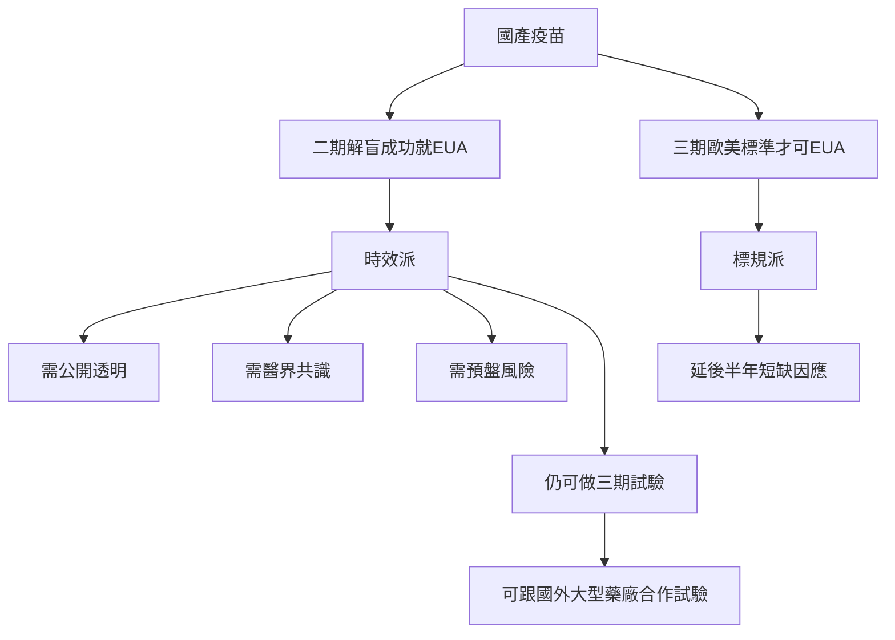

# 你知道嗎？畫圖好簡單


把灰框內這段文字，在編輯頁打下來，在 mermaid 前面打三個撇，最後也打三個撇，圖就出來。

複製貼上，直接把文字代換掉，就是你的流程圖。

```
mermaid
graph TD;
國產疫苗-->二期解盲成功就EUA;
國產疫苗-->三期歐美標準才可EUA;
二期解盲成功就EUA-->時效派;
三期歐美標準才可EUA-->標規派;
時效派-->需公開透明;
時效派-->需醫界共識;
時效派-->需預盤風險;
時效派--->仍可做三期試驗;
標規派-->延後半年短缺因應;
仍可做三期試驗-->可跟國外大型藥廠合作試驗;
```

- [你也可以點雙欄模式檢視語法跟效果](https://hackmd.io/uc-hNQ0wS22kpVyuQqiSxg?both)

## 就像這樣了：

:::success
流程圖內的舉例內容，取自網路投書 [自由開講》國產疫苗緊急授權爭議與因應路徑](https://talk.ltn.com.tw/article/breakingnews/3560344?fbclid=IwAR3dlwQc3HArXKmuzljg4y3vYod4sbE0zYQdZSzFKypPH_EtqjKBzESimiA)
:::




:bulb: 其實， TD 的意思就是由上而下，你可以試試看換成 LR ，就變成由左到右。

:point_right: 更多數學式跟圖表的世界，可以到[這裡](https://hackmd.io/s/MathJax-and-UML-tw)探索。


###### tags: `tutorials`