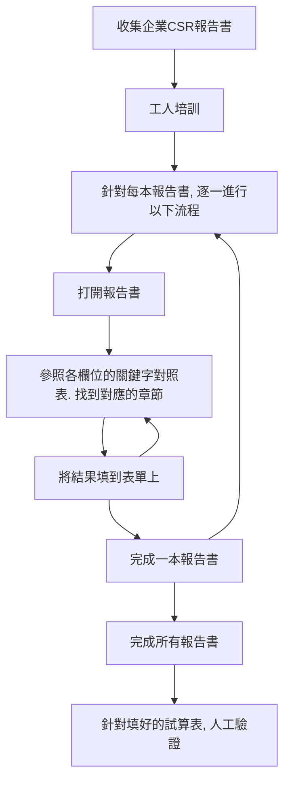

# 開放企業永續資料庫

本文以 CC-BY-4.0 授權釋出

[toc]

[📑 提案投影片](https://docs.google.com/presentation/d/1bHlMC-KmLFsiB7g-XaL-ma5KrbNB-eXPtatbhB2_klM/edit#slide=id.g22b055e8671_0_127)

## 🧑‍🏭 要解決的問題

氣候風險已在全球造成衝擊，臺灣雖已宣示淨零轉型，但企業實際的執行成效，仍缺乏廣泛、公開、結構化的資料集，以致於難以進行整體分析，也拉高了促進轉型的成本；另一方面，大眾對企業永續報告書的印象多是隱惡揚善、報喜不報憂；我們認為，永續報告書，是企業對外溝通的重要管道，我們應該要求企業，如實揭露資訊，避免報告書成為企業漂綠的工具。

使用同一套標準，依據不同產業，驗證企業的永續報告書，是我們的目標，但在過程中，會碰到以下問題：

1. **缺乏完整的公開資料**
   1. 以碳排放量為例，環保署[公開的資料](https://data.epa.gov.tw/dataset/detail/GHG_P_01)是年排放量達 25,000 噸以上的公司，僅 83 家企業。金管會今年開始公開上市櫃公司部分 ESG 資料，因此上市櫃公司範疇一、二的碳排資料有揭露，但有些碳排大戶像長春石化並非上市櫃企業，則不在金管會的資料中。且環保署管制的碳排放邊界與金管會的管制邊界不一致，使得兩個單位的公開資料也不盡相同。
   2. 光要確實掌握企業的碳排放資料就非常困難。其餘像工安事故資料則沒出現在任何政府公開資料中。
2. **缺乏統一彙整的資料集**
   1. 有公開的資料散落在政府各部會。例如空氣污染、環保違規記錄的資料在環保署；但用水量卻是在金管會；職災事故資料在勞動部。
3. **缺乏結構化的公開資料**
   1. 大多數的 ESG 相關指標都沒有在政府公開的資料集內，必須在企業自行發佈的永續報告書中查找，但報告書缺乏統一格式，程式無法直接讀取各指標的數值，不同企業使用的數據單位、詮釋方式，也或有差異，需要人工判讀，增加全面性分析企業 ESG 表現的成本。

### 我們是誰

[綠色公民行動聯盟](https://gcaa.org.tw/)的透明足跡小組，目標是數據開放、使用開放的透過環境、社會與治理數據，促進台灣的產業轉型。

我們從 [2017 開始使用企業數據](https://thaubing.gcaa.org.tw/)，從事企業轉型的倡議，並從 2021 開始建立[開放的企業 CSR 資料庫](https://thaubing-esg.gcaa.org.tw/)，目前已完成 200 餘本報告書的指標欄位資料收集，資料時間段涵蓋 2018-2020 年。目前正收集 2021 年報告書資料。

- [計畫詳細介紹](https://thaubing-esg.gcaa.org.tw/about/)
- [系列專案共筆](https://hackmd.io/@chengh/SkYHa65nO/%2FHtpqaRzEQSaw0j97MLAWyw)

**如何找到我們**

1. g0v slack 頻道 #thaubing-esg
2. g0v slack @ddio
3. 信箱： gcaa.official@gmail.com
4. Github repo: https://github.com/gcaa-org-tw/company-report-toolkit
5. Prototype: https://gcaa-org-tw.github.io/company-report-toolkit/

### 現有解法

1. 培訓讀得懂 CSR 報告書的工人，逐年度、公司，逐本 CSR 報告書進行判讀、校對
   1. 需要支出的工資與時間成本，會隨著要納入的年份、公司數，成指數成長
   2. CSR [報告書原始檔](https://drive.google.com/drive/folders/1RavfXeWt11NphnWjrhdaQ6o0NqBiapWM)、[工人智慧後的結果](https://docs.google.com/spreadsheets/d/18L_Z_TcpPXRMI8xhYWh-cxhaUY0HmcqXiOUZ8kqnBEc/edit#gid=2015097634)，以及[應用範例](https://thaubing-esg.gcaa.org.tw/net-zero/03)
2. 以公開的結構化資料、高污染產業優先整理 CSR 報告書，進行相關研究與分析

### 現有流程

1. 依照年份、產業分類，決定收集的優先順序
2. 招募工人，依照[指標設計共筆](https://docs.google.com/document/d/15AXynNNSIeXZyhxqNvrVBrDvVEkuh5XIRbnBWQsR54Q/edit)，分工判讀各報告書，並填入試算表
3. [公開試算表](https://docs.google.com/spreadsheets/d/18L_Z_TcpPXRMI8xhYWh-cxhaUY0HmcqXiOUZ8kqnBEc/edit#gid=2015097634)，方便 API [介接至其他應用](https://github.com/gcaa-org-tw/thaubing-esg/blob/main/esg-ui/tools/extractEnvironment.js)，像是 [ESG 檢測儀](https://thaubing-esg.gcaa.org.tw/net-zero/03)

## 🧑‍🏭 專案目標

1. 減少讀取、結構化永續報告書的成本，解法不限，目前有的方向：
   1. 簡化人工判讀、校對時的操作成本，像是加速報告書讀取、簡化找到關鍵字頁面的成本
      - 原型 / prototype 試玩： https://gcaa-org-tw.github.io/company-report-toolkit/
   3. 用人工智慧 / LLM ，協助判讀資料
1. 收集過往所有台灣企業的永續報告書，整理為開放資料的資料庫
   1. 先以 2018 ~ 2022 年為主（2022年份報告書預計於 2023 6月底至7月中陸續發佈）
3. 每年持續收集所有台灣企業的永續報告書，擴充開放資料庫

### 範例資料

1. 好判斷的範例報告書 - 2020
   1. 中鋼、中油、台塑化 / [報告書](https://drive.google.com/drive/folders/1N42pQ4b5VNWrVuSxii3dNWZkUSLia83o?usp=sharing) / [人工判讀結果](https://docs.google.com/spreadsheets/d/18L_Z_TcpPXRMI8xhYWh-cxhaUY0HmcqXiOUZ8kqnBEc/edit#gid=567687738)
   4. 南紡 / [報告書](https://drive.google.com/file/d/1jfk0Jc8oCNo9e4na259agb08gudeHQH6/view?usp=drive_link) / [人工判讀結果](https://docs.google.com/spreadsheets/d/1YAz2CZI3cJTmlJm4AfuaNGdSSaxqClTpCIjyy4MlPxo/edit#gid=1014283570)
1. 難判斷的範例報告書 - 2020
   1. 世紀風電 / [報告書](https://drive.google.com/file/d/1_zt9H6dAzWQdI6JOKwSWmbFXErek-Zv6/view?usp=drive_link) / [人工判讀結果](https://docs.google.com/spreadsheets/d/1jFmBLsT7ctkQ4fl-sfNrZiyJap5gIOTOeB47Ew8rFdM/edit#gid=567687738)
   2. 燁輝（鋼鐵） / [報告書](https://drive.google.com/file/d/15rlTz69Key8shnIZ6Zu-038CXe1u61HR/view?usp=drive_link) / [人工判讀結果](https://docs.google.com/spreadsheets/d/1jFmBLsT7ctkQ4fl-sfNrZiyJap5gIOTOeB47Ew8rFdM/edit#gid=567687738)

### 關於人工判讀的使用流程，以及阻礙 

1. 收集企業 CSR 報告書
   > `阻礙` 無標準下載連結，只能從 google 或[公開資訊觀測站](https://mops.twse.com.tw/mops/web/t100sb11)，找到各公司頁面，再手動下載
2. 工人培訓
   > `阻礙` 因為流程多變，每批工人，皆須走過一次人工教學，無法自助上手
   > `阻礙` 工人皆須具備夠多的專業知識，培訓成本高，無法將工作分成不同難度，由不同人執行，垂直擴張難度高
3. 針對每本報告書，針對所有欄位，逐一進行以下流程：
   1. 打開報告書
      > `阻礙` 有些報告書超大，下載費時、渲染很慢，吃電腦資源
   2. 參照對照表的關鍵字，找到對應的章節
      > `阻礙` 每個欄位的關鍵字、查法不同，除非很熟悉流程，否則每個欄位都要看一次小抄
      > `阻礙` 每本報告書寫法不同，有文字、各式圖表、表格、各廠區分開寫、不同單位、不同專有名詞
      >   - 目前會先將數值、單位分開紀錄
      >   - 也會紀錄各廠各自，以及加總的數值，以供驗證
   3. 將結果填到表單上
      > `阻礙` 目前尚無標準的資料儲存場所，是各專案（高碳排產業、<年度>x<產業別>）各自的試算表，事後較難尋找
4. 針對填好的試算表，人工驗證
   > `阻礙` 尚無有效的驗證機制，目前只能針對明顯錯誤，像是缺值、加總錯誤等，進行調整

### 關於機器判讀的可能流程

針對人工流程 3.2 ，想要使用關鍵字搜尋 + LLM ，讀出可能的數值，以作為群眾外包、事後驗證的基礎資料。

參考計畫
- [國際清算銀行(Bank of International Settlement)的蓋婭(GAIA)計畫 Project Gaia: Enabling climate risk analysis using generative AI](https://www.bis.org/about/bisih/topics/suptech_regtech/gaia.htm)，[討論串](https://www.facebook.com/veritaswan/posts/pfbid02CrGn1rhpHFGHS8pR8KGKSdvS2c8VG2QvFQ9ymuWvva5Ly23zy9uCERCY37t6DVRcl?locale=zh_TW)

## 🧑‍🏭 想要找的人

1. UX / 服務設計 - 流程改善專家，協助調整人工判讀流程
2. 資料、LLM 工程師 - PDF 機器判讀 POC
3. 群眾外包專家 - 建立大家願意參與的群眾外包流程

## 2023/07/01 大松小記

[企業永續資料收整表單](https://docs.google.com/spreadsheets/d/1LD1-aPAvOa9iFCsnCIR6a-gd9dbs2ZrtCvRP5-a4o1I/edit?usp=sharing)

目前使用&預計使用的資料
資料範疇以股票上市櫃公司為主

>[name=乾]今天除了希望找到一起協作的人，也想把資料做些更新追加。歡迎大家一起來玩資料。

>[name=Ning] 目前工項的目標是？
>[name=ddio] 讓機器人協助我們把關鍵字所在的位置抓出來，更快找到資訊。

> [name=] 企業應該也會跟能源局申報資料？
> [name=乾] 因為用電通常是營業祕密，所以能源局不會公開，而且那邊的申報資料，限能源大戶
> 

### 使用者旅程回饋

本日貢獻者： ning, ronny, zoe

1. 資料找到後，很難填
2. 搜尋，按 enter ，沒有開始搜尋
3. 資料檢索，機器人，可以做到中間
4. 人工輸入時，會把小數點，打成千分位逗號
5. PDF 只佔半個螢幕，字可能會太小
6. 人機協作旅程新發現：
   1. 不用期待機器人找到答案，但可以協助收斂答案可能出現的地方
      > 猜猜中油的「能源使用量（用電）」、「年度總用電量（度）」在哪裡？
      > 
   3. 速度更快的全文搜尋：[pdf 2 table](https://ronnywang.github.io/pdf-table-extractor/) + [pdftohtml](https://manpages.ubuntu.com/manpages/trusty/man1/pdftohtml.1.html) → 逐頁的表格化、純文字資料 → algolia 找到頁數 -> pdfjs 顯示
      1. 從人工給的關鍵字 → query expansion & prompt 迭代
2. (01st JULY quick interview)
    ESG insect user journey / 阿乾
    ## 優化可能切角 (待驗證)

- 痛點:閱讀與輸入切換|圖片辨識|驗證輸入資料是否正確

步驟:

- 資料搜尋 - 這部分時間成本太高優先序低
    - 找尋報告書下載點
- 資料理解
    - 變形檢索庫 … 推薦搜尋優先閱讀頁數
    - 檢索得到需要的資料
- 資料輸入
    - 數字
    - 單位
    - 輸入區塊圖片原典
- 資料驗證
    - within - between
        - 產出圖表協助做檢視驗證
    -https://ningja.notion.site/ESG-insect-user-journey-c374929fd2a34121be7553675a9a337f

### 推薦的工具

1. [PDF 撈表格](https://ronnywang.github.io/pdf-table-extractor/) by Ronny
   - 專門轉表格，會忽略其他內容，可接受合併儲存格，JS
2. [pdftotext](https://ubunlog.com/zh-TW/pdftotext-convierte-pdf-texto/)
   - 抽取純文字，圖片會以特定格式列出，偵測段落順序的結果較好
3. [pdftohtml](https://manpages.ubuntu.com/manpages/trusty/man1/pdftohtml.1.html)
   - 抽取文字 + 圖片，可以轉出圖檔

### 接下來

1. 七月每週五 14:00-14:30 ，線上小聚
   - 想來的人，記得先來 #thaubing-esg 打聲招呼～
3. slack channel: #thaubing-esg

---

訪談紀錄請點我：https://g0v.hackmd.io/rsJT1-ryRES39e_p9M68AQ

