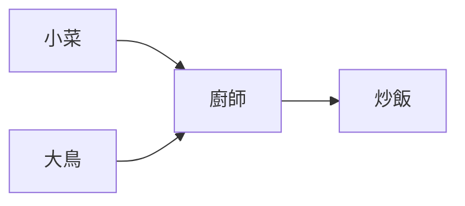
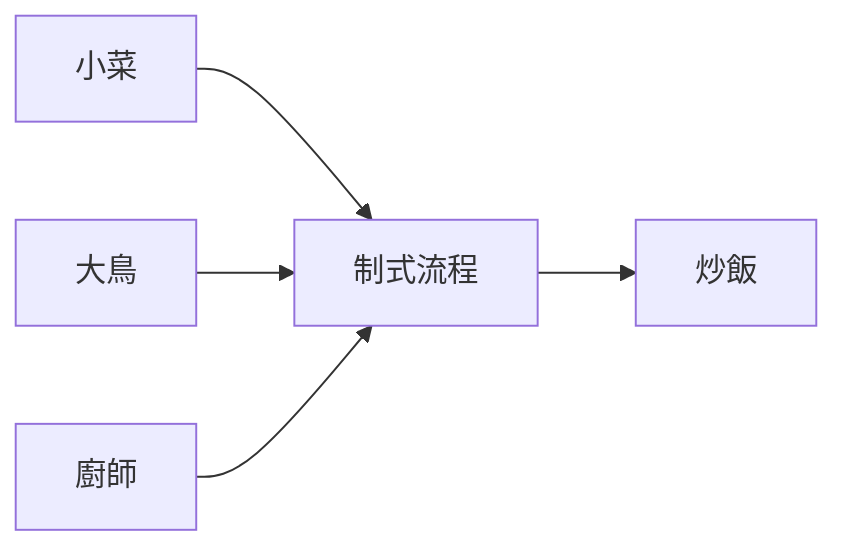

> DD技術讀書會 
> # Builder 建造者模式 
> [name=Kelly][time=Fri, July 12, 2019] [color=#907bf7]

---
<i class="fa fa-file-text"></i> 目錄：
- [Reference](#Reference)
- [導讀](#導讀)
----
## Reference

| 成員 | Reference | 語言 |
| ------ | ----------- | ----------------- |
| 成員1 |  |  |
| 成員2 |  |  |
| 成員3 |  |  |
| 成員4 |  |  |
| 成員5 |  |  |
| 成員6 |  |  |
| 成員7 |  |  |


----
## 導讀

<br>

### 情境問題
``` 
如何解決小吃攤販廚師不同，料理品質不同？
=> 大型連鎖速食店有制式的生產流程
```

<br><br><br><br><br><br>


* 回顧依賴倒轉

原本的好吃的品質取決於廚師

抽出了制式流程之後依賴就倒轉了

    
    
<br><br><br><br><br><br>
    

### 衍生問題
```
需求：畫出各式各樣身材的小人
難題：人工複製創建過程容易出錯
    ex. 小菜少畫一隻腳
=> 創建者模式
```
#### *Builder*
``` java=
abstract class PersonBuilder {
    public abstract void bulidHead();
    public abstract void bulidBody();
    public abstract void bulidArmLeft();
    public abstract void bulidArmRight();
    public abstract void bulidLegLeft();
    public abstract void bulidLegRight();
}
```

#### ConcreteBuilder
``` java=
class PersonThinBuilder extends PersonBuilder {
    @Override
    public void bulidHead() {
        ...
    }
    
    @Override
    public void bulidBody() {
        ...
    }
    
    @Override
    public void bulidArmLeft() {
        ...
    }
    
    @Override
    public void bulidArmRight() {
        ...
    }
    
    @Override
    public void bulidLegLeft() {
        ...
    }
    
    @Override
    public void bulidLegRight() {
        ...
    }
}
```
#### Director
``` java=
class PersonDirector {
    
    private PersonBuilder pb;
    public PersonDirector(PersonBuilder pb) {
        this.pb = pb;
    }
    
    public void createPerson() {
    	pb.bulidHead();
    	pb.bulidBody();
    	pb.bulidArmLeft();
    	pb.bulidArmRight();
    	pb.bulidLegLeft();
    	pb.bulidLegRight();
    }
    
    public void createNoHandsPerson() {
    	pb.bulidHead();
    	pb.bulidBody();
    	pb.bulidLegLeft();
    	pb.bulidLegRight();
    }
}
```

#### Client
``` java=
class Client {
    
    public void main() {
        PersonDirector director = new PersonDirector(new PersonThinBuilder());
        director.createPerson(); // create product
        PersonDirector director = new PersonDirector(new PersonFatBuilder());
        director.createPerson();
    }
}
```

<br><br><br><br><br><br>


* Director: 監督各種 Product 的生產流程
* *Builder*: 包含多樣性的流程
* ConcreteBuilder: 具體創建元件的細節
* Product: 能依照在 Builder 內有宣告的流程創建出來的東西


<br><br><br><br><br><br>


<br><br><br><br><br><br>

#### *Builder*
``` java=
abstract class Builder {
    public void bulidA(){} 
    public void bulidB(){}
    public void bulidC(){}
    public void bulidD(){}
    public void bulidE(){}
    public void bulidF(){}
}
```

#### ConcreteBuilders
``` java=
class HelloBuilder extends Builder {
    @Override
    public void bulidA() {
        ...
    }
    
    @Override
    public void bulidB() {
        ...
    }
}

class FooBuilder extends Builder {
    @Override
    public void bulidA() {
        ...
    }
    
    @Override
    public void bulidD() {
        ...
    }
}

class SanBuilder extends Builder {
    @Override
    public void bulidC() {
        ...
    }
    
    @Override
    public void bulidD() {
        ...
    }
}

class MagicBuilder extends Builder {
    @Override
    public void bulidA() {
        ...
    }
    @Override
    public void bulidB() {
        ...
    }
    @Override
    public void bulidC() {
        ...
    }
    @Override
    public void bulidD() {
        ...
    }
}
```
#### Director
``` java=
class Director {
    public void createMagic(Builder pb) {
    	pb.bulidA();
    	pb.bulidB();
        pb.bulidC();
        pb.bulidD();
    }
    
    public void createDarkness(Builder pb) {
        pb.bulidC();
        pb.bulidD();
        pb.bulidE();
    	pb.bulidF();
    }
}
```

#### Client
``` java=
class Client {
    
    public void main() {
        Director director = new Director();
        director.createMagic(new HelloBuilder()); // create product
        director.createMagic(new FooBuilder()); // create product
        director.createMagic(new SanBuilder()); // create product
    }
}
```

GetResult -> 可能需要用到泛型，或是一開始就需要告訴他要做什麼類型的產品。

<br><br><br><br><br><br>


> ### 最後
> ## 下週一起看看大家找到的生產者們

<br><br><br><br><br><br>

