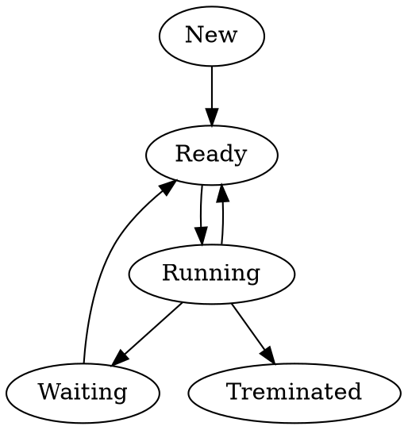
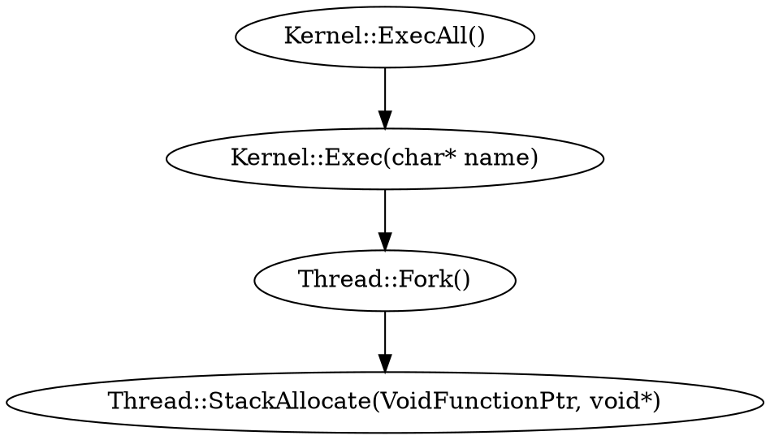

MP3 Scheduling
===

## Table of Contents

[TOC]

## Trace code

* States of processes


* New->Ready
    * Kernel::ExecAll():
    ```cpp
    for(int i = 1; i<=execfileNum; i++) {
        int a = Exec(execfile[i], priority[i]);
    }
    ```
    * Kernel::Exec(char* name): 
    ```cpp
    t[threadNum]->Fork((VoidFunctionPtr) &ForkExecute,(void *)t[threadNum]));
    ```
    * Thread::Fork(VoidFunctionPtr func, void *arg):
    ```cpp
    StackAllocate(func, arg);
    ```
    * Thread::StackAllocate(VoidFunctionPtr, void*):
    ```cpp
    #ifdef x86
        stackTop = stack + StackSize - 4;
        *(--stackTop) = (int)ThreadRoot;
        *stack = STACK_FENCEPOST;
    #endif
    // STACK_FENCEPOST = 0xdedbeef (233684719)
        machineState[PCState] = (void*)ThreadRoot;
        machineState[StartupPCState] = (void*)ThreadBegin;
        machineState[InitialPCState] = (void*)func;
        machineState[InitialArgState] = (void*)arg;
        machineState[WhenDonePCState] = (void*)ThreadFinish;
    // PCState = 7
    // StartupPCState = 3
    // InitialPCState = 0
    // InitialArgState = 1
    // WhenDonePCState = 2
    ```
    * Scheduler::ReadyToRun(Thread*):  

* Running->Ready
* 

## Implementation

* Multilevel feedback queue


static int
PendingCompare (PendingInterrupt *x, PendingInterrupt *y)
{
    if (x->when < y->when) { return -1; }
    else if (x->when > y->when) { return 1; }
    else { return 0; }
}
