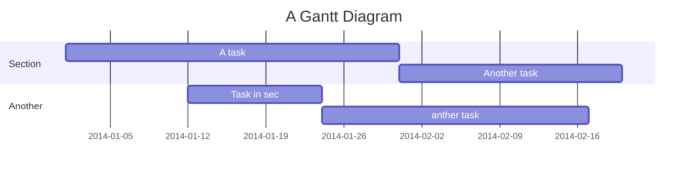

##### 機械視覺
影像拼接
===
本文章主要分享幾種方式進行影像拼接
## Table of Contents

[TOC]

## 方法一、AutoStitch: Panoramic Image Stitching
連接 : [AutoStitch: Panoramic Image Stitching](https://mattabrown.github.io/autostitch.html)

第一次我們先套用非常經典且具里程碑意義的全景圖像拼接技術的軟體。它最初是由不列顛哥倫比亞大學（UBC）的學者 Matthew Brown 和著名的 SIFT 演算法發明者 David G. Lowe 於 2003 至 2007 年間所發表。

它最初是由不列顛哥倫比亞大學（UBC）的學者 Matthew Brown 和著名的 SIFT 演算法發明者 David G. Lowe 於 2003 至 2007 年間所發表。

步驟 : 

解壓縮完打開AutoStitch.exe，就可以上傳你的照片。
注 : 給越多張樣本，匹配度越高。
## 方法二、

1. Visit hackmd.io
2. Click "Sign in"
3. Choose a way to sign in
4. Start writing note!

User story
---

```gherkin=
Feature: Guess the word

  # The first example has two steps
  Scenario: Maker starts a game
    When the Maker starts a game
    Then the Maker waits for a Breaker to join

  # The second example has three steps
  Scenario: Breaker joins a game
    Given the Maker has started a game with the word "silky"
    When the Breaker joins the Maker's game
    Then the Breaker must guess a word with 5 characters
```
> I choose a lazy person to do a hard job. Because a lazy person will find an easy way to do it. [name=Bill Gates]


```gherkin=
Feature: Shopping Cart
  As a Shopper
  I want to put items in my shopping cart
  Because I want to manage items before I check out

  Scenario: User adds item to cart
    Given I'm a logged-in User
    When I go to the Item page
    And I click "Add item to cart"
    Then the quantity of items in my cart should go up
    And my subtotal should increment
    And the warehouse inventory should decrement
```

> Read more about Gherkin here: https://docs.cucumber.io/gherkin/reference/

User flows
---
```sequence
Alice->Bob: Hello Bob, how are you?
Note right of Bob: Bob thinks
Bob-->Alice: I am good thanks!
Note left of Alice: Alice responds
Alice->Bob: Where have you been?
```

> Read more about sequence-diagrams here: http://bramp.github.io/js-sequence-diagrams/

Project Timeline
---


> Read more about mermaid here: http://mermaid-js.github.io/mermaid/

## Appendix and FAQ

:::info
**Find this document incomplete?** Leave a comment!
:::

###### tags: `Templates` `Documentation`
