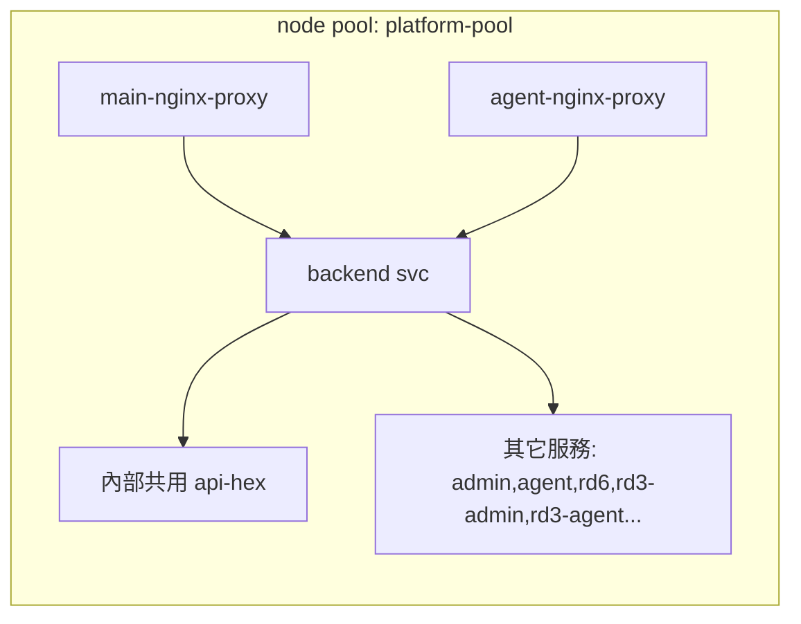
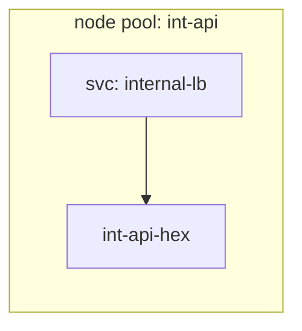
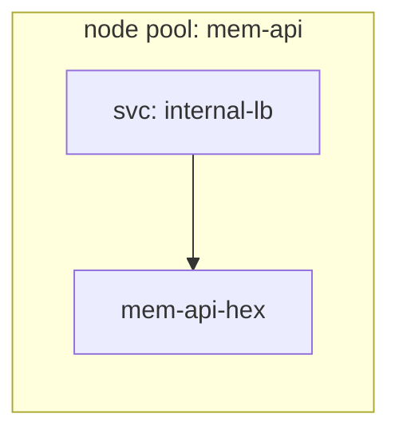
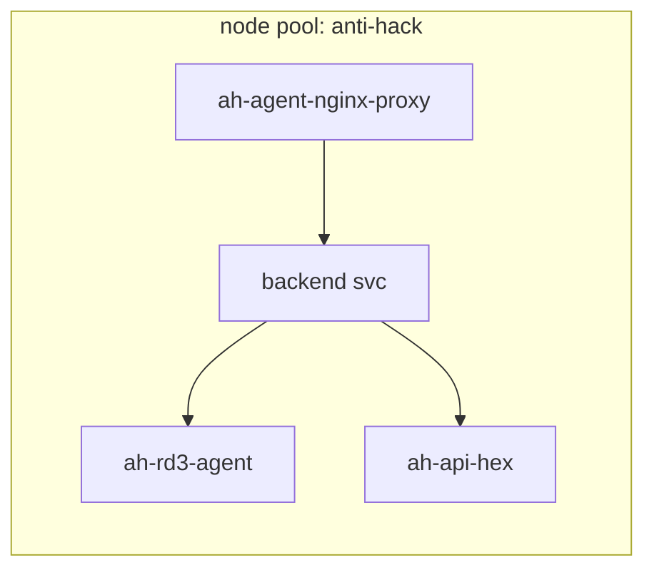

###### tags: `BBIN` `Cloud`
# 平台 BBIN Prod 雲上架構圖

```mermaid
    graph LR

    subgraph "node pool: platform-pool"
    Nginx1[main-nginx-proxy] --> Service[backend svc]
    Nginx2[agent-nginx-proxy] --> Service
    Service --> App1[內部共用 api-hex]
    Service --> App2[其它服務: admin,agent,rd6,rd3-admin,rd3-agent...]
    end
```

```mermaid
    graph LR

    subgraph "node pool: int-api"
    LoadBalance[svc: internal-lb]
    LoadBalance --> App1[int-api-hex]
    end
```

```mermaid
    graph LR

    subgraph "node pool: mem-api"
    LoadBalance[svc: internal-lb]
    LoadBalance --> App1[mem-api-hex]
    end
```

```mermaid
    graph LR

    subgraph "node pool: anti-hack"
    Nginx1[ah-agent-nginx-proxy] --> Service[backend svc]
    Service --> App1[ah-rd3-agent]
    Service --> App2[ah-api-hex]
    end
```