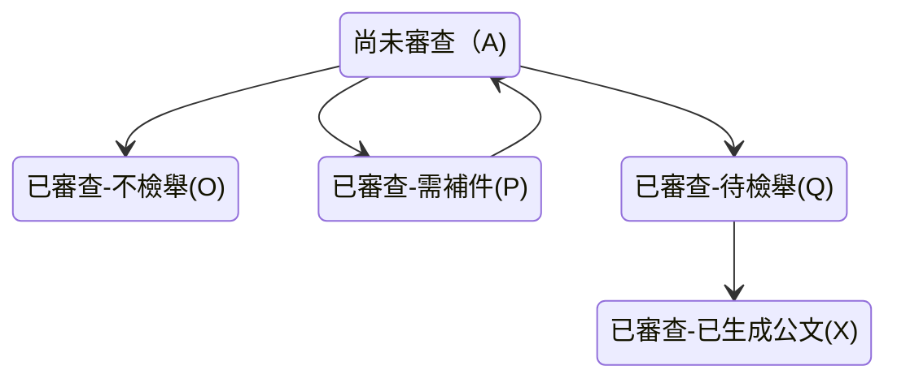
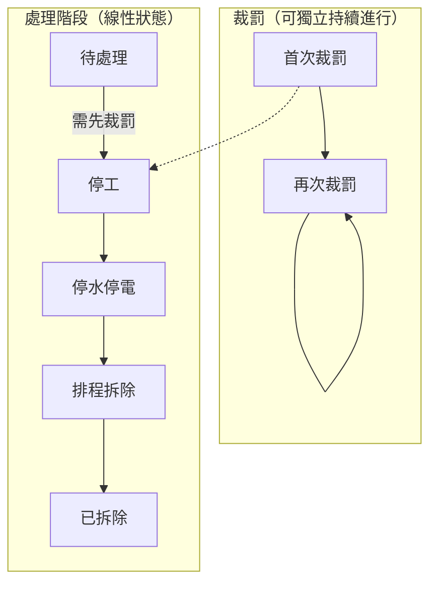

# 違章工廠回報系統_第194次小聚

###### tags: `Disfactory` `違章工廠` `違章工廠舉報系統`

時間：20250416 19:30 (GMT+8)
地點：地球公民基金會
線上：https://meet.google.com/coc-vuaa-ykz
小聚共筆：https://g0v.hackmd.io/UPcHStg9RF6R8K7MiMFyKA

新提案：再裁罰的回報相關的小聚共筆
- 違章工廠回報系統第192次小聚 20250305
- 違章工廠回報系統第193次小聚 20250402

:::info
文件目錄
[TOC]
:::

## 參與者簽到
實體:
oriyar, pei, SL, yukai, yellowsoar, kennyluck, chewei

線上：
ael


---
## 跟新參者介紹 Disfactory

簡報連結：[]


---

# [disfactory新提案](https://www.canva.com/design/DAGg17NISDA/zIM6iFSHSs5SH9HK-VftQw/view?utm_content=DAGg17NISDA&utm_campaign=designshare&utm_medium=link2&utm_source=uniquelinks&utlId=h49962145f6)


**Challenge**: 非工廠（倉庫）已被裁罰的，需要有人去確認，讓連續裁罰的機制動起來（上圖右下角），在罰金壓力下才會做出改變恢復農用。

peii:
- 想要讓民眾協助確認被裁罰的農地上倉儲是否已經改善
- 讓未改善的裁罰動起來
- 也許可以用尋找寶藏的方式？
- 


裁罰紀錄：來自國土署的 single source data
違反非都市土地使用管制案件查處情形表
- 按照地號
- 目前只有流水號，還沒有專屬編號


## 上次會議後討論的 TO DO 

資料
- 整理資料（土地資料查處名單）
- 與國土署溝通資料現有問題
    - 資料內還是有不少案件「歷次查處情形」沒有標示日期
    - 例如有寫 109 年排拆，但沒有後面的內容，今年已 114 年了

設計
- 調整現有平台設計
- 使用者測試調整後平台設計
- 設計 campaign 頁

> ael: 建議還是跟使用者聊過確定現場回報需求再設計

開發
- 前端調整現有平台設計
- 前端開發 campaign 頁
- 後端整理資料至DB
- 串連前端後端


On GitHub

1. 要跟政府討論的資料問題 @peii @swind @yellowsoar 
2. 設計要盤點 status filter 和需要哪些資料狀態 @SL @peii https://github.com/Disfactory/Disfactory/issues/655
3. 前端想升級的東西: 修 production deploy @yukaii  https://github.com/Disfactory/frontend/issues/183

## 本次小聚紀錄


### 考古目前各種回報狀態的資料欄位


最原始後台 admin page 資料欄位設計：
https://github.com/Disfactory/Disfactory/issues/268


factory_status:
https://github.com/Disfactory/Disfactory/issues/527

cet_review_status:


cet next tag:

gov_status:
https://github.com/Disfactory/Disfactory/issues/389

display_status: https://github.com/Disfactory/Disfactory/pull/410


### 白板整理相關裁罰關係






違章工廠的處理順序

```py
cet_review_status_list = [
    ("A", "尚未審查"),
    ("O", "已審查-不檢舉"),
    ("P", "已審查-需補件"),
    ("Q", "已審查-待檢舉"),
    ("X", "已審查-已生成公文"),
]
```

- 待處理
- 裁罰（可連續裁罰）
- 停工
- 停水停電
- 排程拆除
- 已拆除


小結：連續金錢裁罰（地政或是都發）跟排拆（建管單位）是分開的流程，可以分開記 `status`

但是連續裁罰的時間要怎麼記錄呢？
需要整理到：https://github.com/Disfactory/Disfactory/issues/655


### 目前用政府公開資料遇到的問題

1. 希望每個案件都有獨立編號
2. 有些資料有缺漏
3. 歷次查處情形也怪怪的

連續再裁罰相關的有哪些資料呢？ => 只有一份
https://github.com/Disfactory/Disfactory/issues/656

### 攝影計畫？

等攝影師來聯繫 ~