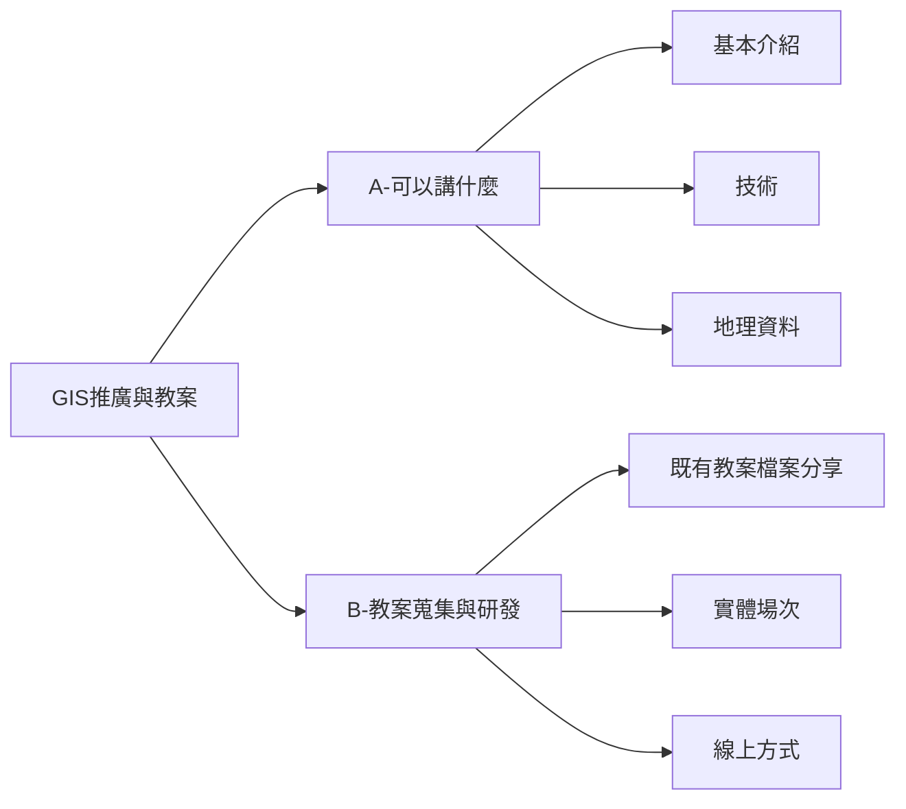

# GIS 推廣與教案

:::warning
文件目錄
[TOC]
:::

## 可以講什麼？

### (1)基本介紹

* 資料視覺化 Data Visualization，從「訊息傳達與溝通」的角度，認識地理資料的角色，了解資料展示與分析工具，建立地理資料服務基本觀念。[8 Free Tools to Make Interactive Data Visualizations in 2021 — No Coding Required](https://www.facebook.com/1144302764/posts/10223874410305206/)
* "The Science of Where" Esri 的標語

地理資料與應用 GIS
* 地理資料介紹 (一) 地理資料的基本屬性 
    * 如何描述位置？
        * 位置：經緯度與座標
            * [TWD97](
https://www.facebook.com/story.php?story_fbid=pfbid036xoBAnv3m9J8aAaSoM4CUnm9hRvcr7Y9pDhnirufcMmwZHx3QakbhE9yosrZpoeol&id=100011888567849)
        * 行政類：地址、地號
    * 電腦看得懂的地理資料類型
        * 向量的點線面
        * 圖片影像，也可以給予地理定位
            * 案例：水保局歷史照片定位 https://g0v.hackmd.io/nPAAuUkSSlKRlgeCcK5v3Q
    * 資料的主控權狀態，也可以區分為
        * Raw Data
        * Web Map Tile Service = WMTS
            * 案例：百年歷史地圖
        * Application Programming Interface = API
            * 案例：公車動態
        * 線上圖臺
            * 案例：國土規劃地理資訊圖臺 http://nsp.tcd.gov.tw/ngis/
* 地理資料介紹 (二) 當代的地理圖資類型
    * 測量成果：數值地形圖
    * 航測與遙測：航測圖、DTM、DSM、光達
    * BIM 與 LOD (Level of Detail)
* 地理資料介紹 (三) 應用案例：公民科技專案
    * 什麼是空間分析？
        * http://excel2earth.blogspot.com/
    * 相異圖資套疊分析：
    * 群眾協作類：
        * iNaturalist 物種與生態研究
            * https://fangyeelin.wixsite.com/fishfish/inaturalist
        * 農地違章工廠舉報
            * https://about.disfactory.tw/
        * 群眾標註
            * https://commutag.agawork.tw/
    * 立體視角：
        * 原住民族傳統領域繪製
* 地理資料介紹 (三) 應用案例：商用服務
    * 位置查詢與導航計算：
        * 導航
    * ＯＯＯＯＯＯ
        * 

### (2)技術

* 常見格式與簡稱
    * csv
    * shp
    * kml
    * geojson
    * wms
    * api

* 常用工具
    * 地址轉經緯度
        * https://g0v.hackmd.io/i6MO2ddVQ8iMy1jSp9vVog
    * 座標轉換
        * 線上工具，Google 搜尋可查到各機構提供的轉換工具
        * GIS 軟體內進行轉換
    * 地理資料格式轉換
        * geojson.io

* 學習路徑：non-coder / 軟體服務使用者
    * 線上地圖 - 自建主題地圖
        * GoogleMyMap
        * Awosome Table
            * 可以即時呈現 Spreadsheet 的資料
        * umap
            * 可以連動呈現 OpenStreetMap 的資料
        * TGOS 協作地圖
        * Carto
            * 已知可以用數值大小，例如[街景綠視率分佈](https://www.facebook.com/groups/573697330058183/permalink/710552026372712/)
    * 立體視角
        * Google Earth
            * https://www.google.com/earth/outreach/tools/
            * [學習資源共筆](https://g0v.hackmd.io/O6NC1bKvQeGKXLiELbepKQ)
                * 進入軟體後，手動在側欄左下角打開地形圖層
    * GIS 軟體
        * QGIS
            * 發問社團：QGIS 小學堂 https://www.facebook.com/groups/600385406707053/
            * 線上資源：
                * [林務局拆解 QGIS 各類操作的線上教育訓練](https://qgislearn.forest.gov.tw/tranning.html)
                * [暑輔作業-QGIS 製圖步驟-](https://www.facebook.com/groups/LASSnet/permalink/2975617432688847/)
                * [LASS-QGIS 一起學](https://paper.dropbox.com/doc/LASS-QGIS--BDTXJJgBEQTsedxGCRfSnpNIAg-3lyvRxyCVjVrTYinOK37R)
                * [鍾明光：用 QGIS 玩開放資料](https://paper.dropbox.com/doc/LASS-QGIS--BDTXJJgBEQTsedxGCRfSnpNIAg-3lyvRxyCVjVrTYinOK37R#:uid=149319079831330817457577&h2=%E7%94%A8-QGIS-%E7%8E%A9%E9%96%8B%E6%94%BE%E8%B3%87%E6%96%99)
                * [林政道：用 QGIS 分析開放資料](https://paper.dropbox.com/doc/LASS-QGIS--BDTXJJgBEQTsedxGCRfSnpNIAg-3lyvRxyCVjVrTYinOK37R#:uid=522540135289108586865422&h2=%E7%94%A8-QGIS-%E5%88%86%E6%9E%90%E9%96%8B%E6%94%BE%E8%B3%87%E6%96%99)
                * [QGIS及Open Geodata資源網@Sinica-中央研究院人社中心地理資訊科學研究專題中心](http://gis.rchss.sinica.edu.tw/qgis/)
            * 實體書
                * 肥貓> 謝惠紅（2015）。地理資訊系統：Quantum GIS實作範例。台北：華都。這是QGIS操作很好的入門書。
                * 肥貓> 石計生、黃映翎（2017）。當代Q地理資訊系統：從人文社會到大數據。台北：雙葉。這本偏向學術類的應用，主要是針對大專院校的社會科學院學生和研究人員，但是內附有一些很好的資料索引。
    * CAD 軟體
        * FreeCAD https://www.facebook.com/groups/2387467934876840
    * 遙測影像
        * https://lines.chromeexperiments.com/
            * 搭配 https://g0v.hackmd.io/@chewei/fractal-taiwan/
        * [遙測影像資料應用及影像處理軟體實作](https://www.nspo.narl.org.tw/activity_view.php?c=21011102)
        * [應用連結論於全球導航衛星系統課程的教學設計](https://www.facebook.com/889701534373509/posts/3993078334035798/)
        * [「空間資訊與智慧生活」是逢甲大學推出的第一門磨課師課程，由逢甲大學地理資訊中心周天穎教授主講](https://www.youtube.com/watch?v=QJTHWd-X8cs&list=PLahfBIy1gOGzYkZoFF9Mqi_a3L1-QFj-y)
    * 其他
        * https://www.playpcesor.com/2022/11/felt.html
    * 台大地理營營隊 https://www.facebook.com/ntugeogcamp
    * https://youtube.com/playlist?list=PLm62a5fQIxdmHfAqL5udfeqiDA4tGWfvo
    * https://youtu.be/ghRtFSZbC3s
    * https://youtu.be/z9aTDzJQuFE
    * https://youtube.com/playlist?list=PLbIMOcrWc6uSSD6-9NaCoeqf3pcpn5Dwu
    * https://gisarchihistories.blogspot.com/

* 學習路徑：coder
    * [寫程式處理地理資料、圖臺開發](https://g0v.hackmd.io/HLyJ6GN5ToK_e9x3ok4WCw)

### (3)地理資料

* 已公開資料，正面列舉
    * 查詢平台
        * 政府資料平台 https://data.gov.tw/
            * 例如 [直轄市、縣市界線(TWD97經緯度)](https://data.gov.tw/dataset/7442)、[內政部20公尺網格數值地形模型資料](https://data.gov.tw/dataset/35430)
        * [OpenStreetMap 地理資料庫拉出你要的資料](https://osmtw.hackpad.tw/-OpenStreetMap-VnjVOhWBZuO)
        * [社會經濟統計地理資料](https://segis.moi.gov.tw/stat/Web/Portal/STAT_PortalHome.aspx)
        * 其他來源：https://ppt.cc/fhfAVx
    * 諮詢社團
        * [OpenData / Taiwan 國內關注開放資料的民間社團](https://www.facebook.com/groups/odtwn)
        * [一日資料申請小幫手](https://www.facebook.com/groups/2819127468115692/)
* 群眾外包類主題
    * 參加並貢獻資料
        * OpenStreetMap 社群，以地貌與設施資料為主
    * 籌劃新的群眾協作的主題
        * 建立協作表格，不透過地圖進行標註
            * 關鍵在於採用哪一種地理定位方式，經緯度，地址，地號等
        * 建立協作地圖，直接在地圖上標註
            * 選擇使用既有線上服務，例如 Google My Map, umap, OpenStreetMap(須先檢視該協作資料主題內容符合 OSM 收錄範疇)
            * 選擇自架
* 可練習資料
    * 「18-20 投票人口分佈地圖」，找 18 ~ 20 之間的年輕人分佈圖，了解 18-20 投票人口分佈
        * 大致操作步驟
            * (1) 下載資料，接著使用 excel 或 spreadsheet 整理好「村里 18~20 歲人口」csv
                * [村里戶數、單一年齡人口（新增區域代碼）](https://data.gov.tw/dataset/77132)
            * (2) 查找並下載「村里 polygon」
                * [台灣 TopoJSON](https://www.facebook.com/600787145/posts/10159095205667146/)
            * (3) 將 polygon 與 人口 csv 兩者對起來，得到 gis 檔案
                * ronny 開發的 github helper 
                * [merge 網頁工具](https://funkeinteraktiv.github.io/geo-data-merger/)
                * 兩份檔案都有「村里代碼」，例如 高雄市林園區中門里 64000130006
                * 取得 Geojson 檔案
            * (4) 選擇 Carto 呈現 (Google My Map 可以用於美食地圖的點資料操作過程)，Carto 應該會有一些資料視覺化選項可以操作，待確認
            * note: 
                * 這部分也可以接續介紹 API，https://data.gov.tw/dataset/77132
                * 步驟 (3)，人口與村里輪廓，可以用網頁 merge https://funkeinteraktiv.github.io/geo-data-merger/
                    * 兩邊檔案都有「村里代碼」，例如 高雄市林園區中門里 64000130006
                * 步驟 (4)，也可能可以用 Plotdb https://plotdb.com/
        

* 查找資料、詢問資料
    * 學習單模式，運用 spreadsheet 共筆
        * 每個人都可以完成特定檔案格式的開放資料，資料集名稱+資料集網址
            * 任務項目：特定格式 shp、...等，
            * chewei> 想用 sheet2site 把大家查好的內容，呈現為前端做展示，提供格式類型標籤
        * 如果發現政府沒有提供某個資料集，可以提問，並採取「資料申請小幫手」來申請

### (4) 有趣的輔助解說內容蒐集
* 學測：[學科能力測驗，社會科第38、39題的題幹出現了#苑裡溪 截彎取直的題目，使用臺灣堡圖](https://www.facebook.com/1856840744613135/posts/2562590094038193/)
* 111年 #大學分科測驗 #地理科，把 #全聯 和 #便利商店 的 #商品圈範圍 納入考題🏪，其中第42題假設若便利商店增加販售的種類要吸引更多客群，其商圈範圍將會擴大，此推論是錯的原因❓
    * https://www.facebook.com/130017733712220/posts/pfbid02qeeETdCRigJnFUR4RDTR8eu4cnEe8gLwu4aniC5NEwGScVGL3514UAb9vQDYfoQQl/
* 109年指考地理考科，以口罩地圖作為出題內容，詢問 GIS 分析功能
    * https://www.facebook.com/photo.php?fbid=10216372993668431&set=p.10216372993668431&type=3
* 實際的國家大小比較，網頁工具
    * https://www.thetruesize.com/

其他
* https://drive.google.com/drive/folders/1m9WeS7mEiZvCp-0IupHhnBfp9_SzdprO
* 談「高中生物科目，探索實作作業」
    * https://www.facebook.com/1783854987/posts/10214929414267213/
* 談「程式學習」
    * https://youtu.be/zo03SaX9odk
* CNS 15683 「地理點位置之座標標準表示法」標準
    * https://www.bsmi.gov.tw/wSite/fp?xItem=49355&ctNode=1963&mp=1
* 如何建立自己的知識系統
    * ooo
* 各種地圖投影介紹、使用語法及樣張
    * https://proj.org/operations/projections/
    * 鄭和下西洋長卷軸方式：https://zhenghe.rslc.us/
* https://www.facebook.com/groups/718089658359103/permalink/2000939216740801/
* https://www.facebook.com/106989324226195/posts/248568236734969/
* 社會領域地理科戶外教育的實踐方法
    * https://www.facebook.com/permalink.php?story_fbid=10220699305135936&id=1335556088
* 臺灣分層著色地圖工具 by Hsieh M.F. 
    * https://stats-finder.tw/cg/
    * 只要有個符合格式的 google sheets 資料表，把分享連結餵給上面那個網站，就可以自動產出分層著色地圖。
    * https://g0v.hackmd.io/2YHe5O9FSZejIQ4LGMjC-w?view
* 熱點地圖產生器 by Hsieh M.F. 
    * https://stats-finder.tw/hm/
    * https://g0v.hackmd.io/a1SJ2Wg5TaukMX0I0HLI4w?view
* Gis 教材：地圖難民遷移
    * https://www.facebook.com/100048134156943/posts/479194217028379/
* 國泰金融創新關鍵勢 Podcast 第三季，主題介紹 GIS 結合空間資料與AI、機器學習等應用案例，結合地理空間圖層分析
    * https://www.facebook.com/groups/datasciencemeetup/posts/5357536747669274/
* River Runner Globe https://www.facebook.com/130017733712220/posts/pfbid035XjTXvsNE1sNrUdFatbj4YJMoere7a2uR83us99Ax7VCxJUD95fDMJ9Esukh91X1l/
- PrettyMaps，只要輸入地址或者坐標，選定其中一個配色主題，就可以輕鬆產製出很有質感和品味的地圖
    - https://www.facebook.com/RiChiTech/posts/pfbid029WrPUnRT4N2FRUu6eqmdS8eprjtx1jaevmEU2izoaoqkVm4hVS2CFgdRenZ5XqqGl

# 教案 (1)蒐集 (2)研發

## 教案蒐集

- 十二年國民基本教育社會領域地理課程的探究實踐方法
    - https://www.facebook.com/permalink.php?story_fbid=pfbid02ZWNJtLJLMGNNEKKkbUtgtcuZgZUZ7jUe3yVQpuPDYBxN7jDCEHcjzMM3hDKHEyHl&id=1335556088
- 東華大學環境學院，地理資訊科學 開放式課程
    - http://opencourse.ndhu.edu.tw/course/view.php?id=5
- 酷客雲
    - 2018 高中地理 地理資料的處理-向量與網格模式 https://youtu.be/4lzilKtSC08
    - 2018 高中地理 GIS的分析與應用 https://youtu.be/MF4DuMD8Hyw
    - 2018 高中地理 臺灣橫麥卡托二度分帶座標系統 https://youtu.be/xwHXZ2VH1tM
    - 2018 高中地理 地圖投影原理 https://youtu.be/p7GoHsywS7Q
- [地理資訊系統概論 - 地理資訊科學研究專題中心](http://gis.rchss.sinica.edu.tw/HGIS_Class_2009/wp-content/uploads/2009/03/gis_basic.pdf)
- [Mapping for a Sustainable World by United Nations and the International Cartographic Association](https://www.un.org/geospatial/sites/www.un.org.geospatial/files/MappingforaSustainableWorld20210124.pdf)

### non-coder 
說明：著重在開放資料(政府資料平台、OpenStreetMap)、地理資料檔案格式介紹(csv、shp、kml、geojson、網格資料、WMS)、工具介紹(Vlookup函式、Carto、GoogleMyMap、umap、QGIS)
* 教案資源查找 https://coteach.app/search?q=GIS
* [開放資料應用班 @ 公務人力發展中心](https://docs.google.com/presentation/d/1xhA57zp7P45CDNG_feq9l8gqou8HGqzOWql4r3gU9EE/edit?usp=sharing) 其中有一小部份提到 GIS ，以非程式基礎為主。
* [資料哪裡取用 @ 地方創生工作坊](https://docs.google.com/presentation/d/1nby_ndeZFSzadoX65MqNgSHMLPpz4SWDYzMLlIv8xMI/edit#slide=id.p) 一些資料取得來源的教學
* 東吳社工系社區營造課程-地圖工具與資料介紹，[輔助網頁](https://www.sheet2site.com/api/?key=19Rh8a7heLw2JnsDCsOyGIusNsEp3PB3jblCT9bH99DQ)

### coder
* [GIS 教學 @ NASA 黑客松](https://docs.google.com/presentation/d/1vg8ITxZB9_QCKRb_uwtX0usLn9dsRQFNOILts0x4LvE/edit?usp=sharing) 內容比較偏向程式開發，可能需要程式基礎。
    * GIS 基本概念
    * Web GIS 工具介紹
        * GeoJSON
        * PostGIS / Spartialite
        * Leaflet.js
        * turfJS
        * WMS / WMTS
    * 圖磚經驗分享

## 教案發想：【給高中生的第一堂地理資料課】

時間長度：三小時
互動對象：高中生、大學生
場地設想：電腦教室，每人都有電腦
課程設定原則：
* 這個三小時是長期地理資料自學探索中的前三小時
    * 三小時內，建立地理資料處理的實踐成就感
    * 三小時之後的下一步有什麼具體的方向與路徑，能找到具體的社群或工具學習目標
        * 例如三小時內提及並簡單介紹 QGIS，三小時後，加入到 QGIS 小學堂 FB 社團
    * RPG 要開始新的旅程，會有一張地圖
* 要鼓勵學生加入 g0v slack #gis
* 製作每人一份的紙本雙面課程大綱，必要的短網址等

本教案架構，實際執行場次：
* 20210301 零時小學校．源力增能營 @台南女中，參加對象為高中生
    * 當天課堂大綱文件、簡報：https://bit.ly/3sooxAD
    * 影片：https://youtu.be/pCTnU69R3SA

第一節 認識地理資料
* 講解 20 分鐘，線上簡報：
    * 地理資料的用途
        * 與他人溝通，套疊輔助討論，數值統計
        * 與他人協作
    * 多元地理資料型態，地址、經緯度、格式..等
        * 門牌與地址
        * 經緯度
        * 地號：日治時期的地號與當代查找，方法說明網址待補充
        * DTM：
            * 海平面上升會淹到哪裡？線上網址待補充
            * [數值地形模型資料-網路服務應用示範網站](http://gisdawh.kcg.gov.tw/dtmdemo/)
            * QGIS plugin 三維度地區並線上發佈為網頁，QGIS 討論串網址待補充
        * 福衛五號衛星資料：哪裡有大樹？4公尺乘4公尺網格的 NDVI，社團討論串網址待補充
        * 寫程式的領域：Google Earth Engine，天下雜誌綠覆率報導網址待補充
        * 寫程式的領域：動態資料
        * 寫程式的領域：iNaturalist 公民科學社群運作，也推薦安裝或查看網頁

第二節 實作：資料合併與面狀資料視覺化

Google My Map
* 主題：台南美食地圖、(公車路線)
    * 找到資料，匯入線上地圖
    * 新增圖層，用地圖介面新增資料
    * 多人協作 spreadsheet 再匯入圖層，規劃資料欄位
    * 帶有經緯度的照片匯入 Google Photo
    * 導覽路線安排
* 主題：共同編輯地圖 
    * 舉例：[議員選舉看板地圖](https://www.google.com/maps/d/u/0/viewer?hl=zh-TW&mid=1FHqsRAqA5M9JGzjS_qvcTkxNJDg&ll=25.01680033451943%2C121.46107865000002&z=14)

Carto
* 主題：「地震分佈位置資料集」視覺化
    * 熱圖
* 主題：18 至 20 歲的投票人口分佈 (面狀資料，並且在視覺上呈現各地區的多寡差異)
    * merge
    * 面狀資料、配色

Excel
* 兩種資料 JOIN 並運算，Excel
    * 例如鄉鎮區平均戶數用電量
    * 例如教育部本部分析後畢業生畢業後第三年之就業概況
        * https://data.gov.tw/dataset/29862

QGIS & Google Earth
* 講師展示：
    * 下載資料 shp
    * 用 QGIS 轉檔成 kml
    * kml 丟到 Google Earth Web 立體展示

data.gov.tw
* 講師展示：
    * 如何找 開放資料集

第三節 介紹「地理資料與工具」學習路徑

* 講解 20 分鐘，線上簡報：

(1) 技能學習路徑說明

* 路徑面向：需求
    * 資料地圖化：各類工具，社群發問
    * 格式轉換：QGIS
    * 介接動態資料：程式語言
    * ..等
* 路徑面向：?

(2) 地圖專案思考，並以「浪浪地圖」提案構想為例

1. 這個構想需要什麼樣的「資料」？
    * 開放填寫
3. 是否需要進行地理分析、演算工作？
    * 否
    * 是
        * non-coder：QGIS
        * coder：
4. 是否希望群眾協作？
    * 否
    * 是
        * [地點通報式專案評估架構](https://g0v.hackmd.io/jRxB8NHwTai543QpUwa8tQ?view)
5. 製圖成果是否需要線上展示給其他人看？
    * 否
    * 是
        * non-coder：
        * coder：
6. 是否希望別人方便打包你的製圖成果？
    * 否
    * 是
        * non-coder：
        * coder：

以上場次結束
備註：場次結束後，下一個時段，會有四組共同課程，屆時可呈現：
* 呈現 本場次學生們的線上協作地圖成果 (美食地圖、18~20歲投票人口分佈地圖)
* 講師說明「地理資料與工具」學習建議段落內容，路徑圖，讓與會者的其他組員都可以大致了解此路徑架構

## 線上教學：錄製講解影片、遠距互動方式

方案討論中
https://g0v.hackmd.io/-ZfT6vUnQSKAjyb5f2PVxw?view

