```mermaid 
graph TD;
A[početak]===G{uvjet 1}
G---Da---B[Korak 1]
G---Ne---C[Korak 2]
B[Korak 1]---F{uvjet 2}
C[korak 2]---H{uvjet 3}
F{uvjet 2}---I[korak 3]
F{uvjet 2}---U[korak 4]
H{uvjet 3}---W[korak 5]
H{uvjet 3}---E[korak 6]
```

 `ovo`
 ==to ve lo==
 |broj|ime|oznaka|
 |:---:|:---:|:---:|
 jedan|Tomo|eu|
 
 
 
 
 $c^2=a^2+b^2$
 

 
 $H_2SO_4 \to 2H^+ + SO_4^{2-}$
 
---



---

```mermaid
gantt
dateformat YYYY-MM-DD
title Projekt ABC
section Faza 1
Zadatak 1 :a1, 2023-07-01. 7d
Zadatak 2 :a2, after a1. 3d
```


