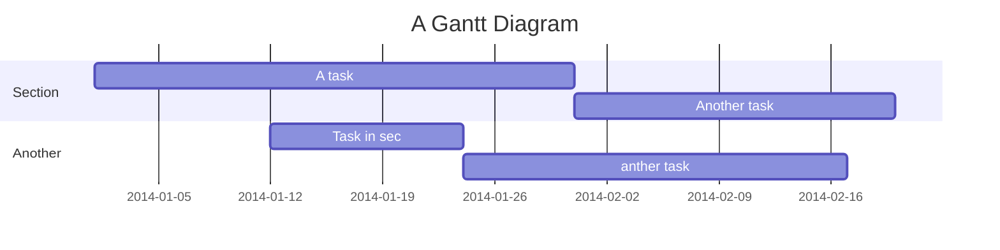

## Table of Contents

[TOC]

## Beginners Guide

If you are a total beginner to this, start here!

1. Visit hackmd.io
2. Click "Sign in"
3. Choose a way to sign in
4. Start writing note!

Code Change
---

```gherkin=
Page: gallery-uploadproject.html

  <form id="CUT" action="" method="post" class="GALLERY_FANCYBOX">
    <div class="FANCY_CONTANT">
      <h6>專案設定</h6>
      <p>為了讓您的創作更快速搜尋，您可增加下列標註！</p>
      <ul>
        <li>
          <h6 class="REDPOINT">創作類別<span>- 必選</span></h6>
          <p>您的創作屬於哪一種類別?</p>
          <button class="BUTTON_STYLE2" data-fancybox="" data-src="#CREATIVE" data-touch="false" data-speed="350" href="javascript:;">新增</button>
        </li>
		<li>
          <h6 class="REDPOINT">行業類別<span>- 必選</span></h6>****
          <p>此作品為何種行業創作?</p>
          <button class="BUTTON_STYLE2" data-fancybox="" data-src="#INDUSTRY" data-touch="false" data-speed="350" href="javascript:;">新增</button>
        </li>
		<li>
          <h6>內容標籤</h6>
          <p>可針對作品內的元素增加文字標籤</p>
          <button class="BUTTON_STYLE2" data-fancybox="" data-src="#STYLELABEL" data-touch="false" data-speed="350" href="javascript:;">新增</button>
        </li>
		<li>
          <h6>使用工具</h6>
          <p>您使用什麼軟體、硬體或材料?</p>
          <button class="BUTTON_STYLE2" data-fancybox="" data-src="#USETOOL" data-touch="false" data-speed="350" href="javascript:;">新增</button>
        </li>
		<li>
          <h6>共同擁有者</h6>
          <p>誰和您一起創作此專案?</p>
          <button class="BUTTON_STYLE2" data-fancybox="" data-src="#COCREATOR" data-touch="false" data-speed="350" href="javascript:;">新增</button>
        </li>
		<li>
          <h6>版權及授權</h6>
          <p>CC: 姓名標示-非商業性-禁止改作</p>
          <button class="BUTTON_STYLE2" data-fancybox="" data-src="#AUTHORIZATION" data-touch="false" data-speed="350" href="javascript:;">編輯</button>
        </li>
      </ul>
	  <div class="TWO_BROTHER_BT">
		<button class="BUTTON_STYLE2" data-fancybox-close="" onclick="replaceImg">上一步</button>
	  	<button type="submit" class="BUTTON_STYLE2" data-fancybox-close="" onclick="">儲存</button>
	  	<button type="submit" class="BUTTON_STYLE2"><a href="gallery-mygallery.html">完成</a></button>
	  </div>
    </div>
  </form>

```
> I choose a lazy person to do a hard job. Because a lazy person will find an easy way to do it. [name=Bill Gates]


```gherkin=
Feature: Shopping Cart
  As a Shopper
  I want to put items in my shopping cart
  Because I want to manage items before I check out

  Scenario: User adds item to cart
    Given I'm a logged-in User
    When I go to the Item page
    And I click "Add item to cart"
    Then the quantity of items in my cart should go up
    And my subtotal should increment
    And the warehouse inventory should decrement
```

> Read more about Gherkin here: https://docs.cucumber.io/gherkin/reference/

User flows
---
```sequence
Alice->Bob: Hello Bob, how are you?
Note right of Bob: Bob thinks
Bob-->Alice: I am good thanks!
Note left of Alice: Alice responds
Alice->Bob: Where have you been?
```

> Read more about sequence-diagrams here: http://bramp.github.io/js-sequence-diagrams/

Project Timeline
---


> Read more about mermaid here: http://knsv.github.io/mermaid/

## Appendix and FAQ

:::info
**Find this document incomplete?** Leave a comment!
:::

###### tags: `Templates` `Documentation`
