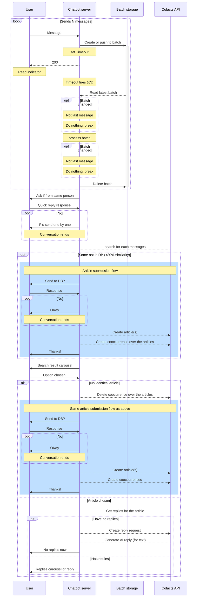
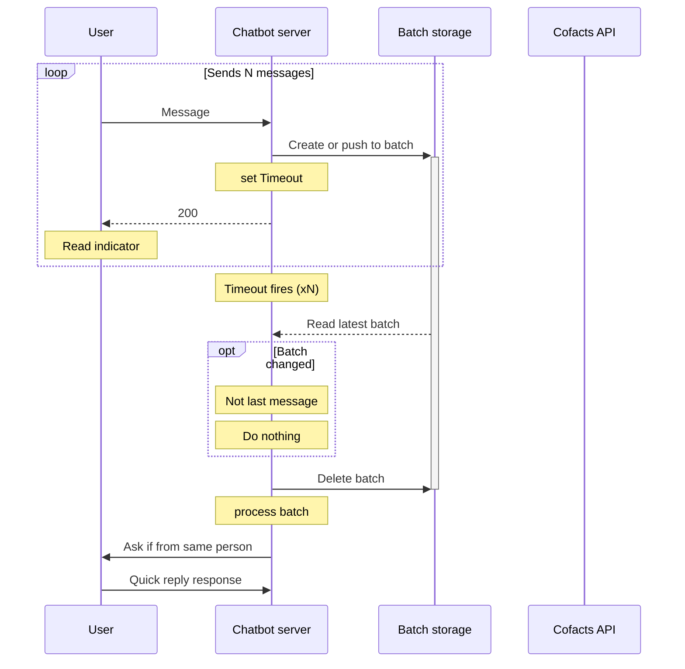

# Cofacts article group design doc

> Previous discussion https://g0v.hackmd.io/3_jgVd9vQreCsgADOdF25w#%E6%96%87%E5%AD%97%E9%85%8D%E5%9C%96%E9%85%8D%E5%BD%B1%E7%89%87%E5%95%8F%E9%A1%8C-article-group
> Previous design  https://g0v.hackmd.io/aJqHn8f5QGuBDLSMH_EinA#Surrounding-text-cooccurrence-model
> 

## UX

Principle
- Handle messages submitted all together
  - First ask if they are sent together by one person
  - Then if any of the material is not in database, ask if they want to submit this to the database
  - Lastly perform search and list search result together
- Multimedia file with no other context: ask them if there are any of other context. If so, send here together again.

https://www.figma.com/file/1tiXCGut4kNCEkDG9FTza7/LINE-Chat-UI-Template-(Community)?node-id=371-2003&t=8OtcQW1yH6BUP59K-4

:::spoiler Old draft
### 送出單一訊息流程

- 提供更多資訊：增加「提供搭配圖文」
- 「提供搭配圖文」：請分享同一人、同一個聊天室、同時搭配傳送的訊息
    - quick reply：提供了能做什麼 --> 說明圖文不符、單一訊息對應到多則圖片的情形，闡述此資訊對闢謠協作者的用處
    - quick reply：取消送出搭配圖文
- 轉傳後
  - 如果有 search hit: 請問您回報的搭配圖文與下面何者最接近？
  - 沒有 search hit: 成為第一個回報此搭配圖文的人
- 得到搭配圖文 article id 後：感謝您回報此搭配圖文
  - 檢視：在網站上看訊息與其搭配圖文

### 一次送很多訊息
- 請問這些訊息是不是由同一人，在同一聊天室，同時傳送的搭配圖文訊息？
  - quick reply 是
  - quick reply 不是 -- 請一則一則分開傳送
  - quick reply 什麼意思 --》 同前解釋
- 是搭配圖文：同上「轉傳後」
:::

## Technical detail

### LINE bot

[Figma](https://www.figma.com/file/1tiXCGut4kNCEkDG9FTza7/LINE-Chat-UI-Template-(Community)?node-id=371-2003&t=8OtcQW1yH6BUP59K-4)

#### Batch processing of incoming messages

Messages sent together are separated into different callbacks

| Message | Callback |
| -------- | -------- |
|  |  |

Also, as the processing time increases, the user may try to click buttons multiple times when the chatbot was still processing previous batch of messages.

We should
- Collects user's incoming webhook and reply tokens together
- Handle messages sent together
- ~~If currently a webhook handler is already processing, we use up the oldest reply token to reply to the user, saying that please be patient~~

To collect webhook callback calls into batches that can perform the operation above, we can:
1. Redis `LPUSH` entire incoming message, using key with user ID.
2. Set timeout
3. On timeout, check if the current msg is the last msg in batch. If not, abort.
    - If we already know there are new messages coming to batch during the timeout, we can do nothing and let the new message's timeout do the job.
    - This check prevents excessive processing.
5. If we are handling the last timeout, and the redis now contains the batch, process the batch.
6. Upon finish, check again if the current msg is the last msg in batch. If not, abort.
    - As the processing usually takes several seconds, it is possible that new messages are being sent from LINE.
    - If there are new messages sent during the processing, we should scrub the current reply and let the new message's timeout do processing with on the correct batch.
    - This check helps us keep the previous timeout essentially small, while still trying to mitigate the inter-message delay posed by LINE messaging app.
8. Delete the key and process the batch, and display reply to the user

#### In-database threshold
Initial threshold that determines if messages are "inside the database" $T_i$: 80%

- Lower than "extact match" 95%, increase probability that grouping occurs on existing messages rather than new messages
- New messages sent to the database in this step should have $1-T_i$ difference

#### Exact match threshold when expressing message not found

- Shows as many search result as possible
- In the carousel, also show the newly submitted messages in the previous step
  - If it's text: the user can still get AI reply, although not accurate without image. Also, they can provide reply request comments.
  - If it's not text: user can still provide reply request comments.
- Question: when to create cooccurrence in the case when all messages have their corresponding one in DB?
- If "My message is not found" is chosen, send all messages with < 95% similarity (exact match threshold $T_e$) to the database
  - Remove the article group created in the previous step if "Cannot find"

#### Cooccurrence handling

- Calls API `CreateOrUpdateCooccurrence` after user sends multiple messages (see API in the section below)
- When user says message is not found in carousel:
    - Means that preivous `cooccurrence` may have article IDs that is not considered identical from user's perspective -- It may be wrong if we group these articles together in a `cooccurrence`!
    - In this case, we call `DeleteCooccurrence` to remove the `cooccurrence` we previously created (with inaccurate article IDs), and `CreateOrUpdateCooccurrence` again (with newly sent articleIds) 

#### Chatbot context and the creation of session ID

Currently we use the following mechanism to handle chatbot context
- Each user has exactly one [context object](https://github.com/cofacts/rumors-line-bot/blob/62362a83050adccb14c3b76824e9cab3c8a9b194/src/webhook/index.ts#L115C36-L115C42), retrieved from Redis everytime the webhook is called.
- Inside that context, we [use sessionId](https://github.com/cofacts/rumors-line-bot/blob/master/src/webhook/handleInput.ts#L61) to determine if the current [context](https://github.com/cofacts/rumors-line-bot/blob/62362a83050adccb14c3b76824e9cab3c8a9b194/src/types/chatbotState.ts#L34-L48) (such as `searchedArticleId` or `searchedText`) is still relevant.

Currently, a session was designed to accomodate one message only. To support multiple messages in article group, we have these methods:

1. Defer the creation of session ID to when after a message is selected.
    - Need to modify current [postback session check mechanism](https://github.com/cofacts/rumors-line-bot/blob/62362a83050adccb14c3b76824e9cab3c8a9b194/src/webhook/index.ts#L115C36-L115C42) when a message is not selected yet
2. Add more fields to session to support multiple messages.
    - Still create a session when user submits the first message.
    - Add new fields 
    - Existing logic must 
3. Create persistent "Search session"s until Redis recycles the key
    - Also start a search session on the arrival of the first message event. Batch them with temporary (< 5 seconds) "user" session.
    - Load search session according to the `sessionId` stored in postback action.
    - Pass values in postback actions whenever possible, and use context to only store things that cannot fit in action payload (such as initial messages).
    - In addition, we can revive old conversation as long as the search session is not cleaned up by Redis rotation mechanism. No need to [block conversation when session ID does not match](https://github.com/cofacts/rumors-line-bot/blob/62362a83050adccb14c3b76824e9cab3c8a9b194/src/webhook/index.ts#L167-L182).

#### Other things to note
- Calls existing API `CreateOrUpdateReplyRequest` when the user clicks "選擇這篇" and the article has no reply (same as current behavior)
    - consistent with the original reply request after article search
- Tutorial on what is "send together" and how to share messages together

### DB

#### New index: `cooccurrences`

Reported co-occurrences of the specified articles. One user can submit one cooccurrence of a set of articles.

Fields:
- `userId`: the user that submitted the 
- `appId`: the app that the user submitted this co-occurrences
- sorted `articleIds`
- `createdAt`: date string. The first time the user reported this cooccurrence.
- `updatedAt`: date string. The last time the user reported this cooccurrence.

ID: `${userId}_${appId}_${sorted articleIds}` (unique by these items)

### API

Basically the CRUD fpr the kew "cooccurrence" entity, plus listing cooccurrence in existing Article object type so that its easier to grab cooccurrences, and / or listing the articles.

#### New API `CreateOrUpdateCooccurrence`

Arguments
- `articleIds`

Return type: `Cooccurrence`

#### ~~New API `DeleteCooccurrence`~~

Arguments
- `articleIds`

:::info
Why delete? I forgot QQ
:::

#### New API `ListCooccurrences`

- Just for debug, no real use case
- Arguments similar to other `ListOOO` API
- Connection type of `Coocurrence`

#### Object type `Article`

Add field "occurrences", type = Cooccurrence

#### Object type `Cooccurrence`

Field: 
- `articles`: `[Article!]!`
- `articleIds`
- `createdAt`
- `updatedAt`

### Website

Top right corner, show occurrences as list of articles that are shown together, sorted by number of occurrences / latest occurrences, in "article level".
- It's hard to display occurrences in such a small space
- Fact-checkers mostly care about what "article" is often sent along with the current ones, so showing article instead of a group of articles makes sense.

"Show Detail" link shows list of "occurrences" with user count, grouped by sorted article IDs.
- Still provides a list view so that user can see the trend of cooccurrences 

## Changes during implementation

### Changes to batching mechanism

The original batching progress looks like this:

Although it is more straight forward, it is common that a batch of several messages can be made into different batches.

Here is the number of milliseconds when webhook for each message in the batch is called:

As shown above, even when multiple messages are sent to LINE at once, and all of the messages are shown together instantly, LINE actuall calls webhooks sequentially and can delay for more than 500ms in between.

In order to not extending our timeout for too long, we chose 500ms for the initial timeout, and adjust the timing we delete the batch to after processing the messages, before we are replying messages.

The rationale behind this change is that, if a message arrives before we reply, we should ditch the result our current process, because the currently in process batch is already outdated. The flow diagram in the technical detail section is already updated.
