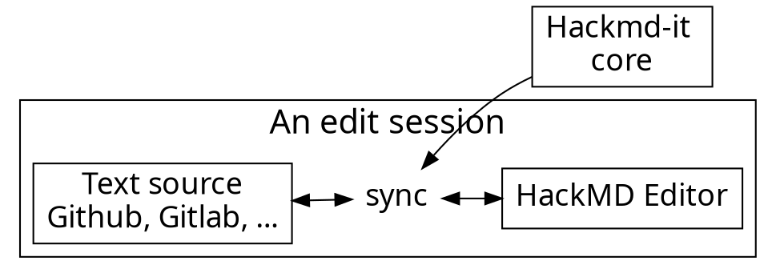

# Arduino 入門
編輯 :　吳冠穎

<!-- Put the link to this slide here so people can follow -->
<!-- slide: https://hackmd.io/p/template-Talk-slide -->

---

## 前言
本課程是介紹Arduino基礎操作及Infineon雷達進階應用，課程合計3小時。
Arduino 將控制晶片和燒錄功能整合到一塊小巧的板子上。它的Pin腳設計讓接線更加簡便，能夠輕鬆地配合麵包板使用，這樣可以快速連接各種感測器和週邊設備。對於初學者來說，只要會插杜邦線，就能開始開發工作。

## 材料
- [ ] Arduino UNO板
- [ ] USB 信號傳輸線
- [ ] 杜邦線

---

## TOPIC 1 : 安裝Arduino環境

- 首先到Arduino官網安裝Arduino
https://www.arduino.cc/en/software


- 在安裝成功後開啟


---

## TOPIC 2 : Arduino UNO 和 LED

第一步需要先檢測Arduino UNO板及其他材料是否完好

- 接上線路

- 用USB 信號傳輸線連接Arduino UNO到電腦主機
- 設定Arduino IDE上方面板 
-- Tools/Board:"Arduino UNO"
-- Tools/Port
- 將code寫入到Arduino IDE
```typescript
void setup() {
  // initialize digital pin Mode 13 as an output.
  pinMode(13, OUTPUT);
}

// the loop function runs over and over again forever
void loop() {
  digitalWrite(13, HIGH);  // turn the LED on (HIGH is the voltage level)
  delay(1000);                      // wait for a second
  digitalWrite(13, LOW);   // turn the LED off by making the voltage LOW
  delay(1000);                      // wait for a second
}
```
- Arduino IDE點選向右箭頭的圖示，將code燒錄至UNO板中
---


## TOPIC 3 : Arduino UNO 和 伺服馬達

Arduino的伺服馬達是一種常用的機電裝置，用於控制角度、速度和位置，適合用於各種自動化和機器人項目。這種馬達通常具有高精度和高效率，能夠根據輸入的控制信號進行精確定位。

- 接上線路


- 將code寫入到Arduino IDE
```typescript
#include <Servo.h>   //載入函式庫，這是內建的，不用安裝

Servo myservo;  // 建立SERVO物件


void setup() {
  myservo.attach(9);  // 設定要將伺服馬達接到哪一個PIN腳
}

void loop() {   
  myservo.write(0);  //旋轉到0度，就是一般所說的歸零
  delay(1000);
  myservo.write(90); //旋轉到90度
  delay(1000);
  myservo.write(180); //旋轉到180度
  delay(1000);
  myservo.write(90);
  delay(1000);
}
```
- Arduino IDE點選向右箭頭的圖示，將code燒錄至UNO板中
- 
---




---

### Architecture of extension

---


---

## Content script

- Bind with each page
- Manipulate DOM
- Add event listeners
- Isolated JavaScript environment
  - It doesn't break things

---

# :fork_and_knife: 

---

<style>
code.blue {
  color: #337AB7 !important;
}
code.orange {
  color: #F7A004 !important;
}
</style>

- <code class="orange">onMessage('event')</code>: Register event listener
- <code class="blue">sendMessage('event')</code>: Trigger event

---

# :bulb: 

---

- Dead simple API
- Only cares about application logic

---

```typescript
import * as Channeru from 'channeru'

// setup channel in different page environment, once
const channel = Channeru.create()
```

---

```typescript
// in background script
const fakeLogin = async () => true

channel.answer('isLogin', async () => {
  return await fakeLogin()
})
```

<br>

```typescript
// in inject script
const isLogin = await channel.callBackground('isLogin')
console.log(isLogin) //-> true
```

---

# :100: :muscle: :tada:

---

### Wrap up

- Cross envornment commnication
- A small library to solve messaging pain
- TypeScript Rocks :tada: 

---

### Thank you! :sheep: 

You can find me on

- GitHub
- Twitter
- or email me
