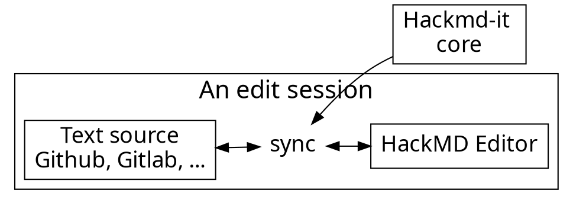

# Arduino 入門
編輯 :　吳冠穎

<!-- Put the link to this slide here so people can follow -->
<!-- slide: https://hackmd.io/p/template-Talk-slide -->

---

## 前言
本課程是介紹Arduino基礎操作及Infineon雷達進階應用，課程合計3小時。
Arduino 將控制晶片和燒錄功能整合到一塊小巧的板子上。它的Pin腳設計讓接線更加簡便，能夠輕鬆地配合麵包板使用，這樣可以快速連接各種感測器和週邊設備。對於初學者來說，只要會插杜邦線，就能開始開發工作。

---

## TOPIC 1 : 安裝Arduino環境

- 首先到Arduino官網安裝Arduino
https://www.arduino.cc/en/software


- 在安裝成功後開啟


---

## TOPIC 2 : Arduino UNO 和 LED

- code
```typescript
import * as Channeru from 'channeru'

// setup channel in different page environment, once
const channel = Channeru.create()
```

---


---

### Usage flow

---




---

### Architecture of extension

---


---

## Content script

- Bind with each page
- Manipulate DOM
- Add event listeners
- Isolated JavaScript environment
  - It doesn't break things

---

# :fork_and_knife: 

---

<style>
code.blue {
  color: #337AB7 !important;
}
code.orange {
  color: #F7A004 !important;
}
</style>

- <code class="orange">onMessage('event')</code>: Register event listener
- <code class="blue">sendMessage('event')</code>: Trigger event

---

# :bulb: 

---

- Dead simple API
- Only cares about application logic

---

```typescript
import * as Channeru from 'channeru'

// setup channel in different page environment, once
const channel = Channeru.create()
```

---

```typescript
// in background script
const fakeLogin = async () => true

channel.answer('isLogin', async () => {
  return await fakeLogin()
})
```

<br>

```typescript
// in inject script
const isLogin = await channel.callBackground('isLogin')
console.log(isLogin) //-> true
```

---

# :100: :muscle: :tada:

---

### Wrap up

- Cross envornment commnication
- A small library to solve messaging pain
- TypeScript Rocks :tada: 

---

### Thank you! :sheep: 

You can find me on

- GitHub
- Twitter
- or email me
