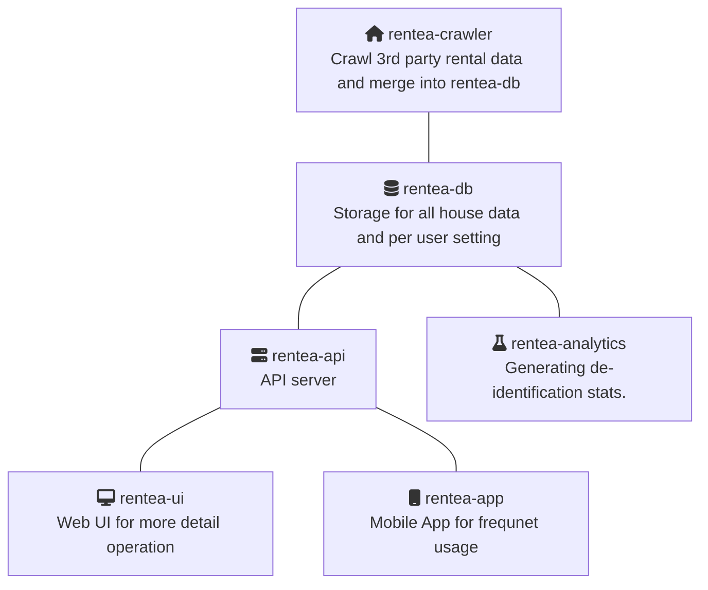

# Rentea Developer Guide / Rentea 開發指南

License: [CC-BY 4.0](https://creativecommons.org/licenses/by/4.0/deed.zh_TW)

This document aims to provide software overview of Rentea and provide an entry point for contributors who are interested in Rentea project. For non-technical introduction, please visit our [hackfoldr](https://beta.hackfoldr.org/rentea/https%253A%252F%252Fhackmd.io%252Fs%252FSJbOIFHpE).

這份文件是關於 Rentea 專案開發的概述，以及提供參與者入門的管道，如果想知道專案非技術的資訊，請參見專案 [hackfoldr](https://beta.hackfoldr.org/rentea/https%253A%252F%252Fhackmd.io%252Fs%252FSJbOIFHpE)。

為了工程師撰寫與閱讀方便，以下內容將以英文進行，如有需要協助，或有其他想法的，歡迎到 [slack](https://g0v-tw.slack.com/messages/CJTBP7YRK/details/) 上討論，或在本文最下方留言。

## For New Comer / 新手請看此

Please visit our [Slack](https://g0v-tw.slack.com/messages/CJTBP7YRK/details/) and say hi to everyone!
歡迎來 [Slack](https://g0v-tw.slack.com/messages/CJTBP7YRK/details/) 群組打聲招呼！

Join Trello via [this link](https://trello.com/invite/b/XYe0A9oO/fc749793e7f68cebb9a0126b8b8bf439/rentea), than join either [backend](https://trello.com/c/w5TH9j8X/9-%E5%A0%B1%E5%90%8D%E8%A1%A8-%E5%BE%8C%E7%AB%AF-%E7%88%AC%E8%9F%B2) or [frontend](https://trello.com/c/HxuEtXRD/10-%E5%A0%B1%E5%90%8D%E8%A1%A8-%E5%89%8D%E7%AB%AF-andriod-ios) card to get latest development update.
請[點此連結](https://trello.com/invite/b/XYe0A9oO/fc749793e7f68cebb9a0126b8b8bf439/rentea)加入 Rentea Trello，並且到[後端](https://trello.com/c/w5TH9j8X/9-%E5%A0%B1%E5%90%8D%E8%A1%A8-%E5%BE%8C%E7%AB%AF-%E7%88%AC%E8%9F%B2)或[前端](https://trello.com/c/HxuEtXRD/10-%E5%A0%B1%E5%90%8D%E8%A1%A8-%E5%89%8D%E7%AB%AF-andriod-ios)打卡，就能知道最新開發需求。

## Project Status

This project is in early design phase. As rental house data from 3rd party is the must, we will start from crawler and API, then extends to UI when design direction is settled.

- [Github](https://github.com/rentea-tw)
- [Rentea Scrapy Package](https://github.com/g0v/tw-rental-house-data/tree/master/scrapy-package/examples)

## Development Practice

1. General
   1. Release early, release often. 
      - utilize github, hackfoldr, and slack
   2. Monthly gathering - g0v hackathon + bi-monthly self hosted event
      - could be technical discussion, tutorial, idea sharing, coding, related public agenda discussion, etc..
   3. Monthly progress report
      - keep contributor in the same page, for people in other functional block and non-technical people
2. Per functional block
   1. Function kickoff - 1+ contributor who is interested in relative long term commitment, say, 6 month
      1. call for initial contributors
      2. propose overall design, rough roadmap, and workflow
      3. call for discussion and reach consensus
   2. Function development
      1. implementing core function
      2. make sure futher todo/enhancement is in issue tracker with `help-wanted` tag
      3. follow [Code of Conduct](https://g0v.hackmd.io/jPagW8Y1R5aDUE-2VsRwCg#%E5%BE%85%E4%BD%9C%E4%BA%8B%E9%A0%85)
      4. share progress in public chanel, such as slack, website, etc..

## Functional Blocks

### rentea-crawler
- <i class="fa fa-percent"></i> Status: `Overall Deisgn`
- <i class="fa fa-book"></i> Doc: [hackmd](https://hackmd.io/@IajGxKO-RUWc8W0jVC9LLg/B1LwYYrpV?type=view#rentea-crawler)
- <i class="fa fa-user"></i> Owner: ddio
- <i class="fa fa-users"></i> Contributor: Steven, ddio, chirske, york
- <i class="fa fa-ticket"></i> Tickets(rentea-crawler): https://github.com/rentea-tw/rentea-crawler/issues
- <i class="fa fa-ticket"></i>Tickets(tw-rental-house-data): https://github.com/g0v/tw-rental-house-data

### rentea-db
- <i class="fa fa-percent"></i> Status: `Overall Deisgn`
- <i class="fa fa-book"></i> Doc: [hackmd](https://beta.hackfoldr.org/rentea/https%253A%252F%252Fg0v.hackmd.io%252FBFd56MJAQqu242x_oqYP2w)
- <i class="fa fa-user"></i> Owner: chriske
- <i class="fa fa-users"></i> Contributor: ddio, Steven, york, yukai
- <i class="fa fa-ticket"></i> Tickets: https://github.com/rentea-tw/rentea-db/issues

### rentea-api

- <i class="fa fa-percent"></i> Status: `Call for kickoff`
- <i class="fa fa-book"></i> Doc: [hackmd](https://hackmd.io/@IajGxKO-RUWc8W0jVC9LLg/B1LwYYrpV?type=view#Backend-Requirement)
- <i class="fa fa-ticket"></i> Tickets: N/A
- 

### rentea-ui

- <i class="fa fa-percent"></i> Status: ` Call for kickoff`
- <i class="fa fa-ticket"></i> Tickets: N/A

### rentea-app

- <i class="fa fa-percent"></i> Status: ` Call for kickoff`
- <i class="fa fa-ticket"></i> Tickets: N/A

### rentea-analytics

- <i class="fa fa-percent"></i> Status: ` Call for kickoff`
- <i class="fa fa-ticket"></i> Tickets: N/A

## Howto

## General Wishlist

:::info
<i class="fa fa-home fa-lg fa-fw"></i> [Back to Project Foldr](https://beta.hackfoldr.org/rentea/https%253A%252F%252Fhackmd.io%252Fs%252FSJbOIFHpE)
:::