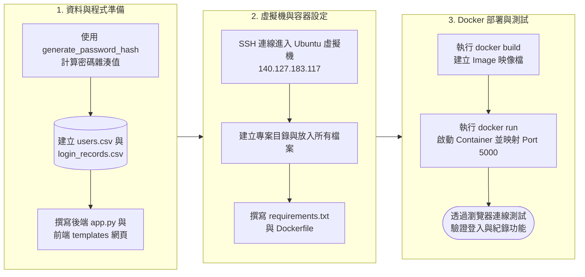

```mermaid
flowchart LR
    subgraph 1_資料與程式準備 [1. 資料與程式準備]
        direction TB
        A[使用 generate_password_hash<br/>計算密碼雜湊值] --> B[(建立 users.csv 與<br/>login_records.csv)]
        B --> C[撰寫後端 app.py 與<br/>前端 templates 網頁]
    end

    subgraph 2_環境與容器設定 [2. 虛擬機與容器設定]
        direction TB
        D[SSH 連線進入 Ubuntu 虛擬機<br/>140.127.183.117] --> E[建立專案目錄與放入所有檔案]
        E --> F[撰寫 requirements.txt<br/>與 Dockerfile]
    end

    subgraph 3_打包與部署測試 [3. Docker 部署與測試]
        direction TB
        G[執行 docker build<br/>建立 Image 映像檔] --> H[執行 docker run<br/>啟動 Container 並映射 Port 5000]
        H --> I([透過瀏覽器連線測試<br/>驗證登入與紀錄功能])
    end

    1_資料與程式準備 --> 2_環境與容器設定 --> 3_打包與部署測試
```