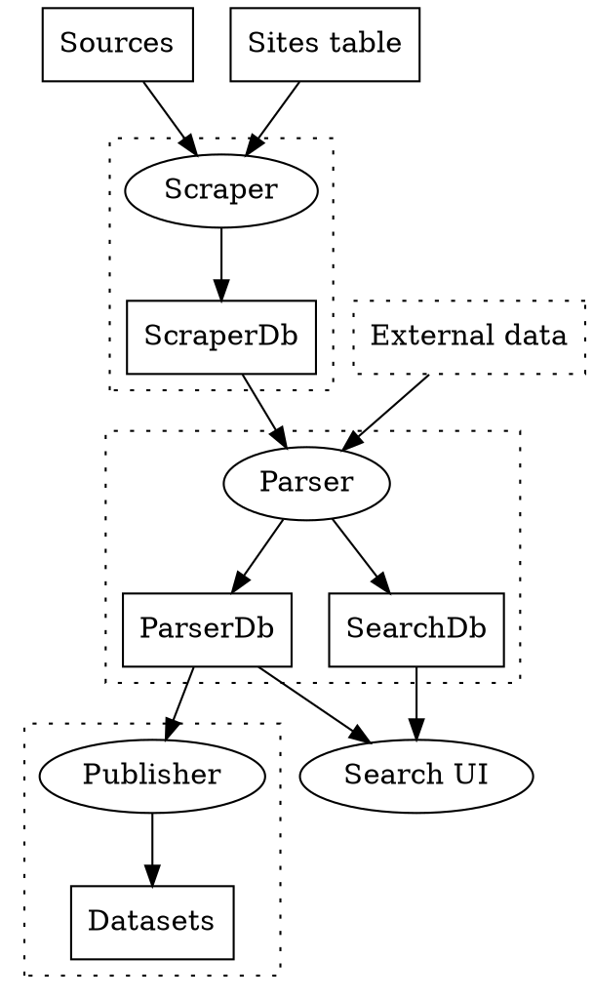

零時檔案局技術文件 0archive Technical Spec
===

## Scrapper database schema

:::warning
以下是討論中的 schema，與 production db schema 不完全相同。
:::

### Site
* site_id (PK) [int11]
* name [text] 名稱
* type [varchar128] 種類 fb page, youtube page, web page, ...
* url [varchar1024] 入口網址，爬蟲開爬的網址
* config [JSON] 爬蟲設定
* site_info [JSON] 爬蟲記錄的關於網站的資訊
* is_active [tinyint] 要不要爬
* airtable_id (UQ) [varchar256] 在 Airtable 上的 ID
* last_crawl_at [int11] 上次爬這個網站的時間

### Article
* article_id (PK) [int11]
* site_id [int11]
* url [varchar1024] 文章網址
* url_hash (UQ) [varchar32] 文章網址 crc32 後的 hash
* article_type [enum] one of "Article", "PTT", "FBPost"
* first_snapshot_at [int11] 第一次發現到的時間
* last_snapshot_at [int11] 最後一次抓取時間
* next_snapshot_at [int11] 下一次要抓取的時間
* snapshot_count [int11] 總共抓取次數
* redirect_to [varchar1024] 這個網址是否不是正確網址，需要導出去
* 索引
    * (url_hash) INDEX
    * next_fetch_at INDEX => 抓取最新文章用的
    * (site_id, first_snapshot_at) INDEX => 顯示在首頁上用的

> Article.find(url) 的邏輯如下：
> ```js
> function find_article(url)
> {
>     article = Article.select({url_hash: hash(url), url: url}) // 先用 hash 搜尋 article，因為直接 url 進 index 會很肥大，多加一個 url_hash 可以加速搜尋
>     
> }
> ```

### ArticleSnapshot
* article_id (PK) [int11] FK Article.article_id
* snapshot_at (PK) [int11] 抓下內容的時間 timestamp
* raw_data [mediumtext] 抓下來的 HTML

### 內文 parser

> [name=chihao] 我腦中的 parser 指的是 parse Article 內文的那種 parser...（這樣講好抽象啊）
> [name=ronny] 抓 title, body 的 function 有現成的工具可用，雖然說準確度不明，我找一下相關工具名稱
> [name=chihao] 理想狀態：所有網站類型的 Article 都用同一個 parser parse title / body，但感覺可能就是有 customization 的需求？
> [name=ronny] 我覺得分兩個層次來處理比較好，(A) 抓原始 HTML 下來的部份 (B) 把 HTML 的 title, body 解出來的部份。而上面的 schema 設計主要是解決 (A) 的部份。至於 (B) 的部份，可以看看現成工具是否適用。之前 #general 好像 kcwu 還是 gugod 有用現成工具實驗過，大部份情況抓出來的還 ok ，但還是會有誤判(把廣告或是一些不重要區塊也判斷成內文了)，不過專案前期我覺得可以先專注在抓原始 HTML 的部份，反正把原始 HTML 存好了，要解 title, body 以後都可以慢慢來...
> [name=chihao] (A) (B) 兩階段 +1
> [name=ronny] 我在 #general 問 @gugod 是不是他了 XD 順便看看要不要把他拉入這坑 XD 他好像也有一個專案是專門在收集政府公告
> [name=chihao] 有 @gugod 有如 god 助？XD 蒐集政府公告 +1 政府公告也算一般網站，套用一樣的流程嗎？

## Parser database schema

### producer
* producer_id (PK) [int11] same as `site_id` in news db
* name [text] 名稱
* classification [varchar256] (not sure what goes here yet...)
* canonical_url [varchar1024] 入口網址
* languages [array] 主要發文語言
* licenses [array] 主要發文授權
* first_seen_at [int11] 最早一篇發文的時間
* last_updated_at [int11] 最近一次發文的時間
* followership [JSON] FB likes & followers, Twitter following & followers, etc

### parser_info
* parser_name (PK) [varchar256]
* info [JSON]
    * last_success_at [number] 最後一次成功跑完的時間

### publication_mapping
* article_id (PK) [int11] same as `article_id` in news db
* snapshot_at (PK) [int11] same as `snapshot_at` in news db
* publication_id (UQ) (FK publication.publication_id) [int11] 在 parser db 的 publication_id
* info [JSON]
    * last_processed_at [number] 最後一次 parse 的時間
    * parser_version [string] 最後一次 parser 的 parser hard-coded version string

### producer_mapping
* site_id (PK) [int11] same as `site_id` in news db`
* producer_id (FK producer.producer_id) [int11] 在 parser db 的 producer_id
* info [JSON]
    * last_processed_at [number] 最後一次 parse 到這個 site 的 article snapshot 的時間
    * parser_version [string] 最後一次 parser 的 parser hard-coded version string

### publication
* publication_id (PK) [int11] same as `article_id` in news db
* producer_id (FK) [int11] foreign key to `producer.producer_id`
* canonical_url [varchar1024] 文章網址
* title [varchar1024] 標題
* publication_text [text] 內文文字
* language [varchar64] 內文語言
* license [varchar64] 內文授權
* published_at [int11] 發文時間
* first_seen_at [int11] 第一次爬到的時間
* last_updated_at [int11] 最近一次更新的時間
* hashtags [JSON] 內文 hashtag
* urls [JSON] 內文提到的 URL
* keywords [JSON] 內文關鍵詞
* tags [JSON] 編輯下的 tag
* metadata [JSON] HTML 內含的 metadata
* comments [JSON] array of comment objects

comments 範例

```json
[
    { "id": "五樓", "text": "哈囉", "author": "寶可夢阿伯", "source_ip": "11.22.33.44", "reactions": {'wow': 3, 'lo'}, "published_at": 334156871 },
    { "id": "六樓", "text": "五樓專業！", "reply_to": "五樓" },
    { "id": "七樓", "text": "五樓專業！", "reply_to": "五樓" }
]
```

## 架構


### Data flow




* Circles are processes; rectangle boxes are for storage.
* Dotted boxes indicate ownership.  Only the owner of a storage will write to it.
* We try to keep the data flow unidirectional.

In our implementation,

* *Sources* include: websites, Facebook pages and groups, PTT boards, Dcard boards.
* *Sites table* is hosted on [Airtable](https://airtable.com/tbl3DrYs5mXgl0EV9/viw2cuXweY8OxNkX6).
* *Scraper* is in NewsScraper and FbScraper.
* *Parser* is in ArticleParser.
* *Publisher* is also in ArticleParser.
* *Datasets* are hosted on ?

### 初始設定

* [Airtable](https://airtable.com/tbl3DrYs5mXgl0EV9/viw2cuXweY8OxNkX6?blocks=hide)
    * Site 列表
    * Airtable 自動產生 id
    * 需提供  name、url、type
    * 需決定 article（必需）、following（必需）、depth、delay、ua
    * 勾選 approve 才會同步進 database

> newsdiff 這邊有一些之前建過的新聞網址的 URL 規則，可以直接列入參考

### 列表抓取

:::warning
以下是討論記錄，與目前的爬蟲邏輯可能不完全相同。
:::

* 執行頻率：site_lookup_freq
* 爬蟲會輪流從 entry_urls 出發，去檢查頁面裡面的 a tag
    * 如果連結符合 url_matches
        * 如果該網址在 Article 存在，就無視
        * 如果該網址在 Article 不存在，就存入 Article
            * next_fetch_at 給現在時間
    * 如果連結不符合 url_matches
        * 當作列表頁繼續抓，最多抓三層
            > [name=chihao] 怎麼抓三層？
            > [name=ronny] 大概邏輯如下：
```js
walked_urls = [];
function crawl_url(entry_url, depth) {
    if (depth > 3) return; // 如果抓到第三層就不抓了
    raw_html = get_html(entry_url); // 抓這個網址的 html 下來
    found_urls = get_urls_from_raw_html(raw_html); // 抓出這網頁內的全部超連結
    for (found_url in found_urls) {
        if (walked_urls.includes(found_url)) {
            continue; // 已經爬過的網址就跳過不用再爬了
        }
        walked_urls[] = found_url;
        if (is_article_url(found_url)) { // 如果符合單篇文章網址規則(url_matches)的話
          // 走單篇文章流程
        } else {
            crawl_url(found_url, depth + 1); // 不是單篇文章的就繼續往下爬
        }
    }
}
crawl_url(entry_url, 1)
```
> [name=chihao] omg 這不是遞迴嗎（驚訝什麼）
> [name=ronny] 寫完了 XD 遞迴在爬資料很好用的啊 XD
> [name=chihao] hackmd live coding XD
> 
> TODO: 如果某頁面網址不符合 url_matches，但是他超過 N 次都沒有抓到內容有半個包含 url_matches 的網址，表示這頁可能是無意義的頁面（可能是版權說明，關於我們，招聘員工之類的），以後就不用浪費時間在上面抓他了

### 單篇文章抓取

:::warning
以下是討論記錄，與目前的爬蟲邏輯可能不完全相同。
:::

* 執行頻率：article_lookup_freq
* 掃一遍 Article table
* 找到 next_fetch_at 小於現在時間又不等於 0 的所有文章
    * 檢查該文章是否有 og:url 或是 canonical link ，並且網址是否跟現在抓取的網址相同
        * 假如相同的話
            * 把抓下來的內容存在 ArticleSnapshot
            * fetch_count ++
            * 並把 next_fetch_at 設為下次想再抓的時間
        * 假如不同的話
            * 現在這個 Article redirect_to 裡面放入新網址
                > [name=chihao] redirect_to 是不是要存新 Article 的 PK？
                > [name=ronny] 對耶，存新的 PK 比較好 XD
            * 並把 next_fetch_at 設為 0 以後不用再抓
            * 用新網址新增一個 Article ，把剛剛抓到的 html 

### 過期 Snapshot 刪除

`ArticleSnapshot` 儲存的是未解析過的原始 HTML，壓縮後大約一個月會用掉 2M rows、80 GB，相當佔空間。需要定期把已經解析完畢的 HTML 清除，或備份到離線儲存服務，省點錢。相反地 `Article` 儲存的是詮釋資料，很省空間，可以一直保留下去做為所有內容的目錄。

處理舊 snapshot 資料大致有兩個步驟：

1. 舊的 `ArticleSnapshot` 會先被移到 `ArticleSnapshot<YYYYMM>` table，其中會包含所有 `snapshot_at` 在 `YYYYMM` 這個年月之中的 snapshot 資料。
2. 再刪除 `ArticleSnapshot<YYYYMM>`。

先移動再刪除，是因為在 MySQL 中 `DELETE` 刪除後，硬碟空間不一定會馬上釋放出來，但 `DROP TABLE` 會馬上釋放空間。

步驟 1 移動舊 snapshot 資料到 `ArticleSnapshot<YYYYMM>` table 的操作，配合 [partitioning](https://dev.mysql.com/doc/refman/8.0/en/partitioning.html) 會比較有效率，所以會依以下步驟進行：

1. 預計每個月 rotate 掉一個舊 snapshot table。
2. `ArticleSnapshot` 以 `snapshot_at_date` 月份值來做 partitioning：
   ```sql
   ALTER TABLE ArticleSnapshot
   PARTITION BY LIST(MONTH(snapshot_at_date)) (
       PARTITION s1 VALUES IN (1),
       PARTITION s2 VALUES IN (2),
       PARTITION s3 VALUES IN (3),
       PARTITION s4 VALUES IN (4),
       PARTITION s5 VALUES IN (5),
       PARTITION s6 VALUES IN (6),
       PARTITION s7 VALUES IN (7),
       PARTITION s8 VALUES IN (8),
       PARTITION s9 VALUES IN (9),
       PARTITION s10 VALUES IN (10),
       PARTITION s11 VALUES IN (11),
       PARTITION s12 VALUES IN (12)
   )
   ```
   這樣 MySQL InnoDB storage engine 會把不同月份抓到的 snapshot 存到不同的底層檔案，但是在寫 SQL 的時候可以當成同一個 `ArticleSnapshot` table 來用。`snapshot_at_date` 欄位底下再說明。
3. 假設現在是第 M 月，M > N，而第 N 月的 snapshot 都 parse 完了，於是要把第 N 月的 snapshot 移動到 `ArticleSnapshot<YYYYMM>` 。
4. 要移動舊 snapshot 的時候，就開一個新的、空的 table，把要被移動的月份的 partition `sN` 用空 table exchange 掉。
   ```sql
   CREATE TABLE ArticleSnapshot<YYYYNN> LIKE ArticleSnapshot;
   ALTER TABLE ArticleSnapshot<YYYYNN> REMOVE PARTITIONING;
   ALTER TABLE ArticleSnapshot EXCHANGE PARTITION sN WITH TABLE ArticleSnapshot<YYYYNN>;
   ```
5. 接下來可以 `DROP TABLE ArticleSnapshot<YYYYNN>` 刪除它。

為了要這樣使用 partitioning，`ArticleSnapshot` 必須增加一個 `snapshot_at_date` 欄位，儲存 `FROM_UNIXTIME(snapshot_at)`，設為 primary key 之一：

```sql
ALTER TABLE ArticleSnapshot ADD COLUMN snapshot_at_date DATETIME;
UPDATE ArticleSnapshot SET snapshot_at_date = FROM_UNIXTIME(snapshot_at);
ALTER TABLE ArticleSnapshot DROP PRIMARY KEY, ADD PRIMARY KEY (article_id, snapshot_at, snapshot_at_date);
```

所有 SQL `INSERT` 指令也要改。這是因為 partitioning 能用的 function 限於[這些](https://dev.mysql.com/doc/refman/8.0/en/partitioning-limitations-functions.html)，而且參數[必須是所有 unique key（包含 primary key）的一部份](https://dev.mysql.com/doc/refman/8.0/en/partitioning-limitations-partitioning-keys-unique-keys.html)。

## Data monitor / dashboard

### Needs to show
* for each site
    - total number of articles
    - number of new articles each day for the past 3, 7, 28, 180, 360 days
    - name, url, type, airtable_id, spider config, is_active

### DB migration & stored procedure?
- New tables?
    - SiteMonitor
        - site_id
        - article_count_total
        - article_count_last_3_days
        - article_count_last_week
        - article_count_last_month
        - article_count_last_6_months
        - article_count_last_year
- New procedures?
```sql
select A.site_id, A.count as count_total, B.count as count_last_3_days, C.count as count_last_week, D.count as count_last_month from
(select site_id, count(*) as count from Article group by site_id) as A, 
(select site_id, count(*) as count from Article where first_snapshot_at > UNIX_TIMESTAMP(DATE_SUB(NOW(), INTERVAL 3 day)) group by site_id) as B,
(select site_id, count(*) as count from Article where first_snapshot_at > UNIX_TIMESTAMP(DATE_SUB(NOW(), INTERVAL 7 day)) group by site_id) as C,
(select site_id, count(*) as count from Article where first_snapshot_at > UNIX_TIMESTAMP(DATE_SUB(NOW(), INTERVAL 30 day)) group by site_id) as D
where A.site_id = B.site_id AND B.site_id = C.site_id AND C.site_id = D.site_id
```

### GraphQL schema

```graphql
schema {
    query: Query
}
type Query {
    sites(
        id: ID,
        isActive: Boolean
    ): SitesResult!
}
type SitesResult {
    count: Int
    items: [Site]!
}
type Site {
    id: ID!
    name: String
    url: String
    type: String
    airtableId: String
    isActive: Boolean
    articles: ArticlesResult!
}
type ArticlesResult {
    count: Int
    hist(days: Int = 7): [ArticleHistory]!
}
type ArticleHistory {
    startAt: Date
    days: Int
    count: Int
}
```

## Data sources 相關討論備份
### Sources + crawlers/datasources
- [x] ptt
    - Gossiping
    - HatePolitics
- [x] fb pages
    - crawlers/datasources
        - ronny crawler
- [x] content farms
    - crawlers/datasources
        - watchout crawler
- [x] newspaper sites
    - crawlers/datasources
        - newsdiff
- [x] tv news
    - tvlogger 側錄
    - 新聞台 YT channel video list metadata
- [ ] 政論節目
- [x] gov sites
    - 各部會的公告新聞區
- [ ] other websites
### Snapshot scheduling (parse/diff optional)
> [name=ronny] [name=chihao]
- tv news YT Channel
    - 列表 - every day?
    - 單篇 - 1 snapshot, no versioning
        - video content save for 1 month?
- news website
    - 列表 - every 10 mins
    - 單篇 - 1/hour for 1 day
- content farms
    - 列表 - every 10 mins
    - 單篇 - 1/day for 1 week, 1/week for 1 month
- public fb pages / groups
    - 列表 - every 10 mins
    - 單篇 - 1/day for 1 week
        - 點開所有 comment 再 snapshot
- Ptt Gossiping & HatePolicits
    - 列表 - every 10 mins
    - 單篇 - 1/day for 1 week
        - 點開所有 comment 再 snapshot
- gov announcements
    - 列表 - daily
    - 單篇 - 1 snapshot, no versioning

## Fb Controller (2020/1/14)
### fb_controller (goal)
- deamon
- 10 selenium sessions
    - 10 proxys
- random firing (discover & update)

### discover_controller (for the time being)
- 找 Site
- 進入每個 Site
- 每個 Site 開 discover

### update_controller
每天跑一次
設定 crontab

## Fb Crawler (2020/1/14)
### (1) discover
**Given**
- one site_id
- one site_url

**Arguments**
- TRY_COUNT = 3?

**Local vars**
- existing_article_urls: from db (from Article, Article.site_id = site_id)
- empty_count = 0

[selenium]
1. enter site_url
2. while empty_count < TRY_COUNT: scroll once
    - _N_ Fb posts -> _N_ fb_post_urls
    - match fb_post_urls with existing_article_urls
    - -> _M_ post urls (to be new Articles)
        - if _M_ = 0:
            - empty_count += 1
        - else:
            - -> db: create _M_ new Articles
                - Article.url = post url
                - Article.site_id = site_id
                - Article.article_type = FBPost
                - Article.next_snapshot_at = 0
            - add _M_ post urls to existing_article_urls

### (2) update
**Given**

**Arguments**
- N

**Local vars**

1. db 抓出需要被 update 的 articles (需要 article_id, url)
    - 判斷 Article 條件 next_snapshot_at < now() and article_type = FBPost
2. 一次進入 N 個 Article
    - [selenium] crawler (article_url)
        - enter Article.url
        - expand comments
            - turn off filter 選擇 "所有留言"
            - load level 0 comments
            - load level 1 comments
        - 抓 raw html
    - pipeline (article_id, raw_html)
        - snapshot_at = now()
        - 存新的 ArticleSnapshot
            - ArticleSnapshot.snapshot_at = snapshot_at
            - ArticleSnapshot.raw_data = raw_html
            - ArticleSnapshot.article_id = article_id
        - 更新 Article
            - first_snapshot_at
                - if is None:
                    - Article.first_snapshot_at = snapshot_at
            - last_snapshot_at = snapshot_at
            - next_snapshot_at = snapshot_at + period
            - snapshot_count++

## Facebook Crawler
1. collect page returned urls of posts and comments
2. query crawled urls from db's Article and check if any page returned urls are new
3. crawl for new returned urls
> pm5: is this going to be from another crawler (operating system) process, or is it in the same crawler?  I'm not sure how are you going to put 1 and 3 in the same crawler logically, because step 1 by its nature will take an indefinite time to finish.  OTOH it will need extra care if you plan to have two crawlers run simultaneously.
> pm5: by extra care I mean 我可能需要知道 url crawler 與 content crawler 它們啟動與結束邏輯的 pseudocode（starting condition & ending condition），例如 url crawler 爬到什麼程度時會停下來，而沒爬完的部份以後怎麼辦；content crawler 每次啟動的時候都去 db 找出還沒爬過的 url 來爬，都爬完了就結束，那 content crawler 要多久重新啟動一次？
4. parse post urls and comment urls
5. write parsed results into database

```python=
main():
    page_handler()
    post_handler()
    comment_handler()

page_handler(table_site):
    # select site_id, url from Site where (JSON_EXTRACT(site_info, "$.next_snapshot_at") <= helper.now()) or (JSON_EXTRACT(site_info, "$.first_snapshot_at") = null)
    sites  = select * from Site where (next_snapshot_at <= now() || last_snapshot_at = None)
    for site in sites:
        site_id = site['site_id']
        latest_post_time, earliest_post_time = select MAX(published_at), MIN(published_at) from Article where type='FBPost' and site_id=site_id
        ps = page_spider(site, browser, latest_post_time, earliest_post_time)
        ps.work()

page_spider(site_url):
    def work():
        crawled = self.crawl(self.site_url, self.browser, self.latest_post_time, self.earliest_post_time)
        parsed = self.parse(crawled['raw_html'])
        raw_html = crawled['raw_html']
        snapshot_at = crawled['snapshot_at']
        posts = parsed['posts']
        comments = parsed['comments']
        self.pipe(snapshot_at, raw_html, posts, comments)
    def crawl(self, url, browser, latest_post_time):
        pc = page_crawler(url, browser, latest_post_time, earliest_post_time)
        return pc.crawl()
    def parse(self, raw_html)
        pp = page_parser(raw_html)
        return pp.parse()
    def pipe(self, snapshot_at, raw_html, posts, comments):
        pi = page_pipeline(snapshot_at, raw_html, posts, comments)
        pi.pipe()

page_crawler():
    def crawl():
        page_ndoe = browser.get(url)
        self.expand(100)
        raw_html = self.get_attribute('innerHTML')
        snapshot_at = now()
        crawled = {}
        crawled['raw_html'] = raw_html
        crawled['snapshot_at'] = snapshot_at
        return crawled
    def expand(self, required_number_of_new_posts):
        expand_post(100)
        expand_comment()
    def expand_post(self, required_number_of_new_posts):
        new_post_count = 0
        while new_post_count < required_number_of_new_posts and not is_page_end()
            self.scroll()
            post_time_range = [p.get_attribute('published_at') for p in self.browser.css('userContentWrapper')]
            new_post_time_range = [t for t in post_time_range if t >= self.latest_post_time or t <= self.earliest_post_time]
            new_post_count = len(new_post_time_range)
            
    def expand_comment(self)
        for load_root_comment in self.browser.css('root_comment_renderer_0'):
            load_root_comment.click()
        for load_comment_in_comment in self.browser.css('root_comment_renderer_1'):
            load_comment_in_comment.click()
    def is_page_end():
        return self.broswer.css('.page_end_element') is not None
    def scroll():
        self.browser.execute_sript(0, 'scrollToTop')
        sleep(2)

page_parser():
    def init(self,raw_html):
        self.raw_html = raw_html

    def parse():
        soup = bs(self.raw_html)
        posts = []
        for post_node in soup.css('.userContent'):
            p = {
                'url': post_node['url'],
                'raw_html': post_node['raw_html']
            }
            posts.append(p)
        comments = []
        for comment_node in soup.css('.comment'):
            c = {
                'url': comment_node['url'],
                'raw_html': comment_node['raw_html']
            }
            comments.append(c)
        parsed = {
           'posts': posts,
           'comments': comments
        }
        return parsed

page_pipeline():
    def pipe():
        for p in self.posts:
            if is_post_existed(p):
                continue
            write_post(p)
    def is_post_existed(self, post):
        select count(*) from FBPostSnapshot where url=post['url']
    def write_post(self, post):
    def write_comment():
```
## PTTWeb Crawler
* To get rid of the "I'm over 18 years old" notice just add a "over18=1" cookie when sending HTTPS requests.

- Speed issue with [Gossiping](https://www.ptt.cc/bbs/Gossiping/index.html).
    - Gossiping has, in average, 2500 posts per day. However, our crawler system cannot catch up with the speed. We are getting around 1800 posts per day. 
    - After incresing concurrent_requests to 16 and depth to 10, the number of posts we collected has not increased much. 
    - 

## Dcard Crawler
* The webpage itself needs to 'scroll' in order to get older posts. However we can use api in the form of `https://www.dcard.tw/_api/forums/{forum_name}/posts?popular=false&limit={post_count}` to get post metadata.
* This api provides post content and post id, but does not give comments. Therefore, we probably need to extract the post id from the api AND store the webpage `https://www.dcard.tw/f/{forum_name}/p/{post_id}` html as snapshot. -- This structure is different than current spider.
* http://blog.cgmlife.net/posts/2019/03/18/problems-i-met-when-using-the-dcard-api mentioned that we need to sign in to Dcard to consistently get new results.
* 
* https://www.dcard.tw/_api/posts/232708880/comments?after=50
