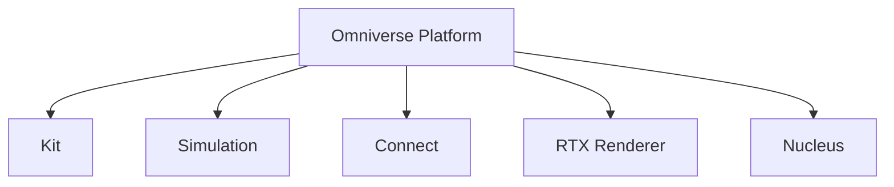
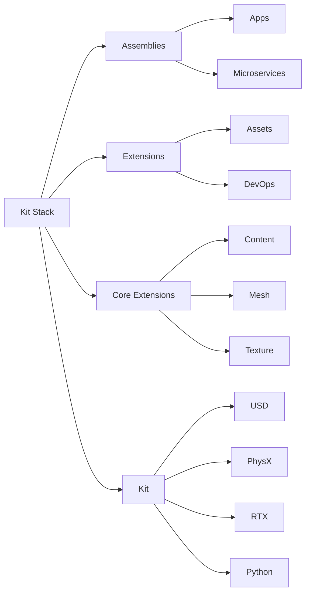

# omniverse operate
```
Omniverse Platform
│
├─ #Nucleus Server（資產 / USD / 協作）
│
├─ Omniverse Kit（系統核心）
│    │
│    ├─ Isaac Sim（機器人模擬器）
│    │     │
│    │     └─ Isaac Lab（AI / RL / Agent 框架）


```

## Omniverse / Isaac Sim 操作方式


| 操作方式| 層級定位 | 適合做什麼 |
| -------- | -------- | -------- |
| Action Graph (OmniGraph)    | 視覺操作層     | 簡單控制、Demo、教學     |
| Script Editor   | 互動控制層     | 即時測試、操作 Scene、學 API     |
| Standalone Python Script    | 實驗控制層     | 正式實驗、論文、可重現流程     |




