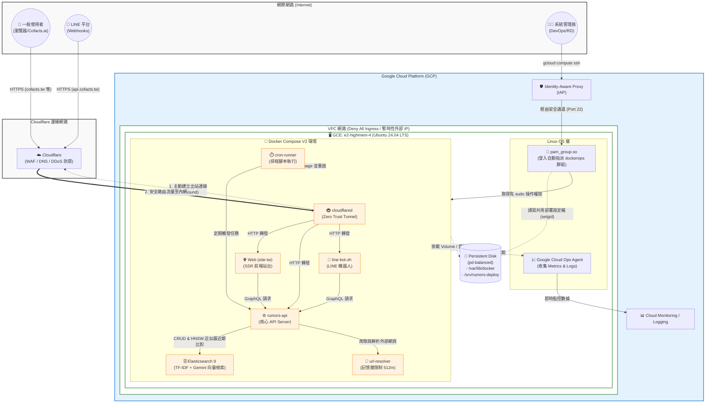

# 20260324 會議記錄

:::info
- [所有會議記錄](https://g0v.hackmd.io/@cofacts/meetings/x232chPbTfGgNL_Q0f47rQ)
- NPO Hub 出席：bil, lahna, mrorz, nonumpa
- 線上出席：
- https://meet.google.com/mrz-dgrd-pri
:::

## 上次會議待辦

### Cofacts.ai 開發

https://github.com/orgs/cofacts/projects/12

- [ ] React-markdown --> 回應編輯器
- [ ] 資料關聯整理：準備 source list 然後掃 messages
- [ ] Session list
- [ ] Deploy to production w/ Claudelare
- [ ] 整理 header (logo、menu、搜尋⋯⋯ etc)
- [ ] landing page focus issue
- [ ] input 在組字時 enter 會直接送出
- [ ] tool call 細節調整
- [ ] Langfuse feedback buttons
- [ ] ADK 升級到可以看到 openapi.json
- [ ] 直接用 ADK type 來 render events 而非轉成 messages
- [ ] 在 tool call 中間關掉瀏覽器視窗再打開同一個 session page，要可以繼續串流結果

### 主機遷移至 GCE
- [x] @mrorz 執行 https://docs.google.com/document/d/1sZ4jOsrZPvbJv4QjlMxgbqFsh_pTZNBRs-NbG-HU0rM/edit?pli=1&tab=t.t599bt7kwc4o#heading=h.351xoil28n2
- [x] @mrorz 確認 docker-compose 與 rumors-deploy script 是否可以共用
- [ ] @mrorz 可以的話，開一台 production 設定好 ES6 snapshot，準備 migrate
	- 準備好後先停機，省 cost

---

> COS 下是可以在 home 底下做出大家都可讀寫的 rumors-deploy
> 但 home 底下的 script 不能執行
> 我連 docker-compose 都沒辦法好好跑，心好累
> 想回到 ubuntu XDDDD
> [name=mrorz]

新 Design document：https://docs.google.com/document/d/1sZ4jOsrZPvbJv4QjlMxgbqFsh_pTZNBRs-NbG-HU0rM/edit?pli=1&tab=t.t599bt7kwc4o#heading=h.351xoil28n2

新 Devops manual https://github.com/cofacts/devops/pull/1/changes

### 小聚籌備
- [ ] 投放目標：雙北
- [ ] VOOM 發文
- [ ] FB 發文
- [ ] 食物：沒有
- [ ] 記得帶：貼紙、不太環保杯 (bil)

