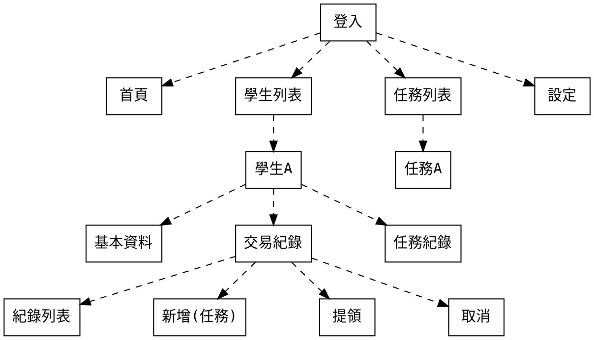

# 幸福存摺 圖像設計

## v1.0.0



### Android

Screenshots


   
### 問題

#### 需要設立獎勵列表嗎？（像任務列表那樣）
    
    John: 其實這個有有在我的初始設計裡面，但小草書屋目前沒有使用，所以我想可以在下一版加入。

#### 同所老師共用任務還是分開？

    John: 系統是多機構形式，目前任務是機構共享，所以是所有老師共用。

#### 首頁放什麼？

    John: 我也沒頭緒，我想應該是公告事項或是一些提醒？請建議～

#### 任務類型：
* 任務需要設置申請型、指令型嗎？

```
John: 有考慮唷～申請型的話後台需要增加申請審核，我想可以在下一版加入～
```

* 顯示任務的狀態進行、已完成？
 目前看起來是學生完成任務後，老師點按給予點數獎勵
（這樣學生這邊要先自己記得他有什麼任務）

 ```
John:
其實這個是有的，因為後台的設計是 任務模板>個人任務(指派/申請)>獎勵。只是從小草書屋既有的模式來看，我覺得引進”個人任務+狀態更新“有點太複雜，所以一開始沒有放在ＵＩ，但現在看來似乎是造成困擾，我這幾天找時間加回去。
至於任務狀態與最後的老師審核也在我的設計之中，但是考量到小草書屋的情況(怕增加複雜性)，所以想說可以推到下一版進行。
```


#### 登入頁

錯誤狀態設計： 
* 缺少註冊功能
```
John: 我盡快加～
```

https://github.com/chunyenHuang/piggy-bank-of-happiness/issues/20

* 按google、fb登入會出現bottom sheet，看能不能直接跳至下頁


```
John: 這個看來是android才有，我看看有沒有解
```
https://github.com/chunyenHuang/piggy-bank-of-happiness/issues/21

 忘記密碼 ：
* 頁面統一語系改成中文
* 放上文字提示會寄送至信箱

```
John: 盡快改
```
https://github.com/chunyenHuang/piggy-bank-of-happiness/issues/22


#### 學生
* 可增加尋學生功能

https://github.com/chunyenHuang/piggy-bank-of-happiness/issues/23

* 分數
-分數後$5.00的.00可以刪掉
-分數條預設5或其他數字為單位
-分數條區間直接寫在拉霸上
-指定分數頁面確認和取消太近，可能錯案


https://github.com/chunyenHuang/piggy-bank-of-happiness/issues/24

* 沒有刪除學生功能(編輯刪除或是滑動刪除)

https://github.com/chunyenHuang/piggy-bank-of-happiness/issues/25

* 新增、領取等頁面可以直接做成modal或一個頁面，去除背面黑幕頁面空間更大

```
John: 現在是用modal，我可以讓他置頂～
```

https://github.com/chunyenHuang/piggy-bank-of-happiness/issues/26

* 編輯的提款記錄放標題，目前會跟取消交易搞混，看起來也是按紐


https://github.com/chunyenHuang/piggy-bank-of-happiness/issues/27

* 「取消交易」可以採用滑動刪除

https://github.com/chunyenHuang/piggy-bank-of-happiness/issues/28

#### 任務
* 沒辦法刪除任務(編輯刪除或是滑動刪除)

```
John: 任務刪除難度高，考量到未來會有資料庫連結，所以我有設定一個欄位isActive可以當作刪除用。
```

https://github.com/chunyenHuang/piggy-bank-of-happiness/issues/29

* 固定點數和區間點數可2選1

https://github.com/chunyenHuang/piggy-bank-of-happiness/issues/30

* 如果修改區間和原本給同學的分數不合(同學分數直接變成最低或最高？)

不會，一但指派之後，個人任務的點數會固定，所以即使之後調整任務點數區間，不會影響既有任務。

#### 老師
* 職員列表功能？可以看到其他老師的學生？可能可以收在設定裡？

這個是權限設定，還要跟機構討論，不過應該是這樣
```
管理員
 - 老師
 - 學生
 - 學生存摺
老師
 - 學生
 - 學生存摺
學生
 - 本人存摺 
```

* 新增和編輯
 ```
 John: 這是一個有點複雜的部分，就是申請加入機構，我想等小草書屋這兩週使用後再開個會討論。
 ```