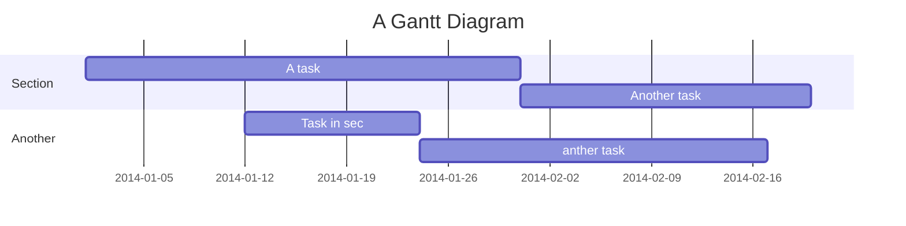

碩論機械手臂相關紀錄
===


## Table of Contents

[TOC]

## Beginners Guide

If you are a total beginner to this, start here!

1. Visit hackmd.io
2. Click "Sign in"
3. Choose a way to sign in
4. Start writing note!

User story
---

```gherkin=
Feature: Guess the word

  # The first example has two steps
  Scenario: Maker starts a game
    When the Maker starts a game
    Then the Maker waits for a Breaker to join

  # The second example has three steps
  Scenario: Breaker joins a game
    Given the Maker has started a game with the word "silky"
    When the Breaker joins the Maker's game
    Then the Breaker must guess a word with 5 characters
```
> I choose a lazy person to do a hard job. Because a lazy person will find an easy way to do it. [name=Bill Gates]


```gherkin=
Feature: Shopping Cart
  As a Shopper
  I want to put items in my shopping cart
  Because I want to manage items before I check out

  Scenario: User adds item to cart
    Given I'm a logged-in Usenvidia-smi.txt                                                                  Page 2
       Display Unit data instead of GPU data.  Unit data is only available for
       NVIDIA S-class Tesla enclosures.
   -i, --id=ID
       Display  data for a single specified GPU or Unit.  The specified id may
       be the GPU/Unit's 0-based index in the natural enumeration returned  by
       the driver, the GPU's board serial number, the GPU's UUID, or the GPU's
       PCI bus ID (as domain:bus:device.function in hex).  It  is  recommended
       that  users  desiring  consistency use either UUID or PCI bus ID, since
       device enumeration ordering is not guaranteed to be consistent  between
       reboots  and  board serial number might be shared between multiple GPUs
       on the same board.
   -f FILE, --filename=FILE
       Redirect query output to the specified file in  place  of  the  default
       stdout.  The specified file will be overwritten.
   -x, --xml-format
       Produce XML output in place of the default human-readable format.  Both
       GPU and Unit query outputs conform to corresponding  DTDs.   These  are
       available via the --dtd flag.
   --dtd
       Use with -x.  Embed the DTD in the XML output.
   --debug=FILE
       Produces  an  encrypted debug log for use in submission of bugs back to
       NVIDIA.
   -d TYPE, --display=TYPE
       Display only selected information: MEMORY, UTILIZATION,  ECC,  TEMPERA-
       TURE,  POWER,  CLOCK,  COMPUTE,  PIDS,  PERFORMANCE,  SUPPORTED_CLOCKS,
       PAGE_RETIREMENT, ACCOUNTING Flags  can  be  combined  with  comma  e.g.
       "MEMORY,ECC".  Sampling data with max, min and avg is also returned for
       POWER,  UTILIZATION  and  CLOCK  display  types.   Doesn't  work   with
       -u/--unit or -x/--xml-format flags.
   -lr
    When I go to the Item page
    And I click "Add item to cart"
    Then the quantity of items in my cart should go up
    And my subtotal should increment
    And the warehouse inventory should decrement
```

> Read more about Gherkin here: https://docs.cucumber.io/gherkin/reference/

User flows
---
```sequence
Alice->Bob: Hello Bob, how are you?
Note right of Bob: Bob thinks
Bob-->Alice: I am good thanks!
Note left of Alice: Alice responds
Alice->Bob: Where have you been?
```

> Read more about sequence-diagrams here: http://bramp.github.io/js-sequence-diagrams/

Project Timeline
---


> Read more about mermaid here: http://mermaid-js.github.io/mermaid/

## Appendix and FAQ

:::info
**Find this document incomplete?** Leave a comment!
:::

###### tags: `Templates` `Documentation`
