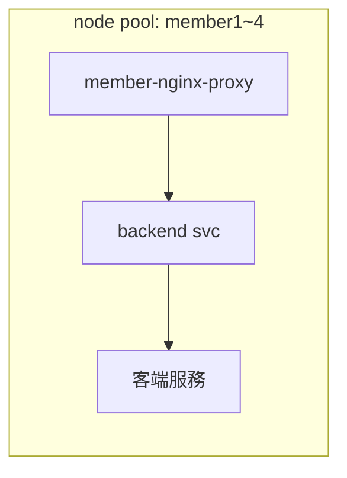
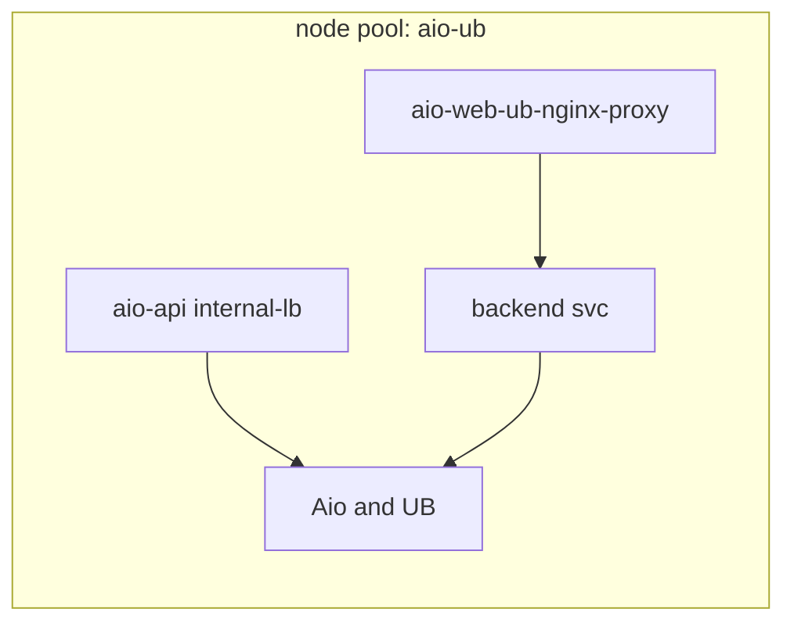
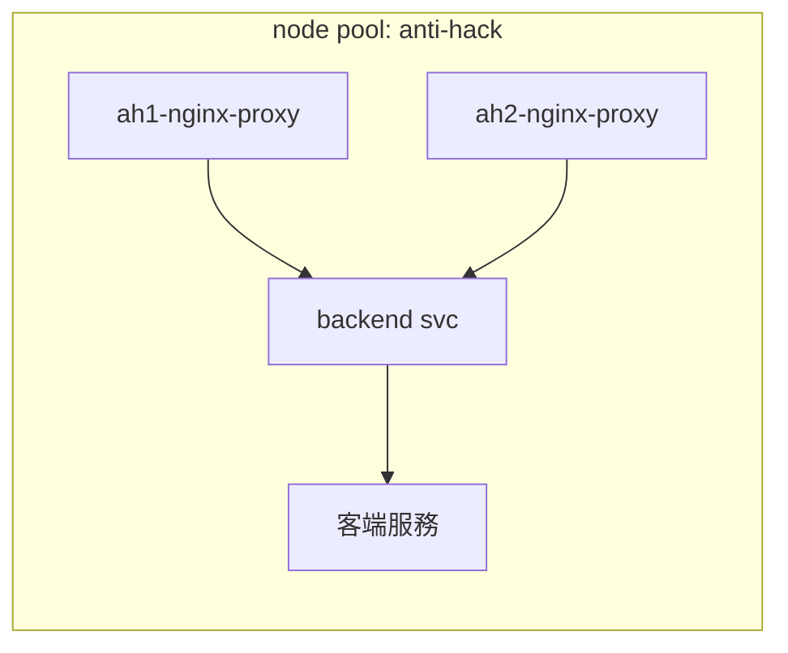
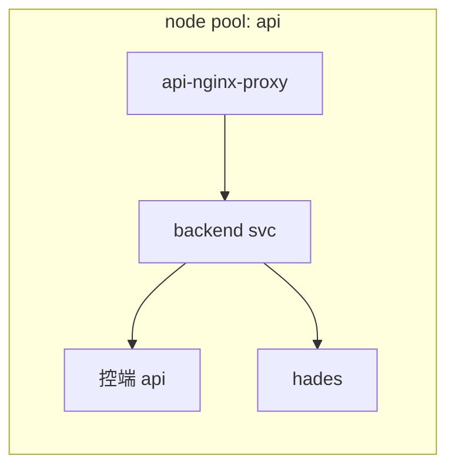
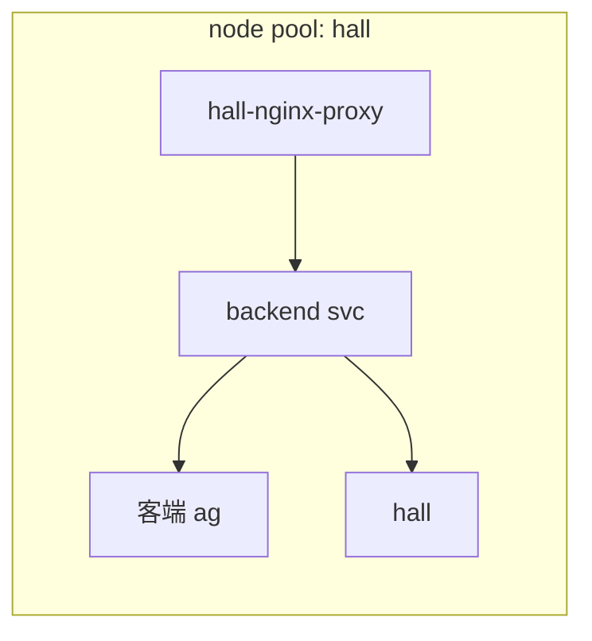
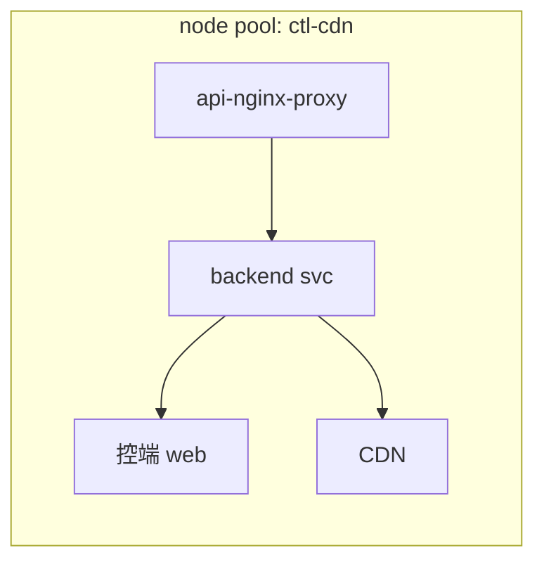

###### tags: `BBIN` `Cloud`
# 介面 BBIN Prod 雲上架構圖

```mermaid
    graph LR

    subgraph "node pool: member1~4"
    Nginx1[member-nginx-proxy] --> Service[backend svc]
    Service --> App1[客端服務]
    end
```

```mermaid
    graph LR

    subgraph "node pool: aio-ub"
    Internal[aio-api internal-lb] --> App1
    Nginx1[aio-web-ub-nginx-proxy] --> Service[backend svc]
    Service --> App1[Aio and UB]
    end
```

```mermaid
    graph LR

    subgraph "node pool: anti-hack"
    Nginx1[ah1-nginx-proxy] --> Service[backend svc]
    Nginx2[ah2-nginx-proxy] --> Service[backend svc]
    Service --> App1[客端服務]
    end
```

```mermaid
    graph LR

    subgraph "node pool: api"
    Nginx1[api-nginx-proxy] --> Service[backend svc]
    Service --> App1[控端 api]
    Service --> App2[hades]
    end
```

```mermaid
    graph LR

    subgraph "node pool: hall"
    Nginx1[hall-nginx-proxy] --> Service[backend svc]
    Service --> App1[客端 ag]
    Service --> App2[hall]
    end
```

```mermaid
    graph LR

    subgraph "node pool: ctl-cdn"
    Nginx1[api-nginx-proxy] --> Service[backend svc]
    Service --> App1[控端 web]
    Service --> App2[CDN]
    end
```