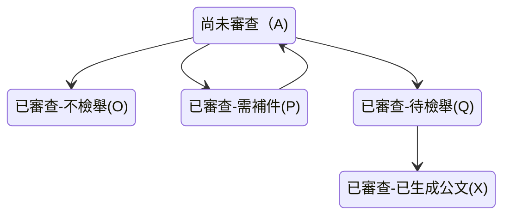
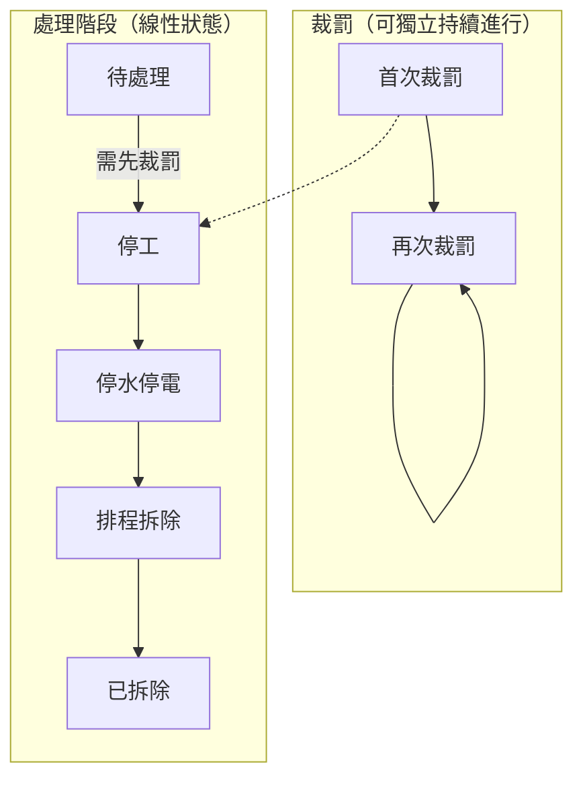

# 違章工廠回報系統_第196次小聚

###### tags: `Disfactory` `違章工廠` `違章工廠舉報系統`

時間：20250528 19:30 (GMT+8)
地點：地球公民基金會
線上：https://meet.google.com/coc-vuaa-ykz
小聚共筆：

新提案：再裁罰的回報相關的小聚共筆

- [違章工廠回報系統第192次小聚](/EmMqbq8zQ-ayWkxsxT9qlg)
- [違章工廠回報系統_第194次小聚](/UPcHStg9RF6R8K7MiMFyKA)
- [違章工廠回報系統_第195次小聚](/qh5kZntmTmG4UhYeJfUgvw)
- [違章工廠回報系統第193次小聚](/Ohq6vQMNSE-ogYBmpz4byw)
- 違章工廠回報系統第192次小聚 20250305
- 違章工廠回報系統第193次小聚 20250402
- 違章工廠回報系統第194次小聚 20250416
- 違章工廠回報系統第195次小聚 20250430

:::info
文件目錄
[TOC]
:::

## 參與者簽到

實體：peii, yellowsoar, yukai, oriyar
線上：ael


---

# [disfactory新提案](https://www.canva.com/design/DAGg17NISDA/zIM6iFSHSs5SH9HK-VftQw/view?utm_content=DAGg17NISDA&utm_campaign=designshare&utm_medium=link2&utm_source=uniquelinks&utlId=h49962145f6)


**Challenge**: 非工廠（倉庫）已被裁罰的，需要有人去確認，讓連續裁罰的機制動起來（上圖右下角），在罰金壓力下才會做出改變恢復農用。

peii:
- 想要讓民眾協助確認被裁罰的農地上倉儲是否已經改善
- 讓未改善的裁罰動起來
- 也許可以用尋找寶藏的方式？
- 


裁罰紀錄：來自國土署的 single source data
違反非都市土地使用管制案件查處情形表
- 按照地號
- 目前只有流水號，還沒有專屬編號


## 本次會議紀錄

### 國土署資料
- [x] 國土署可追蹤案件代碼：市縣代碼＋年度＋案件流水號（已確定不會變動，但還是會跳號）
- 目前拿到的資料只記載到停止供水供電（經濟部專案已結案），但不影響我們使用這份資料繼續追蹤
- 明年初預計上線土地裁罰公開資訊的平台
- 新舊地號格式混用 => 會提供各縣市政府新的填寫方式。但因為一些已經結案，我們可能還要再清一下。 => cue @swind @chewei
- 但是地號欄位裡面還是會有兩個地號。多的地號這件事無法解決。

### Google Drive

- ael: 下次小聚我想要移除近兩年沒有活躍的參與者 access。已在 Slack 上宣布。


### 再裁罰檢舉的使用者研究

ael 希望做的使用者研究：
- 這四年來使用過 disfactory.tw 的回報者。 1-3 人。
- peii 新的目標使用者，是知道這些案件都是可以再檢舉的人。

會更新彙整在這個 GitHub issue:
https://github.com/Disfactory/Disfactory/issues/657

**已用過的回報者**
- 使用者背景
- 怎麼知道 Disfactory 的？為什麼會想要回報？
- 對於政府過去幾年的政策，和現在違章工廠議題的想法
- 過去這五年來，你居住的地方附近農地違章工廠的現況有什麼改變？正向的？負向的？
- 知道可以再裁罰嗎？
- 我們現在想要做一個新功能是，從政府已經裁罰過的名單中，去檢查違章工廠有沒有真的改善。而且金錢上可以連續裁罰，每三個月可以再檢舉再裁罰。你對這個新功能會有什麼想像？
- 


**合作的在地環團**
- 使用者背景：


**處理回報資料的地公人員**
Peii


**處理檢舉資料的公務員**
- 使用者背景
- 怎樣是好的檢舉資料？
- 再裁罰的困難？


Peii 首先想要釐清的是進入網站後的路徑長什麼樣子
- 想要梳理進來的人，需要先填寫哪些資料，才知道要問使用者哪些問題
- 要用到哪些政府資料、哪些需要民眾幫忙確認
- 想要先把路徑想一下：篩哪些資料出來當作可以再檢舉的點。

------

yellowsoar: 工廠主自己拆除的比例有多高？
peii: 應該還算滿高的。 14 間自拆。自拆有些東西可以回收的。


### 新功能預計時程

因為國土署預計明年一月上線新的資訊平台，也希望可能在明年過年前上線。

大家都要六月底以後會比較有空，一週可能 3-5/hr。

所以看能不能 12 月 alpha 可以完成囉！


### 下次小聚目標

跟 Peii 一起整理出整個連續再裁罰功能的 data flow
- 再檢舉公文所需要的資料欄位
- 我們可以從政府資料拿的資料欄位＋需要什麼樣的資料清理
- 我們可以從 disfactory.tw 拿的資料
- 我們需要民眾幫忙加上的資料
- 地公整理資料時需要的資料欄位


再下一次的小聚可以來討論
- 針對已使用過回報平台跟潛在使用者的使用者研究
- Google Drive 權限移除


## 上次小聚紀錄 （20250430）
### 工廠分類
簡化分類，讓「可以連續裁罰的工廠」被強調


大家回饋：
- 再檢舉會給改善時間，不一定會裁罰
- 預設善意：對方可能真的有改善
- 現在的分法會全部都變成紅色ＸＤ

### 使用者回饋
ael: 建議還是跟使用者聊過確定現場回報需求再設計
想請 @peii 從願意被聯絡的人裡面，撈有重複檢舉單一工廠的人 1-3 人。想要知道會連續檢舉的人，是什麼樣貌，通常是怎麼觸發，怎麼使用這個平台。怎樣會想要連續檢舉？怎樣通知他們最好？

SL: 也可以訪問只上傳一次的人


先提出打電話這個issue，細節架構可以再討論

## 上上次小聚紀錄(20250416)
- 


### 考古目前各種回報狀態的資料欄位


最原始後台 admin page 資料欄位設計：
https://github.com/Disfactory/Disfactory/issues/268


factory_status:
https://github.com/Disfactory/Disfactory/issues/527

cet_review_status:


cet next tag:

gov_status:
https://github.com/Disfactory/Disfactory/issues/389

display_status: https://github.com/Disfactory/Disfactory/pull/410


### 白板整理相關裁罰關係






違章工廠的處理順序

```py
cet_review_status_list = [
    ("A", "尚未審查"),
    ("O", "已審查-不檢舉"),
    ("P", "已審查-需補件"),
    ("Q", "已審查-待檢舉"),
    ("X", "已審查-已生成公文"),
]
```

- 待處理
- 裁罰（可連續裁罰）
- 停工
- 停水停電
- 排程拆除
- 已拆除


小結：連續金錢裁罰（地政或是都發）跟排拆（建管單位）是分開的流程，可以分開記 `status`

但是連續裁罰的時間要怎麼記錄呢？
需要整理到：https://github.com/Disfactory/Disfactory/issues/655

討論：


### 目前用政府公開資料遇到的問題

1. 希望每個案件都有獨立編號
2. 有些資料有缺漏
3. 有跳號
4. 歷次查處情形也怪怪的

連續再裁罰相關的有哪些資料呢？ => 只有一份
https://github.com/Disfactory/Disfactory/issues/656

### 攝影計畫？

等攝影師來聯繫 ~