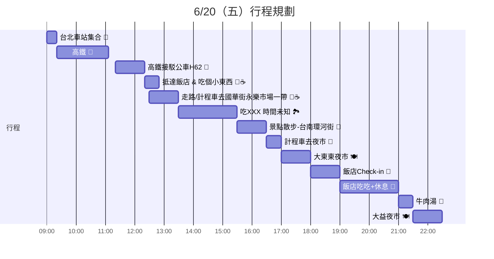

# 台南出遊

```java
🎯 車票還沒買
🎯 旅館還沒訂
🎯 永樂市場/國華街 一帶的行程還沒確定~ 也可以換喔 你還沒說你想去哪~
```



# 📌 討論事項
## 1. H62可以搭到飯店旁邊，但也可以先往前做一站到國賓飯店
怕你餓了~ 先找一間吃吃小東西
喝吧茶飲Drink Brapp手作輕食飲品 有人說他的全麥吐司還不錯


## 2. 台南環河街是想說吃一吃可以去散散步看醜魚 (真滴醜)


## 3. 我自己是覺得搭車到夜市再走回飯店吃比較順路
阿阿~ 也可以都搭計程車那就沒問題了

## 4. 想說牛肉湯當消夜~ 也是可以一起買回飯店吃
然後大益夜市是突然發現在飯店上面十分鐘不到的路程 好像可以加減看看

## 目前朋友推薦的
```java=
八寶彬圓仔惠 金華店
here kyoto 台南 -
```

