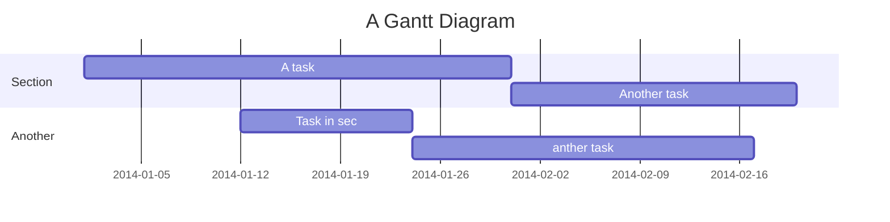

IoT tutorial
===
> By Reem Othman [student ID. ro222it]


## Table of Contents

[TOC]

## Project description

This project is built to measure the user's heart rate using a **KY-039 Heart Rate** Sensor connected to a Raspberry Pi Pico W. We will use microPython to calculate the heart rate data from the sensor and send it to Adafruit IO for visualization. The online table on Adafruit IO shows the user's heart rate on the y-axis and the time of measurement on the x-axis. Adafruit IO also sends a webhook to a specified Discord server if the user's heart rate exceeds a certain value.

The estimated time to build this prototype is 2-5 hours. This time can vary based on your familiarity with the software and hardware.

Objective
---
The objective of this project is to build a device that helps users become more aware of how their heart rate changes while doing office work. Personally, I find this useful because I consume large amounts of caffeine while working on my computer or studying. Additionally, as a student, I often experience a lot of stress during exam seasons, which causes my heart rate to increase drastically. By using this simple prototype, I can monitor my heart rate and receive a webhook on Discord to take a break or do something else to reduce stress and regulate my heartbeat. Since it can be costly to buy a watch to measure my heart rate, it can be more efficient to build a similar device at home. The device can inform you of your heart rate in two ways:

1. By holding the sensor periodically to see your heart rate on the Adafruit table.
2. By improvising and making this simple device into a wearable device (such as a bracelet).

In this tutorial, I will provide you with the information you need to build the device in either way.
```gherkin=
Feature: Guess the word

  # The first example has two steps
  Scenario: Maker starts a game
    When the Maker starts a game
    Then the Maker waits for a Breaker to join

  # The second example has three steps
  Scenario: Breaker joins a game
    Given the Maker has started a game with the word "silky"
    When the Breaker joins the Maker's game
    Then the Breaker must guess a word with 5 characters
```
> I choose a lazy person to do a hard job. Because a lazy person will find an easy way to do it. [name=Bill Gates]


```gherkin=
Feature: Shopping Cart
  As a Shopper
  I want to put items in my shopping cart
  Because I want to manage items before I check out

  Scenario: User adds item to cart
    Given I'm a logged-in User
    When I go to the Item page
    And I click "Add item to cart"
    Then the quantity of items in my cart should go up
    And my subtotal should increment
    And the warehouse inventory should decrement
```

> Read more about Gherkin here: https://docs.cucumber.io/gherkin/reference/

List of material
---
First of all, you need to have a computer and the following list of electronic materials:
| Item | Link | Price |
| -------- | -------- | -------- |
| Raspberry Pi Pico W | [Link](https://www.electrokit.com/en/product/raspberry-pi-pico-w/)| 89 SEK|
|   KY-039  | [Link](https://www.electrokit.com/en/pulssensor-ir)     | 36 SEK    |
| Breadboard     | [Link](https://www.electrokit.com/produkt/kopplingsdack-840-anslutningar/) | 69 SEK |
| Jumper wires 40-pin 30cm female/male      | [Link](https://www.electrokit.com/labbsladd-40-pin-30cm-hona/hane?gad_source=1&gclid=CjwKCAjw1emzBhB8EiwAHwZZxceRuC9RwYzFA_ldIs5yNkUaIQre0qvsQuFrd7gUekDZWThxJi9e7BoCkdAQAvD_BwE)     | 49 SEK     |    |
| Jumper wires 20-pin 30cm male/male       | [Link](https://www.electrokit.com/en/labbsladd-20-pin-15cm-hane/hane)     | 29 SEK     |    |
| USB-cable A-male – mini B male 1.8m 5-pin     | [Link](https://www.electrokit.com/en/product/usb-cable-a-male-mini-b-male-1-8m-5-pin/)     | 35 SEK     |
-| -| **Total 307 SEK**|

You need the Raspberry Pi Pico W to secure a power source for your sensor and to process the data from the sensor (KY-039, which will measure your heart rate) and send it to your computer. The breadboard is necessary to connect the sensor with the microcontroller (Raspberry Pi Pico W) using the jumpers. Lastly, you will use the USB cable to connect the Raspberry Pi Pico W to your computer.


Other materials that can be found in any household (note: if you have three female/female jumper wires, then you only need a hair band):

1. A pair of scissors
2. Tape
3. Any hair band you can find


```sequence
Alice->Bob: Hello Bob, how are you?
Note right of Bob: Bob thinks
Bob-->Alice: I am good thanks!
Note left of Alice: Alice responds
Alice->Bob: Where have you been?
```

> Read more about sequence-diagrams here: http://bramp.github.io/js-sequence-diagrams/

Project Timeline
---


> Read more about mermaid here: http://mermaid-js.github.io/mermaid/

## Appendix and FAQ

:::info
**Find this document incomplete?** Leave a comment!
:::

###### tags: `Templates` `Documentation`
