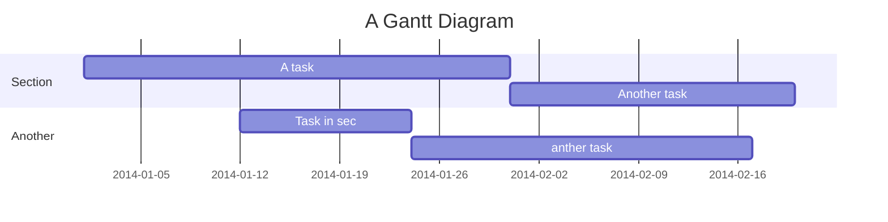

IoT tutorial
===
> By Reem Othman [student ID. ro222it]


## Table of Contents

[TOC]

## Project description

This project is built to measure the user's heart rate using a **KY-039 Heart Rate** Sensor connected to a Raspberry Pi Pico W. We will use microPython to calculate the heart rate data from the sensor and send it to Adafruit IO for visualization. The online table on Adafruit IO shows the user's heart rate on the y-axis and the time of measurement on the x-axis. Adafruit IO also sends a webhook to a specified Discord server if the user's heart rate exceeds a certain value.

The estimated time to build this prototype is 2-5 hours. This time can vary based on your familiarity with the software and hardware.

Objective
---

The Objective of this project is to help the user to be more aware of how thier heart rate changes while doing office work. Personally I find this use full because I consume big amounts of coffien while working on my computer or studying besindes that as a student a usually stress a lot during exam sessons which causes my heart rate to raise drastically. Senci it can be kind of costly to afford buying a watch to musser my heart rate, it can be more efficent to build a quite similar device at home
```gherkin=
Feature: Guess the word

  # The first example has two steps
  Scenario: Maker starts a game
    When the Maker starts a game
    Then the Maker waits for a Breaker to join

  # The second example has three steps
  Scenario: Breaker joins a game
    Given the Maker has started a game with the word "silky"
    When the Breaker joins the Maker's game
    Then the Breaker must guess a word with 5 characters
```
> I choose a lazy person to do a hard job. Because a lazy person will find an easy way to do it. [name=Bill Gates]


```gherkin=
Feature: Shopping Cart
  As a Shopper
  I want to put items in my shopping cart
  Because I want to manage items before I check out

  Scenario: User adds item to cart
    Given I'm a logged-in User
    When I go to the Item page
    And I click "Add item to cart"
    Then the quantity of items in my cart should go up
    And my subtotal should increment
    And the warehouse inventory should decrement
```

> Read more about Gherkin here: https://docs.cucumber.io/gherkin/reference/

User flows
---
```sequence
Alice->Bob: Hello Bob, how are you?
Note right of Bob: Bob thinks
Bob-->Alice: I am good thanks!
Note left of Alice: Alice responds
Alice->Bob: Where have you been?
```

> Read more about sequence-diagrams here: http://bramp.github.io/js-sequence-diagrams/

Project Timeline
---


> Read more about mermaid here: http://mermaid-js.github.io/mermaid/

## Appendix and FAQ

:::info
**Find this document incomplete?** Leave a comment!
:::

###### tags: `Templates` `Documentation`
