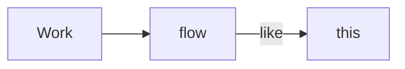

# Markdown quick start guide

Welcome to HackMD! :tada:

This note will get you started on writing in Markdown in no time.

You can try things out right in this note as a playground or leave it in your workspace as a cheatsheet.

:::success

:bulb: **Are you in Both Mode?**

Before we get into the details, make sure you are in Both Mode. Please locate these three icons at the top of HackMD, with which you can toggle Edit/Both/View mode (from left to right).


Let's set it to Both Mode, so that you can take notes in Markdown in the left pane and see how it renders in the right pane.

:::

Writing in Markdown is easy. It's just **using plaintext to format your text**. Here are some Markdown elements that you may find useful. Add them to your writings to give them nice and helpful structures.

## Frequently used elements

```python=9
  print('Hello, world!')
  # See if you can set arbitrary line number or 
  # change syntax highlighting for different language
  # in this code block.
```

- unordered list

1. ordered list

- [ ] task

> quote

[Link](https://hackmd.io/c/tutorials)

## Styles of text

**bold**

_italics_

`literals`

~~strikethrough~~

==highlight==

21^th^ Centuary

H~2~O

## Image


Just drag and drop an image anywhere in the editor, HackMD will render it for you.

You can change the size of the above image. [See how →](https://hackmd.io/s/features#Image-Upload).

## Headers

Put `#` at the beginning of a line, it becomes a header. Three `#`s creates a level 3 header, like this:

### A Level 3 Header

### Paragraph
As intuitive as it is, it's worth mentioning that leaving an empty line (by pressing <kbd>Enter</kbd> or <kbd>Return </kbd>) lets you separate paragraphes.

## Table

| Column 1 | Column 2 | Column 3 |
|:-------- |:--------:| --------:|
| Some     |  thing   |     nice |
| Text     |   Text   |     Text |

Drawing tables with Markdown can be messy, so we created a tool to boost your productivity. Click on any cell in the table above and note the table tool appears in the toolbar on top of the editor changes.


[Learn more about table tool here →](https://hackmd.io/c/tutorials/%2Fs%2Fhow-to-create-table)

## Extensions

Although the following extensions are not included in regular Markdown, they are widely accepted as  useful elements of documentations.

Humans can read them rather easily, so feel free to use them in your notes.

### Write formulas with MathJax

$$ e^{ \pm i\theta } = \cos \theta \pm i\sin \theta $$

### Draw UML diagrams to aid communication



HackMD supports many other UML diagrams. [Read more →](https://hackmd.io/c/tutorials/%2Fs%2Ffeatures#UML-Diagrams)

### Table of Content

You can type `[toc]` to add a table of content of your note as below:

[toc]

:::info
:bulb: **Navigating Menu**

You can bring up the table of contents by clicking the `☰` icon at the bottom-left of the View pane:


:::


### Admonitions

Use these text boxes to emphasize important ideas. Can you change those emojis?

:::warning
:warning: Warnings
:::

:::danger
:radioactive_sign: Danger
:::

:::info
:information_source: Info
:::

:::success
:thumbsup: Success
:::

# Why Markdown?

Markdown describes the structure of the content explicitly with plain text, almost like writing in 'code', while keeping it human readable. This has two major advantages:

1. You can **focus on the content** as you write and leave styling and structures for later.
2. Writing in plaintext means your content is **portable** to any platform (device, operating system, or app). It may look somewhat different in each rendering, yet the content is all the same and **no vendor lock-in**.

# Further Questions

In our [tutorial book](https://hackmd.io/c/tutorials/%2Fs%2Ftutorials), you will find detailed guides to all main features of HackMD that boost your productivity. You will even learn how to [publish](https://hackmd.io/c/tutorials/%2Fs%2Fhow-to-publish-note) a [book](https://hackmd.io/c/tutorials/%2Fs%2Fhow-to-create-book)! :100: 


Feel free to ping us for questions:
- :mailbox: support@hackmd.io
- Mention `@hackmdio` on [Twitter](https://twitter.com/hackmdio)
